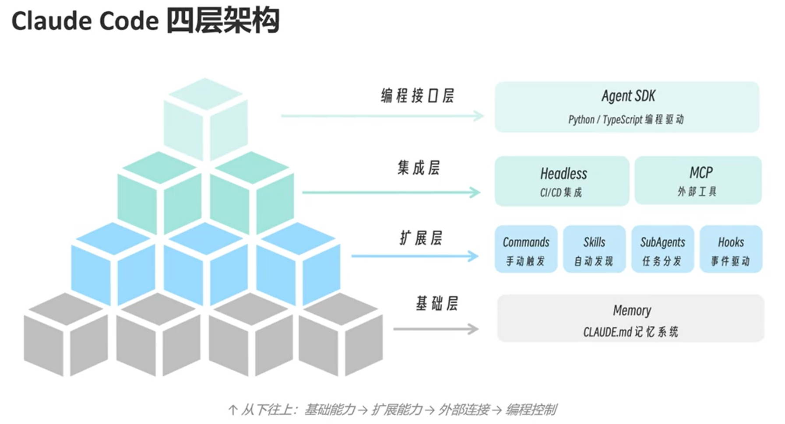

# Claude_Code_工程化实战

<https://time.geekbang.org/column/intro/101113501?tab=catalog>

面对陌生的ai产品，先问3个问题：

1. 它决的核心工程问题是什么？
2. 它选择的是单 Agent，还是某种多 Agent 结构？
3. 它是在用上下文换智能，还是用架构换可控性？

## 安装与初始化

windows

```bash
npm install -g @anthropic/claude-code
```

macos

```bash
curl -fsSL https://claude.ai/install.sh | bash
```

- 设置独立api

系统环境变量可以直接新增自己的api配置

```text
ANTHROPIC_BASE_URL=https://api.deepseek.com/anthropic
ANTHROPIC_API_KEY=sk-7753d355fef94fa5856dd73afc1b18ae
```

- 设置claude跳过登录

```powershell
notepad ~/.claude.json
```

在"firstStartTime后面"加一行：

```json
"hasCompletedOnboarding": true,
```

> 附： 快速切换模型，可以用 CC Switch：<https://github.com/farion1231/cc-switch>

## 架构



1. CLAUDE.md 是记忆系统，用于做基本记忆索引
2. HOOKS 回调护栏
3. Headless 无头模式 自动化集成
4. Agent SDK Python/TypeScrips外部调用agent

## Memory

长期记忆系统 CLAUDE.md，提供了一个基于文件的记忆系统，可以通过文件来存储和索引记忆内容

记忆系统侧重的，是把隐性的经验、默认的判断和反复纠正的规则提前固化成结构

1. 不要记录泛泛的规则或要求，应该记录具体的、有针对性的内容
2. 有效的指引，应使用 WHY、WHAT、HOW 三个维度来描述
3. 非核心但可能被用到的内容，应引用文件位置而非全量复制
4. /init 命令可初始化一份默认的 CLAUDE.md 模板，可以根据需要进行修改和补充
5. /memory 命令可以查看当前会话中被注入的记忆内容。/memory edit 可以编辑记忆文件，/memory clear 可以清空当前会话的记忆内容
    - memory edit 编辑项目级 CLAUDE.md
    - memory edit --global 编辑企业级 CLAUDE.md
    - memory edit --local 编辑本地级 CLAUDE.local.md
    - memory edit --user 编辑用户级 CLAUDE.md

### 1. 记忆原理

记忆文件会在claude code启动时被扫描。工作时会自动注入到每次会话。它始终消耗token

### 2. 五层记忆架构

1. 企业策略(`C:\Program Files\ClaudeCode\CLAUDE.md`)
    主要记录公司编码标准、安全策略、合规要求等全局性规则
    ex：

    ```md
    # 公司开发策略

    ## 安全要求
    - 禁止在代码中硬编码任何密钥或敏感信息
    - 所有 API 调用必须使用 HTTPS
    - 用户输入必须经过验证和清理

    ## 合规要求
    - 所有日志必须排除 PII（个人身份信息）
    - 数据库连接必须使用加密传输

    ## 禁止项
    - 禁止使用未经审批的第三方库
    - 禁止直接访问生产数据库
    ```

2. 用户级(`~\.claude\CLAUDE.md`)
    主要记录个人偏好、工作习惯、常用工具快捷方式等个性化信息
    用户级配置会被项目级配置中相同的要求覆盖

    ex:

    ```md
    # 个人偏好

    ## 沟通方式
    - 使用中文回复
    - 代码注释使用英文
    - 解释简洁直接，不要过多铺垫

    ## 通用代码风格
    - 缩进使用 2 空格
    - 优先使用 async/await
    - 变量命名使用 camelCase
    - 常量命名使用 UPPER_SNAKE_CASE

    ## 我的常用工具
    - 包管理器: uv
    - 编辑器: VS Code
    - 终端: zsh
    ```

3. 项目级(`.\.claude\CLAUDE.md`)
    项目架构、编码标准、常用工作流、技术栈
4. 项目规划(`.claude\rules\*.md`)
    语言特定指南、测试规范、api标注 **超大量规范的初步分类方法**
5. 本地级(`.\CLAUDE.local.md`)
    个人特定偏好，比如开发环境配置、调试技巧、工作备注、敏感信息(测试账号之类)

### 3. 自动记忆机制 Auto Memory

随着项目的演进和对话的深入，Claude Code 会在`~/.claude/projects/memory`目录下自动生成Auto Memory记忆文件，用于记录模型在项目中学习到的模式、调试经验与结构认知

### 4. 有效性评估

CLAUDE.md的本质是是在TOKEN有限的情况的下尽量少走弯路
所以更本质的原则是：

1. 如果CLAUDE.md新增一行，带来的TOKEN消耗期望更小，那就应该新增
2. 如果CLAUDE.md删除一行，带来的TOKEN消耗期望更小，那就应该新增

对期望的定义是：

1. CLUADE.md 里存在这一行，TOKEN的消耗期望 为这一行对应的TOKEN
2. CLUADE.md 里不存在这一行，TOKEN的消耗期望为 发生的概率 * 发生时消耗的TOKEN
两相比较来决定应该是新增还是删除

### 5. 请认真维护CLAUDE.md

1. 每次纠正完Claude，都用这句话收尾：`更新你的 CLAUDE.md，这样你就不会再犯这个错误了`
2. 随着时间的推移，打磨、迭代CLAUDE.md
3. 为每个任务/项目维护一个 notes 目录，每次 PR 后都更新，然后在CLAUDE.md里指向这个目录

## Sub-Agents

1. 处理上下文噪声的最佳实践
2. 职责边界确定 -- .claude/agents 可以自定义子代理：规则、工具权限、上下文窗口
3. 企业本体论 -- 一个企业能拆成工具、skill、agent的层层组合，最终完成agent转型

### 1. 子代理类型

1. 只读(代码分析与审查)
    tools: Read, Grep, Glob等
2. 开发(步骤实现、bug修复)
    tools：Read、Write、Edit、Bash等
3. 研究型(技术调研等，它可以获取实时数据)
    tools:Read、WebFetch、WebSearch等

### 2. 创建自己的子代理

在.claude/agents目录下创建一个新的子代理配置文件，例如`code-reviewer.md`，定义该子代理的职责、权限和工具

子代理配置文件使用Markdown + YAML frontmatter。ex：

```markdown
---
name: code-reviewer
description: Review code for security issues and best practices. Use after code changes.
tools: Read, Grep, Glob
model: sonnet
skills: 
    - chain-knowledge  # 链路拓扑和 SLA 约束
    - recent-incidents # 近期事故记录
hooks: 
    PreToolUse: 
        - matcher: "Bash" 
            hooks: 
                - type: command 
                command: "./scripts/validate-readonly-query.sh"
---

你是一个代码审查专家。

当被调用时：

1. 首先理解代码变更的范围
2. 检查安全问题
3. 检查代码规范
4. 提供改进建议

输出格式：
## 审查结果
- 安全问题：[列表]
- 规范问题：[列表]
- 建议：[列表]
```

#### 2.1 子代理元数据

元数据所有可填的字段如下：

| 字段 | 必填 | 说明 | 示例 |
| :-- | :-- | :-- | :-- |
| name | 是 | 子代理名称，必须唯一 | code-reviewer |
| description | 是 | **最重要的字段**.子代理的简要描述 | Review code for security issues and best practices. Use after code changes. |
| tools | 是 | 子代理可使用的工具列表，逗号分隔。省略则继承主对话的全部工具 | Read, Grep, Glob |
| disallowedTools | 否 | 子代理禁止使用的工具列表，逗号分隔。优先级高于 tools 字段 | Write, Edit |
| model | 否 | 子代理使用的模型，默认为主对话模型 | sonnet、glm-5 |
| permissionMode | 否 | 子代理的权限模式，控制子代理如何处理权限弹窗 | default/plan/bypassPermissions等 |
| skills | 否 | 启动时子代理预加载的skill列表，注入为上下文 | code-search、test-runner等自己的一些skill名字 |
| hooks | 否 | 子代理专属的生命周期hook | onStart、onFinish、onToolUse等 |

1. 其中description决定了claude何时自动调用该子代理。需要说清楚`做什么`和`什么时候用`两件事
2. 白名单与黑名单：白名单告诉子代理只能用这些，黑名单告诉子代理除了这些以外随便用。
    - 白名单适合需要严格限制的场景，如只读审查
    - 黑名单适合需要大部分工具，但难以容忍某些危险工具的场景
    - 二者一般二选一
3. 工具详情

    ```text
    只读型（审计/检查）         研究型（信息收集）         开发型（读写改）
    ├── Read                    ├── Read                   ├── Read
    ├── Grep                    ├── Grep                   ├── Write
    └── Glob                    ├── Glob                   ├── Edit
                                ├── WebFetch               ├── Bash
                                └── WebSearch              ├── Glob
                                                        └── Grep
    ```

4. permissionMode 该字段可以覆盖主对话的权限模式，控制子代理在面对需要权限的操作时的行为：
    - default：标准权限检查，每次都弹出确认
    - acceptEdits: 允许编辑权限，适合需要频繁修改文件的子代理
    - plan：只读探索模式
    - dontAsk： 自动拒绝权限弹窗，权限受限时直接失败
    - bypassPermissions：直接绕过权限检查，适合完全信任的子代理

#### 2.2 为子代理预加载skill

使用以下格式为子代理增加skill，它们在子代理运行时默认生效：

```markdown
skills: 
    - chain-knowledge  # 链路拓扑和 SLA 约束
    - recent-incidents # 近期事故记录
```

#### 2.3 为子代理配置专属hooks

子代理也支持生命周期hooks，可以在特定事件触发时执行自定义脚本。例如，在使用Bash工具前执行一个验证脚本：

```markdown
hooks:
    PreToolUse: 
        - matcher: "Bash" 
            hooks: 
                - type: command 
                command: "./scripts/validate-readonly-query.sh"
```

#### 2.4 交互式创建子代理

在claude 会话中：

```text
步骤 1：输入 /agents
步骤 2：选择 "Create new agent"
步骤 3：选择存放位置（User-level 或 Project-level）
步骤 4：选择 "Generate with Claude" 并描述功能
步骤 5：选择需要的工具
步骤 6：选择模型
步骤 7：保存
```

#### 2.5 CLI参数创建临时子代理

在启动Claude时：

```powershell
claude --agent CLI '{"name":"temp-agent","description":"临时子代理示例","tools":"Read,WebSearch","model":"sonnet"}'
```

这种形式适合CI/CD自动化时在流水线总临时创建任务专用的子代理

#### 2.6 常用的claude code内置子代理

1. Explore 子代理 -- 代码探索
2. Plan 子代理 -- 任务分解与规划
3. General-purpose 子代理 -- 能探索、能修改、能推进，适合大型任务中的某一个极小的关键点处理

### 3. 子代理作用域与运行模式

#### 3.1 作用域

1. 子代理通过`--agent CLI json格式子代理定义`命令指定
    - 活跃在当前会话
2. 子代理配置文件在`./.claude/agents`目录下
    - 当前项目可用
3. 子代理配置文件在`~/.claude/agents`目录下
    - 全局可用
4. Plugin的agents目录
    - 仅在启用了该插件的项目可用

#### 3.2 运行模式

子代理既可以在前台运行(阻塞主对话)，也可以在后台运行
启动前，Claude Code 会预先请求子代理可能需要的所有权限
子代理执行完成后，Claude 会自动收到它的  agent ID。如果需要在之前的子代理基础上继续工作，可以用自然语言提示，让Claude恢复它

### 4. Muti Agent 架构设计

#### 4.1 何时选择多 Agent 架构

1. 上下文管理挑战：当多个能力领域的专业知识无法舒适的塞进单一prompt中时，需要策略性地分发上下文
2. 分布式开发需求：多个团队能力互相独立，不同针对性的子代理可以由各自的团队独立迭代

#### 4.2 Muti Agent 架构的最佳实践

1. 最佳实践1 -- Sub-Agents(子代理委派/集中式编排)
    核心设计思想：一个 Supervisor Agent 充当管理者，将任务分解后委派给专门的 Sub-Agent。每个 Sub-Agent 解决一个特定的任务
    特点：几乎能完全屏蔽信息污染，各任务执行体专注度高。代价是简单任务中token消耗提升、上下文不连贯
2. 最佳实践2 -- Skills渐进式加载
    核心设计思想：根据任务进展动态加载技能到同一个Agent上下文，每个阶段由对应的skill指导
    特点：连续的上下文能获得Agent思考的整体性，特别适合需要繁多SKILL支持的小型任务。代价是上下文污染，过长的任务周期会导致Agent注意力涣散
3. 最佳实践3 -- Handoffs(交接/状态驱动的Agent切换)
    核心设计思想：将任务流划分为边界非常清晰的进度节点，每个Agent负责一个进度节点，并将会话控制权与必要信息传递给下一个Agent
    特点：保持一定会话连续性的同时还维持了Agent专注度，特别适合具有强烈前后依赖关系的工作流。代价是失去并行能力，且需要精心设计状态传递机制以避免核心信息丢失

    实现基于Handoffs的Muti Agent架构：

    1. 需要明确的阶段状态 -- 显式的定义流程阶段，即每个阶段的边界节点。每个阶段都应是一个角色约束的Agent视角
    2. 显式的阶段完成条件 -- 定义清晰的完成条件，确保Agent在满足条件后才会触发交接。这个完成条件包括数据汇报的内容与格式，用来传递给下一个阶段
    3. Handoffs可以抽象成Skill，或每个阶段完成后手动注入下一阶段的信息。举例一个阶段的注入：

        ```text
        系统规则：
        你将按照以下阶段顺序工作：
        1. 信息收集（intake）
        2. 问题诊断（diagnosis）
        3. 解决方案（resolution）

        当前阶段：intake

        规则：
        - 只能提问
        - 不要给解决方案
        - 当信息完整时，明确声明：`进入 diagnosis 阶段`
        ```

4. 最佳实践4 -- Route(路由器/并行分发与合成) **工程级Muti agent 架构最常用的最佳实践**
    核心设计思想：将用户输入根据语义进行拆分与职责分流，由不同的agent组分阶段完成任务。以工程探索阶段为例：
    1. 首先由 Router 对用户请求进行分类和分解。某些设计中，还涉及问题复杂度评估，这影响到单分类中需要分发的并行子agent数量
    2. 然后将子查询并行分发给各自负责的专业 Agent
    3. 最后再将多个结果统一合成为一个对用户友好的响应(一段回复、几分文档等形式)
    -- 工程探索阶段完毕
    该实践一般对应以下几种工作流：
    - 创意需求与小型工程 工作流：
        用户想要实现一个创新性想法雏形，或实现一个小型工程，技术栈小
            -> 语义分析+复杂度评估，route到创意工作流
                -> 按语义分析得到的工程大致需求框架派一定数量的Agent进行信息收集与初步探索，生成初设文档
                    -> 基于初设文档与用户讨论，确认整体架构，生成详设文档
                        -> 基于详设文档派出指定轮次、指定数量的Agent进行实现
                            -> 项目测试与收尾汇报
    - 企业级项目编排与实现 工作流：
        企业级项目或核心模块、大型重构计划，规模较大，技术栈复杂，涉及多个团队协作
            -> 语义分析+复杂度评估，route到企业级工作流
                -> 按语义分析得到的项目需求框架派出不同领域的Agent进行信息收集与初步探索，生成初设文档。进行文档合格度评分，不合格则继续询问用户
                    -> 基于初设文档与用户讨论，确认整体架构，生成详设文档。进行文档合格度评分，不合格则继续询问用户
                        -> 基于详设文档与用户讨论，生成Phase级文档，明确每个Phase的目标、输入输出、参与角色等。进行verification Agent检查，确保文档质量
                            -> 基于Phase级文档拆解为Task级文档，明确每个Task的目标、输入输出、参与角色等。进行verification Agent检查，确保文档质量
                                -> 基于Task级文档派出1个Agent进行实现
                                    -> 每个Task结束后，都需要Verification Agent进行质量检查，确保实现符合预期
                                        -> 项目测试与收尾汇报
    - 排障 工作流：
        专用于bug修复
            -> 语义分析，route到排障工作流
                -> 按语义分析得到的bug描述派出不同领域的Agent进行信息收集与初步探索，评估bug修复难度与影响范围，生成诊断报告
                    -> 基于诊断报告与用户讨论，确认修复方案，生成修复文档
                        -> 基于修复文档派出指定轮次、指定数量的Agent进行修复实现(一般是1个，影响度过广的"bug"，一般算小规模重构了)
                            -> 修复测试与收尾汇报

#### 4.3 Muti Agent 的协作挑战

1. 检查点：Agent的失误会在agent之间的信息传递中被级联放大。每个agent的输出端都应设置检查点
2. 非确定性调试：Agent 的动态决策使得传统的日志分析不够用。需要完整的生产链路追踪，记录每个 Agent 的输入、决策过程和输出。可以引入 Observability 工具，记录完整的 Agent 调用链
3. 部署复杂度。多 Agent 系统的部署不能简单地“停机更新”。因为 Agent 可能正在执行中，打断它会导致不可预测的行为。可以考虑采用新旧版本共存迁移的渐进式部署策略（Rainbow Deployment），让旧版本的 Agent 完成当前任务后自然退出，新版本接管后续请求
4. 同步瓶颈。当前大多数 SubAgent 是同步执行的，SubAgent 之间的信息流受限。未来的方向是打通异步执行 + Agent 间消息通道，让 SubAgent 在执行过程中可以相互共享发现

#### 4.4 Muti Agent 架构选择决策

```text
一个任务需要多 Agent 吗？
├─ 单一领域、工具 < 5 个、上下文 < 50K tokens
│  └─→ 不需要。用单 Agent + 好的 prompt 即可
│
├─ 单一领域、但工具 > 10 个
│  └─→ 考虑 Skills 模式（渐进式能力加载）
│
├─ 多领域、各领域需要独立上下文
│  └─→ 使用 Sub-Agents 模式
│
├─ 需要多步骤状态流转（如客服工单流程）
│  └─→ 使用 Handoffs 模式
│
└─ 需要跨多个数据源并行查询
   └─→ 使用 Router 模式
```

## Skills

子代理，适合隔离执行高噪声任务

## Hooks

事件触发的脚本，主要用于自动化检查

## Headless

无头模式 适合CI/CD集成

## Agent SDK

代码驱动claude，适合构建自定义agent

## Plugins

打包容器，适合分发和部署以“命令、技能、子代理、钩子”形成的完整功能模块
