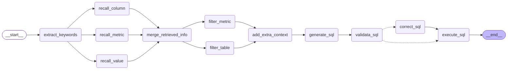

# 尚硅谷大模型项目之掌柜问数

# 1. 项目概述

掌柜问数是一个基于自然语言处理与数据分析技术的智能数据服务系统，面向数据仓库（Data Warehouse）应用场景，旨在帮助用户通过对话方式高效获取数据仓库中的数据洞察。用户无需掌握复杂的查询语法，即可用自然语言提出问题，系统自动完成对数据仓库数据的理解、计算分析与结果可视化，大幅提升数据使用效率，降低数据分析门槛，助力业务决策智能化。

掌柜问数核心实现：**NL2SQL**（自然语言转 SQL）,它是自然语言处理（NLP）的一个细分方向，目标是将用户用自然语言描述的查询需求，自动转换成语法正确、可直接执行的 SQL 语句.

简单理解：掌柜问数本质上就是实现一个RAG的过程,通过用户的问题，进行处理后，将处理后的数据交给大模型进行处理，最终生成sql,执行后返回结果。


生成的sql语句：

~~~sql
SELECT 
    d.year,
    d.month,
    dp.product_name,
    SUM(fo.order_quantity) AS total_sales
FROM fact_order fo
JOIN dim_date d ON fo.date_id = d.date_id
JOIN dim_product dp ON fo.product_id = dp.product_id
GROUP BY d.year, d.month, dp.product_id, dp.product_name
HAVING SUM(fo.order_quantity) = (
    SELECT MAX(monthly_sales)
    FROM (
        SELECT
            d2.year,
            d2.month,
            fo2.product_id,
            SUM(fo2.order_quantity) AS monthly_sales
        FROM fact_order fo2
        JOIN dim_date d2 ON fo2.date_id = d2.date_id
        GROUP BY d2.year, d2.month, fo2.product_id
    ) sub
    WHERE sub.year = d.year AND sub.month = d.month
)
ORDER BY d.year, d.month;
~~~


生成的sql:

~~~sql
SELECT 
    dr.region_name AS 地区,
    SUM(fo.order_amount) AS 销售总额
FROM fact_order fo
JOIN dim_region dr ON fo.region_id = dr.region_id
JOIN dim_date dd ON fo.date_id = dd.date_id
WHERE dd.date_id BETWEEN 20250101 AND 20251231
GROUP BY dr.region_name
ORDER BY 销售总额 DESC;
~~~


生成的sql:

~~~sql
SELECT SUM(fo.order_amount) AS 销售总额
FROM fact_order fo
JOIN dim_region dr ON fo.region_id = dr.region_id
WHERE dr.region_name = '华北';
~~~


# 2. 项目架构

## 2.1 概述


本项目以数据仓库的元数据为核心，使用 MySQL 存储结构化元数据信息，结合 Qdrant 构建语义向量索引、Elasticsearch 构建全文索引，形成统一的元数据知识库。查询过程中，系统首先根据用户自然语言问题进行多路召回，筛选相关表、字段及指标定义，再将元数据信息与用户问题共同输入大模型生成 SQL，最终完成自动查询与结果返回，确保生成结果的准确性与可控性。

 

## 2.2 元数据知识库

元数据知识库作为数据仓库的语义基础设施，用于集中管理和高效检索表结构、字段定义、字段取值示例及复杂指标说明等元数据信息，支撑后续的智能检索与 SQL 生成。

元数据信息主要来源于两部分：一部分数据仓库自动采集，另一部分由人工进行补充与配置。完整的元数据统一存储于 MySQL 数据库中，并对其中部分关键信息构建向量索引和全文索引，以提升语义召回与关键词召回的效果。

修饰数据的数据。

### 2.2.1 元数据库meta

元数据库共包含四张表，具体结构如下图所示：

metric_info:指标描述信息表

column_metric:字段指标关联表

column_info:字段描述信息表 

table_info:表描述信息表

列角色说明：

```
primary_key:主键
foreign_key：外键
measure: 度量，可计算的数值，主要用于做统计，例如：卖了多少钱、买了几件、耗时多少
dimension：维度 分析的“角度”,主要用于来做筛选和分组，例如：按时间看、按区域看、按商品分类看
```


metric_info(指标信息表)

| 字段名             | 类型           | 注释                                                      |
| ------------------ | -------------- | --------------------------------------------------------- |
| `id`               | `varchar(64)`  | **指标编码**（主键，唯一标识一个指标）                    |
| `name`             | `varchar(128)` | **指标名称**（如 “销售总额”）                             |
| `description`      | `text`         | **指标描述**（详细说明指标的业务含义、计算口径）          |
| `relevant_columns` | `json`         | **关联列信息**（JSON 格式，记录该指标计算时依赖的物理列） |
| `alias`            | `json`         | **指标别名**（JSON 格式，记录指标的别名、简称等）         |

column_metric（列 - 指标关联表）

| 字段名      | 类型          | 注释                                        |
| ----------- | ------------- | ------------------------------------------- |
| `column_id` | `varchar(64)` | **列编号**（外键，关联 `column_info.id`）   |
| `metric_id` | `varchar(64)` | **指标编号**（外键，关联 `metric_info.id`） |

column_info（列信息表）

| 字段名        | 类型           | 注释                                                   |
| ------------- | -------------- | ------------------------------------------------------ |
| `id`          | `varchar(64)`  | **列编号**（主键，唯一标识一个物理列）                 |
| `name`        | `varchar(128)` | **列名称**（如 `order_amount`）                        |
| `type`        | `varchar(64)`  | **数据类型**（如 `INT`, `VARCHAR`, `DATETIME`）        |
| `role`        | `varchar(32)`  | **列角色**（如 `primary key`, `dimension`, `measure`） |
| `examples`    | `json`         | **数据示例**（JSON 格式，记录该列的示例值）            |
| `description` | `text`         | **列描述**（详细说明该列的业务含义）                   |
| `alias`       | `json`         | **列别名**（JSON 格式，记录该列的别名）                |
| `table_id`    | `varchar(64)`  | **所属表编号**（外键，关联 `table_info.id`）           |

table_info（表信息表）

| 字段名        | 类型           | 注释                                         |
| ------------- | -------------- | -------------------------------------------- |
| `id`          | `varchar(64)`  | **表编号**（主键，唯一标识一个物理表）       |
| `name`        | `varchar(128)` | **表名称**（如 `fact_sales_order`）          |
| `role`        | `varchar(32)`  | **表类型**（如 `fact` 事实表，`dim` 维度表） |
| `description` | `text`         | **表描述**（详细说明该表的业务含义）         |

构建指令知识库：

~~~shell
python -m app.scripts.build_meta_knowledge -c .\conf\meta_config.yaml 
~~~

### 2.2.2 数据仓库dw

dim_customer: 客户维度表

dim_date: 日期维度表

dim_product: 商品维度表

dim_region: 区域维度表

fact_order: 订单事实表

类型说明：

**（1）以`dim_`开头的是维度表**：用于描述业务的 “维度属性”，比如客户信息、商品信息、时间维度、区域信息，是分析的 “上下文”，在实际使用中维度表主要用于分组和过滤操作

**（2）以`fact_`开头的是事实表**：存储核心业务的 “度量值”（如订单数量、订单金额），并通过外键关联各个维度表，是分析的 “核心数据”	，在实际使用中事实表主要用于聚合操作

特点：**订单分析的星型模型**：fact_order（事实表）是中心，关联 4 张 dim_维度表，是数据仓库中最经典的建模方式。


`dim_date`（日期维度表）

| 字段名    | 类型         | 注释                                      |
| --------- | ------------ | ----------------------------------------- |
| `date_id` | `int`        | **日期 ID**（主键，唯一标识一条日期记录） |
| `year`    | `int`        | **年份**（如 2025）                       |
| `quarter` | `varchar(2)` | **季度**（如 Q1、Q2）                     |
| `month`   | `int`        | **月份**（1-12）                          |
| `day`     | `int`        | **日期**（1-31）                          |

`dim_region`（地区维度表）

| 字段名        | 类型          | 注释                                      |
| ------------- | ------------- | ----------------------------------------- |
| `region_id`   | `varchar(20)` | **地区 ID**（主键，唯一标识一条地区记录） |
| `province`    | `varchar(50)` | **省份**                                  |
| `region_name` | `varchar(50)` | **地区名称**                              |
| `country`     | `varchar(50)` | **国家**                                  |

`dim_customer`（客户维度表）

| 字段名          | 类型          | 注释                                  |
| --------------- | ------------- | ------------------------------------- |
| `customer_id`   | `varchar(20)` | **客户 ID**（主键，唯一标识一个客户） |
| `customer_name` | `varchar(50)` | **客户名称**                          |
| `gender`        | `varchar(10)` | **性别**                              |
| `member_level`  | `varchar(20)` | **会员等级**                          |

`dim_product`（商品维度表）

| 字段名         | 类型           | 注释                                  |
| -------------- | -------------- | ------------------------------------- |
| `product_id`   | `varchar(20)`  | **商品 ID**（主键，唯一标识一个商品） |
| `product_name` | `varchar(200)` | **商品名称**                          |
| `category`     | `varchar(50)`  | **商品类别**                          |
| `brand`        | `varchar(50)`  | **品牌**                              |

`fact_order`（订单事实表）

| 字段名           | 类型          | 注释                                                 |
| ---------------- | ------------- | ---------------------------------------------------- |
| `order_id`       | `varchar(30)` | **订单 ID**（主键，唯一标识一条订单记录）            |
| `customer_id`    | `varchar(20)` | **客户 ID**（外键，关联 `dim_customer.customer_id`） |
| `product_id`     | `varchar(20)` | **商品 ID**（外键，关联 `dim_product.product_id`）   |
| `date_id`        | `int`         | **日期 ID**（外键，关联 `dim_date.date_id`）         |
| `region_id`      | `varchar(20)` | **地区 ID**（外键，关联 `dim_region.region_id`）     |
| `order_quantity` | `int`         | **订单数量**（度量，本次订单购买的商品件数）         |
| `order_amount`   | `float`       | **订单金额**（度量，本次订单的总金额）               |

### 2.2.3 向量索引

本项目选用 [Qdrant](https://qdrant.tech/) 作为向量数据库，向量索引主要用于对**指标信息**和**字段信息**进行语义召回。向量索引的构建内容具体如下：

[Qdrant_python_client](https://python-client.qdrant.tech/)

- metric_info  需要建立向量索引的字段如下图所示：


具体示例如下图所示：

 

- column_info 需要建立向量索引的字段如下图所示：

  
  
  具体示例如下图所示：
  
   

### 2.2.4 全文索引

本项目使用 Elasticsearch 作为全文检索引擎，全文索引主要用于对**字段取值**进行检索与匹配，索引内容以各类维度值为主，具体如下：

针对字段取值的索引建立，主要选择维度表的维度角色字段，只有维度字段在召回时，用于过滤匹配


具体示例如下图所示：


## 2.3 问数智能体

本项目的智能体主体基于Langgraph构建，具体结构如下图所示：


后端项目启动（data-agent）：fastapi dev 

前端项目启动（data-agent-frontend）：npm run dev 

# 3. 项目开发环境

## 3.1 创建项目

本项目使用 [`uv`](https://docs.astral.sh/uv/getting-started/installation/)进行依赖管理与虚拟环境管理，如下图所示

注意:pycharm中使用方便的uv需要再2025版本（创建项目出现uv图标）

若没有uv图标也不换PyCharm的版本，可以使用方式：[Working on projects](https://docs.astral.sh/uv/guides/projects/#working-on-projects)


UV（Unified Virtualenv ）是一款由 Astral 公司开发的**极速 Python 包管理与虚拟环境工具**它基于 Rust 语言开发，核心解决了传统 Python 包管理工具（如 pip）安装速度慢、依赖解析复杂、跨平台兼容性差等问题，同时整合了虚拟环境创建、包安装 / 卸载 / 更新、依赖锁定等全流程能力，是当前 Python 生态中最热门的新一代包管理工具,提供依赖管理、虚拟环境创建、Python 版本管理等一站式服务。


打开Windows PowerShell：


~~~
# 执行安装
PS C:\WINDOWS\system32> pip install uv
# 查看安装
PS C:\WINDOWS\system32> uv --version
uv 0.9.28 (0e1351e40 2026-01-29)

~~~

常用操作：

1.虚拟环境管理

| 操作                 | 命令示例                                                     | 说明                                                         |
| -------------------- | ------------------------------------------------------------ | ------------------------------------------------------------ |
| 创建虚拟环境         | `uv venv`                                                    | 在当前目录创建 `.venv` 虚拟环境（默认路径）；可指定路径：`uv venv ./myenv` |
| 指定 Python 版本创建 | `uv venv --python 3.11`                                      | 创建基于 Python 3.11 的虚拟环境（需系统已安装对应版本）      |
| 激活虚拟环境         | Windows：`.venv\Scripts\activate`  Linux/macOS：`source .venv/bin/activate` | 激活后终端前缀会显示 `(.venv)`，表示进入虚拟环境             |
| 删除虚拟环境         | `rm -rf .venv`（Linux/macOS） `rmdir /s .venv`（Windows）    | UV 无专门删除命令，直接删除环境目录即可                      |

2.依赖操作指令

| 指令场景                        | 指令示例                       | 说明                                                         |
| ------------------------------- | ------------------------------ | ------------------------------------------------------------ |
| 安装单个包                      | `uv add requests`              | 安装最新兼容版本，自动写入 `pyproject.toml` 的 `dependencies` |
| 安装指定版本                    | `uv add requests==2.31.0`      | 安装固定版本，避免自动升级                                   |
| 安装版本范围                    | `uv add "requests>=2.30,<3.0"` | 安装 2.30 及以上、3.0 以下版本（兼容写法）                   |
| 安装开发依赖                    | `uv add --dev pytest`          | 安装到 `[project.optional-dependencies].dev`，仅用于开发环境 |
| 批量安装（从 requirements.txt） | `uv add -r requirements.txt`   | 把 `requirements.txt` 中的依赖全部导入到 `pyproject.toml` 并安装 |
| 安装可选依赖组                  | `uv add fastapi[standard]`     | 安装包含可选依赖的包（如 fastapi 的 standard 扩展）          |
| 离线安装（仅用缓存）            | `uv add requests --offline`    | 不联网，仅从本地缓存安装（需提前下载过该包）                 |

创建项目和创建环境

| 命令      | 核心作用                                                    | 适用场景                                                    |
| --------- | ----------------------------------------------------------- | ----------------------------------------------------------- |
| `uv init` | **初始化一个完整的 Python 项目**（包含虚拟环境 + 项目配置） | 从零新建一个项目，需要 `pyproject.toml` 配置文件 + 虚拟环境 |
| `uv venv` | **仅创建纯虚拟环境**（无任何项目配置文件）                  | 只想快速建一个空的虚拟环境，不需要项目配置（比如临时测试）  |

创建项目后目录结构：uv init

~~~
data-agent/
├── .venv/               # UV 创建的虚拟环境目录
├── main.py              # 项目入口脚本
└── pyproject.toml       # 项目配置与依赖声明文件
~~~

## 3.2 安装项目所需依赖

以下是项目所需的全部依赖


注意：在项目根目录执行一下依赖安装，必须是在初始化完成后，有pyproject.toml的情况。

```bash
uv add asyncmy cryptography "elasticsearch[async]>=8,<9" fastapi[standard] huggingface-hub jieba langchain langchain-deepseek langchain-huggingface langgraph loguru omegaconf pyyaml qdrant-client sqlalchemy
```

版本变更后

~~~
uv add asyncmy==0.2.11 cryptography==46.0.4 "elasticsearch[async]>=8,<9" fastapi[standard]==0.128.0 huggingface-hub==0.36.0 jieba==0.42.1 langchain==1.2.7 langchain-deepseek==1.0.1 langchain-huggingface==1.2.1 langgraph==1.0.7 loguru==0.7.3 omegaconf==2.3.0 pyyaml==6.0.3 qdrant-client==1.16.2 sqlalchemy==2.0.46
~~~


各依赖说明如下： 

- [fastapi](https://fastapi.org.cn/)：高性能异步 Web 框架，作为整个服务的 API 入口。

- [sqlalchemy](https://docs.sqlalchemy.org/en/20/orm/quickstart.html)：Python 最主流 ORM，用统一模型管理数据库读写与事务。

- [asyncmy](https://pypi.org/project/asyncmy/)：MySQL 的高性能 asyncio 驱动，配合 SQLAlchemy 实现全异步数据库访问。

- [qdrant-client](https://python-client.qdrant.tech/)：向量数据库客户端，用于 Embedding 向量存储与相似度检索。

- [elasticsearch](https://www.elastic.co/guide/en/elasticsearch/reference/8.19/elasticsearch-intro-what-is-es.html)[async]：异步 Elasticsearch 客户端，用于全文检索。

- [langchain](https://docs.langchain.com/oss/python/langchain/overview)：LLM 应用编排框架，用于构建 RAG、Tool 调用、Prompt 链路。

- [langchain-huggingface](https://docs.langchain.com/oss/python/integrations/text_embedding/huggingfacehub)：LangChain 与 HuggingFace 模型的桥接层（Embedding / LLM 加载）。

- [langgraph](https://docs.langchain.com/oss/python/langgraph/quickstart)：用图结构构建可控 Agent 流程。

- [jieba](https://github.com/fxsjy/jieba)：中文分词库。

- [omegaconf](https://omegaconf.readthedocs.io/en/2.3_branch/index.html)：强大的分层配置系统，适合多环境、多模型、多参数管理。

- [pyyaml](https://github.com/yaml/pyyaml)：YAML导入导出。

- [loguru](https://loguru.readthedocs.io/en/stable/)：更优雅的日志库，替代 logging，适合工程化项目。

  

## 3.3 搭建开发环境

本项目采用 Docker 管理开发环境，相关容器配置文件已提供于课程资料中的 `docker` 目录。将该目录拷贝至项目根目录后，进入 `docker` 目录并执行 `docker compose up -d`，即可一键启动项目所需的全部基础服务。


docker使用两种方式：

方式一：选择VMware中的环境安装docker

方式二：在Windows中直接安装[Docker desktop](https://docs.docker.com/desktop/)

​			下载地址：https://docs.docker.com/desktop/setup/install/windows-install/

​			 也可以使用应用市场安装

注意：可以Docker desktop需要依赖运行环境wsl2，在安装过程中选择安装即可（网络原因可能失败率较高）

wsl2：Windows Subsystem for Linux 2， 在 Windows 里直接跑一个轻量 Linux 系统。

compose常用操作指令

| 指令场景                | 指令示例                         | 说明                                                         |
| ----------------------- | -------------------------------- | ------------------------------------------------------------ |
| 启动 / 创建容器（前台） | `docker compose up`              | 读取配置文件，创建并启动所有服务（前台运行，终端关闭则容器停止） |
| 启动 / 创建容器（后台） | `docker compose up -d`           | 后台运行容器（生产 / 开发环境首选），返回容器 ID             |
| 启动指定服务            | `docker compose up -d web mysql` | 只启动 `web` 和 `mysql` 服务，忽略其他服务                   |
| 停止容器（保留容器）    | `docker compose stop`            | 停止所有运行的服务容器，容器、数据卷、网络均保留，可再次启动 |
| 重启容器                | `docker compose restart`         | 重启所有服务容器；加 `-t 10` 指定等待时间（如 `restart -t 10`） |
| 重启指定服务            | `docker compose restart mysql`   | 只重启 `mysql` 服务                                          |
| 停止并删除容器          | `docker compose down`            | 停止并删除所有容器，默认保留数据卷和网络                     |
| 彻底清理（含数据卷）    | `docker compose down -v`         | 停止并删除容器 + 数据卷 + 网络（谨慎使用，会丢失持久化数据） |

简单理解：Compose 的所有操作，本质都是 “按配置文件的规则，批量管理一组容器的生命周期”。

## 3.4 安装所需服务

### 3.4.1 服务说明

本项目所需的全部服务如下：

- MySQL

MySQL 用于存储数据仓库的元数据信息，包括表格信息、字段信息和指标信息，同时也充当业务数据仓库使用（模拟 Hive 场景）。

- Qdrant

Qdrant 作为向量数据库，用于存储字段信息、指标信息的向量表示，在用户提问时通过语义相似度检索出最相关的元数据，为生成SQL提供高相关性的上下文信息。

- Elasticsearch

Elasticsearch 对各维度字段的实际取值建立倒排索引。当用户问题中包含自然语言形式的维度描述时（例如“华北地区”、“数码品类”），可通过全文检索匹配到数据库中真实存在的字段取值，为生成 SQL 时的 WHERE 条件或者GROUP BY分组提供准确依据。

- Kibana

Kibana 是 Elasticsearch 的可视化管理与调试界面，用于索引管理、查询语句调试以及检索效果验证，方便开发过程中观察和优化检索行为。

- Text Embedding Inference

简称：TEL ,Text Embedding Inference 用于部署 Embedding 模型推理服务，将元数据文本及用户问题转换为向量表示，为 Qdrant 提供向量数据来源，是语义检索能力的基础。

- BAAI/bge-base-zh-v1.5

简称：BGE,bge-large-zh-v1.5 是智源研究院（BAAI）推出的中文专用、大参数量、高精度文本嵌入模型，主打强中文语义理解、高维向量、长文本支持、检索友好，是当前中文 RAG / 语义检索场景的工业级首选模型。

TEL和BGE的关系：`TEI 负责高效运行 BGE，BGE 提供高质量语义向量能力`。

### 3.4.2 安装

​	本项目所需的全部基础服务通过 Docker Compose 统一部署。相关脚本与依赖文件已包含在项目资料中。进入 docker-compose.yaml 所在目录，执行以下命令即可完成所有服务的安装与启动：

```bash
docker compose up -d
```

# 4. 基础设施搭建

## 4.1 项目目录结构

```yaml
data-agent 根目录
├── app 代码目录
│   ├── agent 智能体
│   ├── api 接口
│   ├── clients 数据库客户端
│   ├── conf 配置类
│   ├── core 基础设施
│   ├── models 数据库实体类
│   ├── prompt 提示词工具
│   ├── repositories Repo层——负责数据库底层查询
│   ├── scripts 脚本
│   └── services Service层——负责具体的业务逻辑
├── conf 配置文件
├── docker 开发环境
│   ├── elasticsearch
│   ├── embedding
│   └── mysql
├── logs 日志目录
└── prompts 提示词目录
```

## 4.2 配置参数管理

### 4.2.1 配置文件

本项目采用 YAML 文件管理配置参数，配置文件的路径为 `data-agent/conf/app_config.yaml` 。以下是本项目所需的全部参数。

~~~yaml
（1）对象结构
yaml对象结构：

    name:  "张三"
    age: 18
    gender: "男"
    
JSON对象结构：

{
  "name": "张三",
  "age": 18,
  "gender": "男"
}

（2）数组结构
yaml数组结构：

- 张三
- 李四
- 王五


json数组结构：
	["张三","李四","王五"]
	
（3）对象数组结构	
yaml对象数组结构：

- name:  "张三"
  age: 18
  gender: "男"

- name:  "李四"
  age: 20
  gender: "男"

json对象数组结构：
    [
      {
        "name": "张三",
        "age": 18,
        "gender": "男"
      },
      {
        "name": "李四",
        "age": 20,
        "gender": "男"
      }
    ]
~~~

```yaml
logging:
  file:
    enable: true
    level: INFO
    path: logs
    rotation: "10 MB"
    retention: "7 days"
  console:
    enable: true
    level: INFO

db_meta:
  host: localhost
  port: 3306
  user: atguigu
  password: Atguigu.123
  database: meta

db_dw:
  host: localhost
  port: 3306
  user: atguigu
  password: Atguigu.123
  database: dw

qdrant:
  host: localhost
  port: 6333
  embedding_size: 1024

embedding:
  host: localhost
  port: 8081
  model: BAAI/bge-large-zh-v1.5


es:
  host: localhost
  port: 9200
  index_name: data_agent


llm:
  model_name: deepseek-chat
  api_key: <deepseek_api_key>

```

### 4.1.2 加载工具

**[OmegaConf](https://omegaconf.readthedocs.io/en/2.3_branch/index.html))** 是由 Facebook开源的Python 配置管理库，核心定位是为机器学习 / 深度学习项目（也适用于各类 Python 项目）提供灵活、强类型、易扩展的配置解决方案。它解决了传统配置文件（YAML/JSON）在动态配置、类型校验、参数合并等场景下的痛点

本项目使用的yaml配置文件加载工具为[OmegaConf](https://omegaconf.readthedocs.io/en/2.3_branch/index.html)，具体用法参考其官网即可。

入门案例：

步骤一：定义配置文件

创建配置文件/conf/text_config.yaml

~~~yaml
name: zhangsan
age: 18
height: 1.8
~~~

步骤二：读取配置文件

创建加载程序文件/app/conf/text_config.py

参考官网：[From a YAML file](https://omegaconf.readthedocs.io/en/2.3_branch/usage.html#id12)


~~~python
from pathlib import Path

from omegaconf import OmegaConf
# 定义配置路径
config_file = Path(__file__).parents[2] / 'config' / 'text_config.yaml'
# 读取配置数据
conf = OmegaConf.load(config_file)
# 获取配置内容
print(conf['name'])
~~~

步骤三：优化读取方式

定义封装类型，读取配置文件内容封装到对应实体中

参考官网[From structured config](https://omegaconf.readthedocs.io/en/2.3_branch/usage.html#id16)

~~~python
from dataclasses import dataclass
from pathlib import Path
from omegaconf import OmegaConf
# 定义封装实体
@dataclass
class AppConfig:
    name: str
    age: int
    height: float

# 定义配置路径
config_file = Path(__file__).parents[2] / 'conf' / 'text_config.yaml'
# 读取配置数据
content = OmegaConf.load(config_file)
# 创建封装结构
schema = OmegaConf.structured(AppConfig)
# 封装配置内容到配置对象中
app_config: AppConfig = OmegaConf.to_object(OmegaConf.merge(schema, content))
# 获取配置数据
print(app_config.name)

~~~


用于读取配置文件的代码放置在`data-agent/app/conf/app_config.py`文件中，具体内容如下：

```python
from dataclasses import dataclass
from pathlib import Path

from omegaconf import OmegaConf


# 日志配置
@dataclass
class File:
    enable: bool
    level: str
    path: str
    rotation: str
    retention: str


@dataclass
class Console:
    enable: bool
    level: str


@dataclass
class LoggingConfig:
    file: File
    console: Console


# 数据库配置
@dataclass
class DBConfig:
    host: str
    port: int
    user: str
    password: str
    database: str


@dataclass
class QdrantConfig:
    host: str
    port: int
    embedding_size: int


@dataclass
class EmbeddingConfig:
    host: str
    port: int
    model: str


@dataclass
class ESConfig:
    host: str
    port: int
    index_name: str


@dataclass
class LLMConfig:
    model_name: str
    api_key: str


@dataclass
class AppConfig:
    logging: LoggingConfig
    db_meta: DBConfig
    db_dw: DBConfig
    qdrant: QdrantConfig
    embedding: EmbeddingConfig
    es: ESConfig
    llm: LLMConfig


config_file = Path(__file__).parents[2] / 'conf' / 'app_config.yaml'
context = OmegaConf.load(config_file)
schema = OmegaConf.structured(AppConfig)
app_config: AppConfig = OmegaConf.to_object(OmegaConf.merge(schema, context))
```

## 4.3 MySQL库客户端管理

**[SQLAlchemy](https://www.sqlalchemy.org/)** 是 Python 生态中最主流的 ORM（Object Relational Mapper，对象关系映射）框架，也是 Python 官方推荐的数据库操作工具之一。它的核心定位是「数据库交互的抽象层」—— 让开发者用 Python 对象的方式操作数据库，无需直接编写原生 SQL，同时保留对原生 SQL 的灵活支持。

本项目中的MySQL客户端使用**SQLAlchemy**，具体用法参考官方文档。

在`data-agent/app/clients/mysql_client_manager.py`中编写如下代码，用来管理MySQL客户端。

版本一：

https://docs.sqlalchemy.org/en/20/dialects/mysql.html#module-sqlalchemy.dialects.mysql.asyncmy

```python
from typing import Union
from sqlalchemy.ext.asyncio import AsyncEngine, create_async_engine

class MysqlClientManager:
    def __init__(self, db_config: DBConfig):
        self.db_config = db_config
        # self.engine : AsyncEngine=None
        # self.engine: AsyncEngine|None = None
        # self.engine=Optional(AsyncEngine)
        self.engine: Union[AsyncEngine, None] = None

    def _get_url(self):
        return f"mysql+asyncmy://{self.db_config.user}:{self.db_config.password}@{self.db_config.host}:{self.db_config.port}/{self.db_config.database}?charset=utf8mb4"


    def init(self):
        # 创建异步引擎
        self.engine = create_async_engine(
            # 指定数据地址
            self._get_url(),
            # 设置连接池最大空闲连接数
            pool_size=10,
            # 提前检测死连接，自动替换为新连接，避免业务报错。
            pool_pre_ping=True
        )

    async def close(self):
        await self.engine.dispose()

dw_mysql_client_manager = MysqlClientManager(app_config.db_dw)
meta_mysql_client_manager = MysqlClientManager(app_config.db_meta)

if __name__ == '__main__':
    dw_mysql_client_manager.init()

    async def test():
        async with AsyncSession(dw_mysql_client_manager.engine) as session:
            # 执行sql查询
            result = await session.execute(text("select * from fact_order limit 10"))
            # 提取查询结果rows对象结构如：[(),(),()]
            rows = result.fetchall()
            # 提取查询结果封装成字典结构如：[{},{},{}]
            rows = result.mappings().fetchall()
            # 输出返回结果类型
            print(type(rows[0]))
			# 输出首行数据
            print(rows[0])
    asyncio.run(test())
  
```

参数说明：[引擎创建参数](https://docs.sqlalchemy.org/en/20/core/engines.html#sqlalchemy.create_engine)

~~~python
 #链接地址: 创建引擎的连接地址
https://docs.sqlalchemy.org/en/20/dialects/mysql.html#module-sqlalchemy.dialects.mysql.asyncmy
    # 创建异步引擎
        self.engine = create_async_engine(
            # 指定数据地址
            self._get_url(),
            # 设置连接池最大空闲连接数
            pool_size=10,
            # 提前检测死连接，自动替换为新连接，避免业务报错。
            pool_pre_ping=True
        )
pool_size=10：
	pool_size 用于设置数据库连接池的固定大小，也就是连接池中始终保持的 “活跃” 数据库连接数量。
核心作用：连接池会预先创建 10 个数据库连接并维护，当程序需要访问数据库时，直接从池中获取空闲连接，用完后归还，避免频繁创建 / 销毁连接（创建数据库连接是高开销操作）。
10 表示连接池的最大 “常驻” 连接数，程序同时最多能从池中获取 10 个连接，超出的请求会等待（直到超时或有连接归还）。
pool_pre_ping：
	是连接池的 “心跳检测” 开关，开启后会在从连接池获取连接时，先执行一个轻量的 ping 操作（比如 SELECT 1），验证连接是否有效。
核心作用：解决 “失效连接” 问题：数据库端可能因超时、重启、网络波动等关闭连接，但连接池仍认为该连接有效，此时程序获取到无效连接会抛出错误（如 MySQL server has gone away）。
开启后，每次获取连接前会先检测连接可用性：如果连接失效，会自动丢弃该连接并重新创建一个新连接，保证程序拿到的是可用连接。	
~~~

参数说明: [Session创建参数](https://docs.sqlalchemy.org/en/20/orm/session_api.html#sqlalchemy.orm.Session)

~~~python
# 创建异步数据库会话（自动管理会话的创建与关闭）
async with AsyncSession(dw_mysql_client_manager.engine,autoflush=True,expire_on_commit=False) as session:
    pass

1.autoflush：自动刷新
	autoflush（默认值为 True）控制当你执行查询操作时，是否自动将当前会话中未提交的修改（新增 / 修改 / 删除）先同步到数据库（但未真正提交事务）。
可以用一个简单的比喻理解：
你在会话里对数据做的修改，就像在草稿纸上写的内容；
	(1)flush 是把草稿纸内容 “誊抄” 到数据库的临时区域（未最终确认）；
	(2)commit 是最终 “盖章确认”，让修改永久生效；
	(3)autoflush=True 就是：你每次想 “查数据库”（执行查询）时，系统会先自动把草稿纸的内容誊抄好，再查，保证你查到的是最新的内容。


2.autobegin:事务的自动开启
	autobegin（默认值为 True）控制 SQLAlchemy Session 是否自动为首次数据库操作开启事务，无需开发者手动调用 session.begin()。

3.expire_on_commit:    
    expire_on_commit（默认值为 True）控制：当你调用 session.commit() 提交事务后，从数据库查询出来的 ORM 对象（实例）是否会被标记为 “过期（expired）”。
    (1)expire_on_commit=True:
        提交后状态：事务提交后，所有通过该会话查询到的 ORM 对象会被 “过期”—— 对象的属性仍可访问，但首次访问时会自动发起数据库查询，重新加载最新数据；
		核心目的：保证你访问的始终是数据库中的最新数据，避免使用内存中过时的缓存；
	(2)expire_on_commit=False:
    	提交后状态：事务提交后，ORM 对象不会过期，访问属性时直接使用内存中已加载的数据，不会触发额外查询；
		核心优势：提升性能，减少数据库交互；
        
注意：expire_on_commit在异步场景下需要设置为False   
    在异步环境下如果设置为true,表示通过该session获取的对象为过期，再次查询的时候会进行一次io请求，再次查询，但是在异步函数中执行io请求需要添加await关键字，而对查询结果处理操作并不是一个可等待的协程，又无法添加await关键字，所以无法使用True,需要设置为False


~~~


优化一：[Sessionmaker](https://docs.sqlalchemy.org/en/20/orm/session_api.html#sqlalchemy.orm.sessionmaker)优化Session的获取

~~~python
async_sessionmaker作用：
	async_sessionmaker 本质是一个会话工厂函数，它接收一组会话配置（如引擎、autoflush、expire_on_commit 等），返回一个可调用的 “会话类”；调用这个类就能创建出配置完全一致的 Session（同步）或 AsyncSession（异步）实例。
	
self.session_factory = async_sessionmaker(
            # 绑定异步引擎
            bind=self.engine,
            # 只有你手动调用 session.flush() 或 session.commit() 时才会把内存中的对象变更同步到数据库；
            autoflush=False,
            # 提交后，ORM 对象的属性仍保留内存中的值，访问时不触发任何数据库 IO
            expire_on_commit=False
        )
~~~

版本二：最终优化版本

~~~python
class MysqlClientManager:
    def __init__(self, db_config: DBConfig):
        self.db_config = db_config
        # self.engine : AsyncEngine=None
        # self.engine: AsyncEngine|None = None
        # self.engine=Optional(AsyncEngine)
        self.engine: Union[AsyncEngine, None] = None
        self.session_factory = None

    def _get_url(self):
        return f"mysql+asyncmy://{self.db_config.user}:{self.db_config.password}@{self.db_config.host}:{self.db_config.port}/{self.db_config.database}?charset=utf8mb4"


    def init(self):
        # 创建异步引擎
        self.engine = create_async_engine(
            # 指定数据地址
            self._get_url(),
            # 设置连接池最大空闲连接数
            pool_size=10,
            # 提前检测死连接，自动替换为新连接，避免业务报错。
            pool_pre_ping=True
        )
        self.session_factory = async_sessionmaker(
            # 绑定异步引擎
            bind=self.engine,
            # 只有你手动调用 session.flush() 或 session.commit() 时，才会把内存中的对象变更同步到数据库；
            autoflush=False,
            # 提交后，ORM 对象的属性仍保留内存中的值，访问时不触发任何数据库 IO
            expire_on_commit=False
        )

    async def close(self):
        await self.engine.dispose()

dw_mysql_client_manager = MysqlClientManager(app_config.db_dw)
meta_mysql_client_manager = MysqlClientManager(app_config.db_meta)

if __name__ == '__main__':
    dw_mysql_client_manager.init()

    async def test():
        async with meta_mysql_client_manager.session_factory() as session:
            # 执行sql查询
            result = await session.execute(text("select * from fact_order limit 10"))
            # 提取查询结果rows对象
            rows = result.fetchall()
            # 提取查询结果封装成字段结构
            rows = result.mappings().fetchall()
            # 输出返回结果类型
            print(type(rows[0]))
			# 输出首行数据
            print(rows[0])
    asyncio.run(test())
  
~~~


SqlAichemy的[实体类](https://docs.sqlalchemy.org/en/20/orm/quickstart.html)创建：


**DeclarativeBase**是SQLAlchemy 2.0 官方推荐的唯一基类,是实现 SQLAlchemy ORM 的「基类」，所有数据库模型都必须继承它,

- ​	 统一管理所有表结构

- ​	 统一连接、元数据管理

- ​	 提供 ORM 映射能力

- ​	 SQLAlchemy 2.0 标准写法


- `data-agent/app/models/base.py`

  ```python
  from sqlalchemy.orm import DeclarativeBase
  
  class Base(DeclarativeBase):
      pass
  
  ```

- `data-agent/app/models/table_info_mysql.py`

  ```python
  from sqlalchemy import String, Text
  from sqlalchemy.orm import Mapped, mapped_column
  
  from app.models.base import Base
  
  
  class TableInfoMySQL(Base):
      __tablename__ = "table_info"
  
      id: Mapped[str] = mapped_column(
          String(64),
          primary_key=True,
          comment="表编号"
      )
      name: Mapped[str | None] = mapped_column(
          String(128),
          comment="表名称"
      )
      role: Mapped[str | None] = mapped_column(
          String(32),
          comment="表类型(fact/dim)"
      )
      description: Mapped[str | None] = mapped_column(
          Text,
          comment="表描述"
      )
  ```

- `data-agent/app/models/column_info_mysql.py`

  ```python
  from sqlalchemy import String, Text
  from sqlalchemy.types import JSON
  from sqlalchemy.orm import Mapped, mapped_column
  
  from app.models.mysql.base import Base
  
  
  class ColumnInfoMySQL(Base):
      __tablename__ = "column_info"
  
      id: Mapped[str] = mapped_column(
          String(64),
          primary_key=True,
          comment="列编号"
      )
      name: Mapped[str | None] = mapped_column(
          String(128),
          comment="列名称"
      )
      type: Mapped[str | None] = mapped_column(
          String(64),
          comment="数据类型"
      )
      role: Mapped[str | None] = mapped_column(
          String(32),
          comment="列类型(primary_key,foreign_key,measure,dimension)"
      )
      examples: Mapped[dict | list | None] = mapped_column(
          JSON,
          comment="数据示例"
      )
      description: Mapped[str | None] = mapped_column(
          Text,
          comment="列描述"
      )
      alias: Mapped[dict | list | None] = mapped_column(
          JSON,
          comment="列别名"
      )
      table_id: Mapped[str | None] = mapped_column(
          String(64),
          comment="所属表编号"
      )
  
  ```

- `data-agent/app/models/metric_info_mysql.py`

  ```python
  from sqlalchemy import String, Text
  from sqlalchemy.types import JSON
  from sqlalchemy.orm import Mapped, mapped_column
  
  from app.models.mysql.base import Base
  
  
  class MetricInfoMySQL(Base):
      __tablename__ = "metric_info"
  
      id: Mapped[str] = mapped_column(
          String(64),
          primary_key=True,
          comment="指标编码"
      )
      name: Mapped[str | None] = mapped_column(
          String(128),
          comment="指标名称"
      )
      description: Mapped[str | None] = mapped_column(
          Text,
          comment="指标描述"
      )
      relevant_columns: Mapped[dict | list | None] = mapped_column(
          JSON,
          comment="关联字段"
      )
      alias: Mapped[dict | list | None] = mapped_column(
          JSON,
          comment="指标别名"
      )
  
  ```

- `data-agent/app/models/column_metric_mysql.py`

  ```python
  from sqlalchemy import String
  from sqlalchemy.orm import Mapped, mapped_column
  
  from app.models.mysql.base import Base
  
  
  class ColumnMetricMySQL(Base):
      __tablename__ = "column_metric"
  
      column_id: Mapped[str] = mapped_column(
          String(64),
          primary_key=True,
          comment="列编号"
      )
      metric_id: Mapped[str] = mapped_column(
          String(64),
          primary_key=True,
          comment="指标编号"
      )
  ```

## 4.4 Qdrant客户端管理

Qdrant 是一款**开源、高性能、云原生的向量数据库**，专门用于**高维向量存储 + 相似度检索**，是现在 AI 应用（RAG、推荐、搜索）的标配存储组件。

Qdrant 的作用（核心用途）

1. 存储向量

   保存大模型 /embedding 模型生成的高维向量。

2. 快速相似度检索

   给定一个向量，快速找出最相似的 Top-K 向量。

3. 支持过滤检索

   向量检索 + 元数据（Payload）条件过滤同时使用。

4. 支撑 AI 应用

   - RAG 知识库检索
   - 语义搜索、智能问答
   - 图片 / 音视频多模态检索
   - 推荐系统、用户匹配、去重

本项目中的Qdrant客户端使用[qdrant-client](https://python-client.qdrant.tech/)，具体用法参考官方文档。

在`data-agent/app/clients/qdrant_client_manager.py`中编写如下代码，用来管理Qdrant客户端。

```python
import asyncio
import random
from typing import Optional
from qdrant_client import AsyncQdrantClient, models
from app.conf.app_config import QdrantConfig, app_config

class QdrantClientManager:
    """Qdrant向量数据库异步客户端管理器：封装客户端的初始化、关闭逻辑"""

    def __init__(self, qdrant_config: QdrantConfig):
        """
        初始化Qdrant客户端管理器
        :param qdrant_config: Qdrant配置对象，包含host/port等连接信息
        """
        # 保存Qdrant连接配置
        self.qdrant_config = qdrant_config
        # 定义异步Qdrant客户端对象，初始为None（init方法中初始化）
        self.client: Optional[AsyncQdrantClient] = None

    def _get_url(self):
        """
        拼接Qdrant服务的连接URL
        :return: 符合Qdrant客户端要求的http连接地址
        """
        return f"http://{self.qdrant_config.host}:{self.qdrant_config.port}"

    def init(self):
        """初始化异步Qdrant客户端（创建客户端实例）"""
        self.client = AsyncQdrantClient(self._get_url())

    async def close(self):
        """异步关闭Qdrant客户端，释放连接资源"""
        await self.client.close()


# 实例化Qdrant客户端管理器（传入全局配置中的Qdrant配置）
qdrant_client_manager = QdrantClientManager(app_config.qdrant)

if __name__ == '__main__':
    # 初始化Qdrant异步客户端
    qdrant_client_manager.init()

    async def test():
        """测试Qdrant异步客户端核心功能：创建集合、插入向量、相似度检索"""
        # 获取初始化后的Qdrant异步客户端实例
        client = qdrant_client_manager.client
        # 1. 检查集合是否存在，不存在则创建
        if not await client.collection_exists("my_collection"):
            await client.create_collection(
                collection_name="my_collection",  # 集合名称（类似数据库表名）
                # 向量字段配置：10维向量，使用余弦相似度计算
                vectors_config=models.VectorParams(size=10, distance=models.Distance.COSINE),
            )

        # 2. 批量插入100个10维随机向量到集合中
        await client.upsert(
            collection_name="my_collection",
            # 列表推导式生成100个PointStruct对象（包含ID和随机向量）
            points=[
                models.PointStruct(
                    id=i,  # 向量唯一标识ID
                    vector=[random.random() for _ in range(10)]  # 生成10维随机向量
                )
                for i in range(100)
            ],
        )

        # 3. 向量相似度检索：查找最相似的10个向量
        res = await client.query_points(
            collection_name="my_collection",  # 检索的集合名称
            query=[random.random() for _ in range(10)],  # 10维随机查询向量（type: ignore忽略类型提示）
            limit=10,  # 返回最相似的前10个向量
            score_threshold=0.5  # 相似度得分阈值：只返回得分≥0.5的结果
        )
        # 打印检索结果中的向量点信息（包含ID、向量、得分等）
        print(res.points)

    # 运行异步测试函数（asyncio.run是执行异步函数的标准方式）
    asyncio.run(test())

```

注意：查询向量对应的条件不是query_vector，修改为query

`参数说明`:

~~~
# 设置向量数据库向量存储规则
vectors_config=models.VectorParams(size=10, distance=models.Distance.COSINE),
参数一：size=10 表示存储10个维度向量
    简单理解就是：你要存的每个向量是 10 个数字组成的数组
    一般跟着模型设置值，BGE-large → 1024 维，属于高精度模型
 
参数二：distance=models.Distance.COSINE 用余弦相似度做距离计算方式
	特点“它不看向量长度，只看方向，方向越接近，两个向量就越相似
	最适合文本、图像、语义、特征、推荐、RAG。

~~~


客户端地址：[UI | Qdrant](http://localhost:6333/dashboard#/collections)


## 4.5 ES客户端管理

Elasticsearch（简称 ES）是一个**开源、分布式、RESTful 风格的搜索引擎**，基于 Lucene 构建，主打**全文检索、结构化检索、日志分析、数据统计**。

本项目中的ES客户端使用[elasticsearch](https://www.elastic.co/docs/reference/elasticsearch/clients/python)，具体用法参考官方文档。

在`data-agent/app/clients/es_client_manager.py`中编写如下代码，用来管理ES客户端。

```python
import asyncio
from typing import Optional

from elasticsearch import AsyncElasticsearch

from app.conf.app_config import ESConfig, app_config


class ESClientManager:
    """Elasticsearch异步客户端管理器：封装ES客户端的初始化、连接、关闭逻辑"""

    def __init__(self, es_config: ESConfig):
        """
        初始化ES客户端管理器
        :param es_config: ES配置对象，包含host（主机地址）、port（端口号）等核心连接参数
        """
        # 保存ES服务的连接配置信息
        self.es_config = es_config
        # 定义异步ES客户端对象，初始值为None（通过init方法初始化）
        self.client: Optional[AsyncElasticsearch] = None

    def _get_url(self):
        """
        拼接ES服务的连接URL
        :return: 符合ES客户端要求的http格式连接地址（如：http://127.0.0.1:9200）
        """
        return f"http://{self.es_config.host}:{self.es_config.port}"

    def init(self):
        """初始化异步Elasticsearch客户端实例（创建连接）"""
        # 创建异步ES客户端，hosts参数接收列表形式的连接地址
        self.client = AsyncElasticsearch(hosts=[self._get_url()])

    async def close(self):
        """异步关闭ES客户端连接，释放资源（需在程序退出前调用）"""
        await self.client.close()

# 实例化ES客户端管理器，传入全局配置中的ES连接配置
es_client_manager = ESClientManager(app_config.es)


if __name__ == '__main__':
    es_client_manager.init()

    async def test():
        client = es_client_manager.client

        # 创建索引
        #参考：https://www.elastic.co/guide/en/elasticsearch/reference/8.19/getting-started.html#getting-started-explicit-mapping
        await client.indices.create(
            index="my-books",
            mappings={
                "dynamic": False,
                "properties": {
                    "name": {
                        "type": "text"
                    },
                    "author": {
                        "type": "text"
                    },
                    "release_date": {
                        "type": "date",
                        "format": "yyyy-MM-dd"
                    },
                    "page_count": {
                        "type": "integer"
                    }
                }
            },
        )

        # 插入数据
        #参考：https://www.elastic.co/guide/en/elasticsearch/reference/8.19/getting-started.html#getting-started-add-multiple-documents
        await client.bulk(
            operations=[
                {
                    "index": {
                        "_index": "my-books"
                    }
                },
                {
                    "name": "Revelation Space",
                    "author": "Alastair Reynolds",
                    "release_date": "2000-03-15",
                    "page_count": 585
                },
                {
                    "index": {
                        "_index": "my-books"
                    }
                },
                {
                    "name": "1984",
                    "author": "George Orwell",
                    "release_date": "1985-06-01",
                    "page_count": 328
                },
                {
                    "index": {
                        "_index": "my-books"
                    }
                },
                {
                    "name": "Fahrenheit 451",
                    "author": "Ray Bradbury",
                    "release_date": "1953-10-15",
                    "page_count": 227
                },
                {
                    "index": {
                        "_index": "my-books"
                    }
                },
                {
                    "name": "Brave New World",
                    "author": "Aldous Huxley",
                    "release_date": "1932-06-01",
                    "page_count": 268
                },
                {
                    "index": {
                        "_index": "my-books"
                    }
                },
                {
                    "name": "The Handmaids Tale",
                    "author": "Margaret Atwood",
                    "release_date": "1985-06-01",
                    "page_count": 311
                }
            ],
        )

        # 搜索
        # 参考：https://www.elastic.co/guide/en/elasticsearch/reference/8.19/getting-started.html#getting-started-match-query
        resp = await client.search(
            index="my-books",
            query={
                "match": {
                    "name": "brave"
                }
            },
        )
        print(resp)
        await es_client_manager.close()


    asyncio.run(test())
```

## 4.6 Embedding客户端管理

Hugging Face 文本嵌入推理（Text Embeddings Inference，简称 TEI）是一套用于部署和提供开源文本嵌入与序列分类模型服务的工具包。TEI 可为当下最主流的各类模型实现高性能的特征提取。bedding Inference客户端使用HuggingFaceEndpointEmbeddings，具体用法参考[官方文档](https://docs.langchain.com/oss/python/integrations/text_embedding/text_embeddings_inference)。向量模型服务创建时使用的是bge-large-zh-v1.5模型

在`data-agent/app/clients/embedding_client_manager.py`中编写如下代码，用来管理Text Embedding Inference客户端。

TEI和bge的关系：

BGE 是嵌入向量模型，TEI 是跑模型的服务化引擎；你通过 TEI 调用 BGE 做向量化

```python

from typing import  Optional
from langchain_huggingface import HuggingFaceEndpointEmbeddings
from app.conf.app_config import EmbeddingConfig, app_config

class EmbeddedClientManager:
    """
    嵌入式向量嵌入客户端管理器类
    用于管理 HuggingFaceEndpointEmbeddings 客户端的初始化和配置
    """
    def __init__(self, config:EmbeddingConfig):
        """
        初始化嵌入式客户端管理器
        
        Args:
            config (EmbeddingConfig): 嵌入服务的配置对象，包含 host、port 等关键配置
        """
        # 保存嵌入服务配置
        self.config=config
        # 初始化嵌入客户端对象，初始值为 None，后续通过 init 方法初始化
        self.client:Optional[HuggingFaceEndpointEmbeddings]=None


    def _get_url(self):
        """
        私有方法：根据配置拼接嵌入服务的完整 URL
        
        Returns:
            str: 拼接后的嵌入式服务地址（http://host:port 格式）
        """
        return f"http://{self.config.host}:{self.config.port}"


    def init(self):
        """
        初始化 HuggingFaceEndpointEmbeddings 客户端
        将拼接好的服务 URL 作为模型地址传入客户端
        """
        self.client=HuggingFaceEndpointEmbeddings(model=self._get_url())


# 创建 EmbeddedClientManager 实例（全局变量），传入应用配置中的嵌入服务配置
embedding_client_manager =EmbeddedClientManager(app_config.embedding)

# 主程序入口：测试嵌入式客户端功能
if __name__ == '__main__':
    # 创建 EmbeddedClientManager 实例
    client = EmbeddedClientManager(app_config.embedding)
    # 初始化嵌入客户端
    client.init()
    # 对文本 "hello world" 进行向量嵌入
    query = client.client.embed_query("hello world")
    # 打印嵌入向量的长度
    print(len(query))
    # 打印嵌入向量的具体值
    print(query)

```


## 4.7 日志管理

Loguru 是一个致力于为 Python 带来「愉悦式日志体验」的库。

你是否也曾懒得配置日志器（logger），转而用 print () 来代替？…… 我反正这么做过。但日志功能对于任何应用程序而言都是不可或缺的核心环节，它能极大简化调试过程。使用 Loguru，你再也没有理由从项目一开始就不用日志功能 —— 只需简单写下 `from loguru import logger` 即可上手。

此外，该库还旨在通过新增一系列实用功能来解决标准日志器的痛点，让 Python 日志使用体验不再「痛苦」。在应用程序中使用日志本应是一种自然而然的习惯，而 Loguru 正试图让这件事既顺手又强大。

本项目使用[loguru](https://loguru.readthedocs.io/en/stable/#readme)管理日志，具体用法参考官网。

在`data-agent/app/core/context.py`中编码如下，实现异步任务上下文变量定义

~~~python
import asyncio
from contextvars import ContextVar
from app.core.log import logger

# 定义上下文变量request_id_ctx_var，用于在异步/多请求场景下存储和获取当前请求的唯一标识request_id
# 参数1："request_id" - 上下文变量的名称，用于标识该变量的用途
# 参数2：default=1 - 默认值，当未显式设置request_id时，获取到的值为1
request_id_ctx_var=ContextVar("request_id",default=1)


~~~

在`data-agent/app/core/log.py`中编写如下代码，统一管理日志。

```python
import asyncio
import sys
from pathlib import Path

from loguru import logger

from app.conf.app_config import app_config
from app.core.context import request_id_ctx_var

# 配置日志格式
log_format = (
    "<green>{time:YYYY-MM-DD HH:mm:ss.SSS}</green> | "  # 绿色显示日志时间（精确到毫秒）
    "<level>{level: <8}</level> | "                      # 按级别颜色显示日志级别（左对齐，占8个字符）
    "<magenta>request_id - {extra[request_id]}</magenta> | "  # 品红色显示request_id（从日志extra中获取）
    "<cyan>{name}</cyan>:<cyan>{function}</cyan>:<cyan>{line}</cyan> - "  # 青色显示日志所在文件、函数、行号
    "<level>{message}</level>"  # 按级别颜色显示日志正文
)

def inject_request_id(record):
    """
    Loguru 日志补丁函数：为日志记录对象注入 request_id（请求唯一标识）
    保证每条日志都能关联到对应的请求，便于问题排查和请求链路追踪
    
    Args:
        record: Loguru 的日志记录对象，包含日志的所有上下文信息（如时间、级别、extra 等）
    """
    try:
        # 尝试从上下文变量中获取当前请求的 request_id
        # 上下文变量适配异步/多请求场景，可保证不同请求的 request_id 互不干扰
        request_id = request_id_ctx_var.get()
    except Exception as e:
        # 若获取失败（如上下文变量未初始化、无有效值等异常），生成 UUID4 作为兜底的唯一标识
        # 避免因 request_id 获取失败导致日志记录异常
        request_id = uuid.uuid4()
    # 将 request_id 存入日志记录的 extra 字段，供日志格式中 {extra[request_id]} 调用
    record["extra"]["request_id"] = request_id


# 移除Loguru默认的控制台输出（避免重复输出日志）
logger.remove()

# 给日志打补丁，使其在输出每条日志前执行inject_request_id函数，注入request_id
logger = logger.patch(inject_request_id) 

# 如果配置中开启了控制台日志输出
if app_config.logging.console.enable:
    # 添加控制台日志输出器
    logger.add(sink=sys.stdout, level=app_config.logging.console.level, format=log_format)

# 如果配置中开启了文件日志输出
if app_config.logging.file.enable:
    # 解析日志文件存储路径
    path = Path(app_config.logging.file.path)
    # 递归创建日志目录（如果不存在），已存在则不报错
    path.mkdir(parents=True, exist_ok=True)
    # 添加文件日志输出器
    logger.add(
        sink=path / "app.log",  # 日志文件完整路径
        level=app_config.logging.file.level,  # 文件日志输出级别
        format=log_format,  # 使用自定义的日志格式
        rotation=app_config.logging.file.rotation,  # 日志文件分割规则（如按大小/时间）
        retention=app_config.logging.file.retention,  # 日志文件保留时长
        encoding="utf-8"  # 日志文件编码格式
    )
if __name__ == '__main__':
    async def graph(request: str):
        # 获取ID值
        id = request_id_ctx_var.get()
        # 输出结果
        logger.info(id)


    async def test1():
        # 接收到请求
        request_id_ctx_var.set("111111111")

        # 模拟处理
        await asyncio.sleep(1)
        await graph("request-1")


    async def test2():
        # 接收到请求
        request_id_ctx_var.set("2222222222")

        # 模拟处理
        await asyncio.sleep(1)
        await graph("request-2")
        
    async def main():
        await asyncio.gather(test1(), test2())
    asyncio.run(main())
```

配置说明：https://loguru.readthedocs.io/en/stable/api.html

~~~python
1.日志级别配置
    logger.trace("这是 TRACE 级别的调试信息")  # 不会输出到控制台（控制台是 INFO），但会输出到文件
    logger.debug("这是 DEBUG 级别的调试信息")    # 同上
    logger.info("服务启动成功")                 # 控制台+文件都输出
    logger.success("数据同步完成")              # Loguru 独有级别
    logger.warning("内存使用率超过 80%")
    logger.error("接口调用失败：超时")
    logger.critical("数据库连接中断，服务停止")
2.移除和添加配置
	移除：logger.remove()
	添加：logger.add()
logger.add(sink=sys.stdout, level=app_config.logging.console.level, format=log_format) 
	（1）sink=sys.stdout 将日志输出到标准输出（也就是控制台）
	    sink=“app.log”:日志会输出到指定文件
	（2）level=app_config.logging.console.level 指定日志输出的级别，值是从配置文件中读取的
    （3）format=log_format：自定义日志的输出格式，决定日志最终显示的样式

        log_format = (
            "<green>{time:YYYY-MM-DD HH:mm:ss.SSS}</green> | "
            "<level>{level: <8}</level> | "
            "<magenta>request_id - {extra[request_id]}</magenta> | "
            "<cyan>{name}</cyan>:<cyan>{function}</cyan>:<cyan>{line}</cyan> - "
            "<level>{message}</level>"
        )
		格式说明：
        {time:YYYY-MM-DD HH:mm:ss.SSS}：日志产生的时间，精确到毫秒；
        {level: <8}：日志级别，左对齐且占 8 个字符宽度；
        {extra[request_id]}：从日志的 extra 字段中获取注入的 request_id；
        {name}/{function}/{line}：分别表示日志所在的文件名、函数名、行号；
        {message}：日志的正文内容；
	（4）rotation: 定义日志文件的自动分割规则，避免单个日志文件过大或时间跨度太长，方便日志管理和归档。
	（5）retention定义日志文件的自动清理规则，指定日志文件的保留时长 / 数量，避免日志文件无限堆积占用磁盘空间。

~~~

注意：实现时注意循环导入问题

# 5. 元数据知识库

## 5.1 需求说明

本章旨在开发一个用于构建元数据知识库的脚本。该脚本以一个 YAML 配置文件作为输入参数，配置文件中定义了需要同步至元数据知识库的表格信息与指标信息。脚本功能包括：

-  根据配置内容，将指定的表及指标信息同步至 Meta 数据库；

-  为字段信息和指标信息构建向量索引；

-  为字段取值建立全文索引。


## 5.2 代码组织规划

构建元数据知识库模块的核心代码采用分层设计，具体组织结构如下：

```bash
data-agent/
├── conf/
│   └── meta_config.yaml # 配置文件，用于指定待同步的表格和指标
└── app/
    ├── conf/
    │   └── meta_config.py # 用于定义meta_config.yaml的参数结构
    ├── scripts/
    │   └── build_meta_knowledge.py # 构建元数据知识库的入口脚本，负责解析命令行参数
    ├── services/
    │   └── meta_knowledge_service.py # 负责实现构建元数据知识库的核心逻辑
    ├── entities/
    │   ├── table_info.py # 用于定义表格信息的业务实体类
    │   ├── column_info.py # 用于定义字段信息的业务实体类
    │   ├── metric_info.py # 用于定义指标信息的业务实体类
    │   ├── column_metric.py # 用于定义字段指标关系的业务实体类
    │   └── value_info.py # 用于定义字段取值的业务实体类
    └── repositories/
        ├── mysql/
        │   ├── meta/
        │   │   ├── meta_mysql_repository.py # 负责实现meta数据库的读写操作
        │   │   └── mappers/
        │   │       ├── table_info_mapper.py # table_info orm实体和业务实体的类型转换
        │   │       ├── column_info_mapper.py # column_info orm实体和业务实体的类型转换
        │   │       ├── metric_info_mapper.py # metric_info orm实体和业务实体的类型转换
        │   │       └── column_metric_mapper.py # column_metric orm实体和业务实体的类型转换
        │   ├── dw/
        │   │   └── dw_mysql_repository.py # 负责实现dw数据库的读写操作
        ├── qdrant/
        │   ├── column_qdrant_repository.py # 负责实现qdrant中column相关集合的读写操作
        │   └── metric_qdrant_repository.py # 负责实现qdrant中metric相关集合的读写操作
        └── es/
            └── value_qdrant_repository.py # 用于定义es中value索引的实体类
```

## 5.3 具体实现

### 5.3.0 脚本文件

执行脚本文件说明：创建 `\app\scripts\build_meta_knowledge.py` 知识库构建脚本入口

~~~python
from app.core.log import logger
def build():
    """
    构建元知识库函数
    用于执行构建元知识相关的业务逻辑，例如加载配置、初始化数据等
    """
    # 打印INFO级别的日志，记录当前正在执行的操作
    logger.info("Building meta knowledge...")


# 判断当前脚本是否作为主程序运行
if __name__ == '__main__':
    # 调用build函数，执行元知识构建逻辑
    build()
    
   
~~~

执行脚本：

​	命令终端：python .\app\scripts\build_meta_knowledge.py 

异常信息：

~~~
Traceback (most recent call last):
  File "D:\workspace\data-agent\app\scripts\build_meta_knowledge.py", line 4, in <module>
    from app.core.log import logger
ModuleNotFoundError: No module named 'app'
~~~

**错误核心**：Python 解释器在执行脚本时，无法找到名为 `app` 的模块，导致导入失败

原因解析：

​				项目根目录（`D:\workspace\data-agent`）没有被添加到 Python 的模块搜索路径 `sys.path` 中

查看路径

~~~python
import sys

print(sys.path)
from app.core.log import logger

def build():
    """
    构建元知识库函数
    用于执行构建元知识相关的业务逻辑，例如加载配置、初始化数据等
    """
    # 打印INFO级别的日志，记录当前正在执行的操作
    logger.info("Building meta knowledge...")


# 判断当前脚本是否作为主程序运行
if __name__ == '__main__':
    # 调用build函数，执行元知识构建逻辑
    build()
~~~

`sys.path` 是 Python 内置模块 `sys` 中的一个**列表（list）**，里面存储的是 Python 解释器在导入模块时，会依次搜索的**目录路径**。

简单来说：当你执行 `import app` 时，Python 会遍历 `sys.path` 里的每一个路径，检查该路径下是否有 `app` 模块（文件夹 /`.py` 文件），找到则导入，找不到就报 `ModuleNotFoundError`。

内容包含一下路径：

~~~json
[
    # 1. 脚本所在目录（优先级最高）
    "D:\\workspace\\data-agent\\app\\scripts",  
    # 2. Python 环境的 site-packages 目录
    "C:\\Python310\\Lib\\site-packages",
    # 3. Python 标准库目录
    "C:\\Python310\\Lib",
    # 4. 其他（如 PYTHONPATH 或虚拟环境路径）
    "D:\\workspace\\data-agent\\venv\\Lib\\site-packages"
]
~~~

`sys.path` 里没有项目根目录 `D:\\workspace\\data-agent`，所以 Python 找不到 `data-agent/` 下的 `app` 模块。

解决方式一： 设置pythonPath环境变量

~~~shell
# 设置pythonpath （项目的绝对路径）
$env:PYTHONPATH = 'D:\workspace\data-agent'
# 执行脚本
python .\app\scripts\build_meta_knowledge.py

~~~

解决方式二：使用模块运行方式（推荐）

~~~
python -m app.scripts.build_meta_knowledge
~~~

以模块运行的方式，在运行时，将所在路径加入到pythonpath中，所以模块运行需要再项目根据中执行以上命令。

### 5.3.1 配置文件

#### 5.3.1.1 结构说明

配置文件采用yaml格式，用于指定待同步的表格和指标信息，其结构要求如下

```yaml
tables: # 表格信息
    - name: <table_name> # 真实表名
      role: dim | fact # 表角色
      description: <table_description> # 表的业务含义说明
      columns:
          - name: <column_name> # 真实字段名
            role: primary_key | foreign_key | dimension | measure # 字段角色 
            description: <column_description> # 字段的业务含义
            alias: [<alias1>, <alias2>] # 字段同义词
            sync: true | false # 该字段取值是否需要同步到ES建立全文索引

metrics: # 指标信息
    - name: <metric_name> # 指标名称，如 GMV、AOV
      description: <metric_description> # 指标的业务含义与计算口径说明
      relevant_columns: [<table_name.column_name>] # 指标相关字段
      alias: [<alias1>, <alias2>] # 指标同义词
```

#### 5.3.1.2 具体配置

当前的数据仓库模拟环境（dw库）中共有 5 张表和 2 个指标需要同步到元数据知识库，具体配置如下。

**说明：**该配置文件应由脚本调用方提供，所以该文件在项目中的路径不做要求，现暂将其置于`data-agent/conf/meta_config.yaml`中。

```yaml
tables:
  - name: dim_region
    role: dim
    description: 地区维度表，用于描述订单发生的地理区域信息。
    columns:
      - name: region_id
        role: primary_key
        description: 地区唯一标识。
        alias: [ 地区ID, 区域ID ]
        sync: false

      - name: province
        role: dimension
        description: 订单所属的省份名称。
        alias: [ 省份, 省, 所在省份 ]
        sync: true

      - name: region_name
        role: dimension
        description: 订单所属的大区名称，如华东、华南等。
        alias: [ 地区, 区域, 大区 ]
        sync: true

      - name: country
        role: dimension
        description: 地区所属国家名称。
        alias: [ 国家, 国家名称 ]
        sync: true


  - name: dim_customer
    role: dim
    description: 客户维度表，描述下单客户的基本属性。
    columns:
      - name: customer_id
        role: primary_key
        description: 客户唯一标识。
        alias: [ 客户ID, 用户ID ]
        sync: false

      - name: customer_name
        role: dimension
        description: 客户名称。
        alias: [ 客户名称, 用户名称 ]
        sync: true

      - name: gender
        role: dimension
        description: 客户性别。
        alias: [ 性别 ]
        sync: true

      - name: member_level
        role: dimension
        description: 客户会员等级。
        alias: [ 会员等级, 用户等级 ]
        sync: true


  - name: dim_product
    role: dim
    description: 商品维度表，描述商品的基本属性信息。
    columns:
      - name: product_id
        role: primary_key
        description: 商品唯一标识。
        alias: [ 商品ID, 产品ID ]
        sync: false

      - name: product_name
        role: dimension
        description: 商品名称。
        alias: [ 商品名称, 产品名称 ]
        sync: true

      - name: category
        role: dimension
        description: 商品所属品类。
        alias: [ 商品类别, 品类, 分类 ]
        sync: true

      - name: brand
        role: dimension
        description: 商品品牌名称。
        alias: [ 品牌, 品牌名称 ]
        sync: true


  - name: dim_date
    role: dim
    description: 时间维度表，用于多时间粒度分析。
    columns:
      - name: date_id
        role: primary_key
        description: 日期唯一标识，格式 yyyyMMdd。
        alias: [ 日期ID, 日期 ]
        sync: false

      - name: year
        role: dimension
        description: 年份。
        alias: [ 年, 年份 ]
        sync: false

      - name: quarter
        role: dimension
        description: 季度。
        alias: [ 季度 ]
        sync: true

      - name: month
        role: dimension
        description: 月份。
        alias: [ 月, 月份 ]
        sync: false

      - name: day
        role: dimension
        description: 日。
        alias: [ 日, 天 ]
        sync: false

  - name: fact_order
    role: fact
    description: 订单事实表，记录订单数量和金额等核心指标。
    columns:
      - name: order_id
        role: primary_key
        description: 订单唯一标识。
        alias: [ 订单ID ]
        sync: false

      - name: customer_id
        role: foreign_key
        description: 关联客户维度的外键。
        alias: [ 客户ID, 用户ID ]
        sync: false

      - name: product_id
        role: foreign_key
        description: 关联商品维度的外键。
        alias: [ 商品ID, 产品ID ]
        sync: false

      - name: date_id
        role: foreign_key
        description: 关联时间维度的外键。
        alias: [ 日期, 下单日期 ]
        sync: false

      - name: region_id
        role: foreign_key
        description: 关联地区维度的外键。
        alias: [ 地区ID, 区域ID ]
        sync: false

      - name: order_quantity
        role: measure
        description: 订单中商品的购买数量。
        alias: [ 销量, 购买数量, 件数 ]
        sync: false

      - name: order_amount
        role: measure
        description: 订单金额。
        alias: [ 销售额, 订单金额, 收入 ]
        sync: false


metrics:
  - name: GMV
    description: 全称Gross Merchandise Value，表示所有订单的成交金额总和。
    relevant_columns:
      - fact_order.order_amount
    alias: [ 成交总额, 订单总额 ]
  - name: AOV
    description: 全称Average Order Value，表示所有订单的成交金额平均值。
    relevant_columns:
      - fact_order.order_quantity
    alias: [ 平均单价, 平均订单金额 ]

```

### 5.1.3 结构定义

在`data-agent/app/conf/meta_config.py`中编写如下内容，用于定义上述配置参数的结构。

```python
from dataclasses import dataclass
from typing import Optional


@dataclass
class ColumnConfig:
    name: str
    role: str
    description: str
    alias: list[str]
    sync: bool


@dataclass
class TableConfig:
    name: str
    role: str
    description: str
    columns: list[ColumnConfig]


@dataclass
class MetricConfig:
    name: str
    description: str
    relevant_columns: list[str]
    alias: list[str]


@dataclass
class MetaConfig:
    tables: Optional[list[TableConfig]] = None
    metrics: Optional[list[MetricConfig]] = None

```

### 5.3.2 入口脚本

入口脚本（`data-agent/app/scripts/build_meta_knowledge.py`）主要负责解析调用者传入的配置文件路径。具体内容如下：

脚本文件执行，配置文件的加载方式：动态传递配置文件位置，解析获取文件路径

~~~shell
python -m app.scripts.build_meta_knowledge -c .\conf\meta_config.yaml
~~~

[argparse](https://docs.python.org/zh-cn/3.13/library/argparse.html)模块让编写用户对命令行接口的参数处理变得容易。 程序定义它需要哪些参数，`argparse` 将会知道如何从 [`sys.argv`](https://docs.python.org/zh-cn/3.13/library/sys.html#sys.argv) 解析它们。 `argparse` 模块还能自动生成帮助和用法消息文本。 该模块还会在用户向程序传入无效参数时发出错误提示。

简单理解：argparse是python内置的一个模块，专门用于解析命令行选项、参数和子命令解析器。

演示：sys.argv输出Python 脚本的命令行参数

~~~python
if __name__ == '__main__':
    logger.info(argv)
    build()
~~~

脚本执行：python -m app.scripts.build_meta_knowledge -c .\conf\meta_config.yaml

输出内容:传递给python脚本的参数

~~~python
['E:\\python_workspace\\java0903\\data-agent\\app\\scripts\\build_meta_knowledge.py', '-c', '.\\conf\\meta_config.yaml']
~~~

如果要获取传递的配置文件的路径可以使用：

~~~python
if __name__ == '__main__':
    logger.info(argv[2])
    build()
~~~

注意：这种方式获取需要固定位置实现，有位置要求

优化：选择使用基于argv实现的[argparse](https://docs.python.org/zh-cn/3.13/library/argparse.html)模块获取

~~~python
if __name__ == '__main__':
    # 创建一个命令行参数解析器对象
    parser = ArgumentParser(
        prog='ProgramName',          # 程序名称，在帮助信息中显示
        description='What the program does',  # 程序的简短描述
        epilog='Text at the bottom of help'   # 帮助信息底部的附加文本
    )

    # 添加一个位置参数（必须传入的参数），名为 filename
    parser.add_argument('filename')  
    # 添加一个可选参数，支持短选项 -c 和长选项 --count
    parser.add_argument('-c', '--count')
    # 添加一个可选参数，支持短选项 -v 和长选项 --verbose
    # action='store_true' 表示该参数是一个开关，出现时设为 True，不出现则为 False
    parser.add_argument(
        '-v', '--verbose',
        action='store_true'  # on/off flag
    )
    # 解析命令行传入的所有参数，并将结果存入 args 对象
    args = parser.parse_args()
    # 打印解析后的所有参数，用于调试或确认
    print(args)
    # 调用主业务函数 build()
    build()
~~~

执行脚本

~~~python
# (1)查看脚本帮助信息
python -m app.scripts.build_meta_knowledge -h

# (2)传参测试
python -m app.scripts.build_meta_knowledge -c 10 -v meta.yaml
# 输出结果
Namespace(filename='meta.yaml', count='10', verbose=True)

~~~

获取filename参数即可

~~~python
if __name__ == '__main__':
    parser = ArgumentParser(
        prog='ProgramName',
        description='What the program does',
        epilog='Text at the bottom of help')

    parser.add_argument('filename')  # positional argument
    parser.add_argument('-c', '--count')  # option that takes a value
    parser.add_argument('-v', '--verbose',
                        action='store_true')  # on/off flag

    args = parser.parse_args()

    print(args.filename)
    build()
~~~

执行脚本：

~~~shell
python -m app.scripts.build_meta_knowledge -c 10 -v meta.yaml
结果：
meta.yaml
~~~

最终优化：

需求：根据脚本执行指令设计加载实现

~~~shell
python -m app.scripts.build_meta_knowledge -c .\conf\meta_config.yaml
~~~

优化实现：

~~~python
# 从 pathlib 库导入 Path 类，用于处理文件路径
from pathlib import Path
# 从 app.core.log 模块导入 logger 对象，用于日志记录
from app.core.log import logger

# 定义 build 函数，接收一个 Path 类型的参数 config_path，表示配置文件路径
def build(config_path: Path):
    # 打印日志，提示正在构建元知识
    logger.info("Building meta knowledge...")

# 当脚本被直接运行时执行以下代码
if __name__ == '__main__':
    # 创建一个命令行参数解析器对象
    parser = ArgumentParser()
    # 添加一个可选参数，支持短选项 -c 和长选项 --conf
    # 该选项用于接收配置文件的路径
    parser.add_argument('-c', '--conf')  
    # 解析命令行传入的所有参数，并将结果存入 args 对象
    args = parser.parse_args()
    # 将命令行参数中获取的配置文件路径字符串，转换为 Path 对象
    config_path = Path(args.conf)
    # 调用 build 函数，传入解析后的配置文件路径
    build(config_path)
~~~

脚本具体执行业务如下：

```python
import asyncio
from argparse import ArgumentParser
from pathlib import Path

from app.clients.embedding_client_manager import embedding_client_manager
from app.clients.es_client_manager import es_client_manager
from app.clients.mysql_client_manager import meta_mysql_client_manager, dw_mysql_client_manager
from app.clients.qdrant_client_manager import qdrant_client_manager
from app.repository.qdrant.column_qdrant_repository import ColumnQdrantRepository
from app.repository.mysql.dw_mysql_repository import DwMysqlRepository
from app.repository.mysql.meta_mysql_repository import MetaMysqlRepository
from app.repository.es.value_es_repository import ValueEsRepository
from app.repository.qdrant.metric_qdrant_repository import MetricQdrantRepository
from app.service.meta_knowledge_service import MetaKnowledgeService


async def build(config_path:Path):
    # 初始化engine和session工厂
    meta_mysql_client_manager.init()
    dw_mysql_client_manager.init()
    qdrant_client_manager.init()
    embedding_client_manager.init()
    es_client_manager.init()
    # 创建session
    async with meta_mysql_client_manager.session_factory() as meta_session,dw_mysql_client_manager.session_factory() as dw_session:
        # 创建meta_repository
        meta_mysql_repository = MetaMysqlRepository(meta_session)
        # 创建dw_repository
        dw_mysql_repository = DwMysqlRepository(dw_session)
        # 创建qdrant客户端对象
        column_qdrant_repository = ColumnQdrantRepository(qdrant_client_manager.client)
        # 创建embedding客户端对象
        embedding_client=embedding_client_manager.client
        # 创建ValueEsRepository对象
        value_es_repository=ValueEsRepository(es_client_manager.client)
        # 创建MetricQdrantRepository客户端
        metric_qd_repository = MetricQdrantRepository(qdrant_client_manager.client)
        # 创建service对象
        meta_knowledge_service=MetaKnowledgeService(
            meta_mysql_repository=meta_mysql_repository,
            dw_mysql_repository=dw_mysql_repository,
            column_qdrant_repository=column_qdrant_repository,
            embedding_client=embedding_client,
            value_es_repository=value_es_repository,
            metric_qdrant_repository=metric_qd_repository
        )
        # 构建知识库
        await meta_knowledge_service.build(config_path)

    # 关闭客户端资源
    await meta_mysql_client_manager.close()
    await dw_mysql_client_manager.close()
    await qdrant_client_manager.close()
    await es_client_manager.close()


if __name__ == '__main__':

    # 创建argparse解析器
    parser = ArgumentParser()

    # 设置解析器参数
    parser.add_argument('-c', '--conf')  # 接受一个值的选项
    args = parser.parse_args()
    config_path=Path(args.conf)
    asyncio.run(build(config_path))
```

### 5.3.3 核心业务逻辑

核心业务逻辑位于`data-agent/app/services/meta_knowledge_service.py`中，具体内容如下：

主要实现思路
~~~python
async def build(self, config_path: Path):
    pass
    # 1.加载配置文件

    # 2.处理表信息
    # 2.1 保存表信息到meta数据库
    # 2.2 为字段信息建立向量索引
    # 2.3 为字段取值建立全文索引

    # 3.处理指标信息
    # 3.1 保存指标信息到meta数据库
    # 3.2 为指标信息建立向量索引
~~~


业务逻辑实现：

```python
import uuid
from pathlib import Path

from langchain_huggingface import HuggingFaceEndpointEmbeddings
from omegaconf import OmegaConf

from app.conf.meta_config import MetaConfig
from app.core.log import logger
from app.models.es.value_info_es import ValueInfoEs
from app.models.mysql.column_info_mysql import ColumnInfoMySQL
from app.models.mysql.column_metric_mysql import ColumnMetricMySQL
from app.models.mysql.metric_info_mysql import MetricInfoMySQL
from app.models.mysql.table_info_mysql import TableInfoMySQL
from app.models.qdrant.column_info_qdrant import ColumnInfoQdrant
from app.models.qdrant.metric_info_qdrant import MetricInfoQdrant
from app.repository.es.value_es_repository import ValueEsRepository
from app.repository.mysql.dw_mysql_repository import DWMysqlRepository
from app.repository.mysql.meta_mysql_repository import MetaMysqlRepository
from app.repository.qdrant.column_qdrant_repository import ColumnQdrantRepository
from app.repository.qdrant.metric_qdrant_repository import MetricQdrantRepository


class MetaKnowledgeService:
    def __init__(self,
                 meta_mysql_repository: MetaMysqlRepository,
                 dw_mysql_repository: DWMysqlRepository,
                 column_qdrant_repository: ColumnQdrantRepository,
                 embedding_client: HuggingFaceEndpointEmbeddings,
                 value_es_repository: ValueEsRepository,
                 metric_qdrant_repository: MetricQdrantRepository):
        self.meta_mysql_repository = meta_mysql_repository
        self.dw_mysql_repository = dw_mysql_repository
        self.column_qdrant_repository = column_qdrant_repository
        self.embedding_client = embedding_client
        self.value_es_repository = value_es_repository
        self.metric_qdrant_repository = metric_qdrant_repository

    async def build(self, config_file: Path):
        # 1.加载配置文件，构建配置对象
        # 根据文件路径加载配置文件内容
        context = OmegaConf.load(config_file)
        # 构建配置内容封装结构
        schema = OmegaConf.structured(MetaConfig)
        # 合并结构和内容后转换成对象
        meta_config: MetaConfig = OmegaConf.to_object(OmegaConf.merge(schema, context))
        logger.info("加载配置文件完成")
        # 判断配置中是否存在表的配置信息
        if meta_config.tables:
            # 2.处理表信息，
            # 2.1添加表信息到meta数据库
            column_infos: list[ColumnInfoMySQL] = await self._save_table_info_to_meta_db(meta_config)
            logger.info("保存表信息到meta数据库")
            # 2.2为列信息构建向量索引qdrant
            await self._save_column_info_to_qdrant(column_infos)
            logger.info("为列信息添加向量索引")
            # 2.3为列值信息构建全文索引
            await self._save_value_info_to_es(column_infos,meta_config)
            logger.info("为值信息添加全文索引")

        # 判断配置中是否存在指标的配置信息
        if meta_config.metrics:
            # 3.处理指标信息
            # 3.1 保存指标到meta数据库
            metric_infos:list[MetricInfoMySQL]=await self._save_metric_info_to_meta_db(meta_config)
            logger.info("保存指标信息到meta数据库")
            # 3.2为指标信息构建向量索引
            await self._save_metric_info_to_qdrant(metric_infos)
            logger.info("为指标信息添加向量索引")


    async def _save_table_info_to_meta_db(self, meta_config: MetaConfig) -> list[ColumnInfoMySQL]:
        # 定义列表收集表信息
        table_infos: list[TableInfoMySQL] = []
        # 定义列表收集列信息
        column_infos: list[ColumnInfoMySQL] = []
        for table in meta_config.tables:
            # 查询当前表列的类型
            column_types: dict[str, str] = await self.dw_mysql_repository.get_column_types(table.name)
            # 构建表信息对象
            table_info = TableInfoMySQL(
                id=table.name,
                name=table.name,
                role=table.role,
                description=table.description
            )
            table_infos.append(table_info)
            # 遍历当前表的列数据
            for column in table.columns:
                # 查询指定列的examples
                column_values: list[str] = await self.dw_mysql_repository.get_column_values(table.name, column.name)
                
                # 构建列对象信息
                column_info = ColumnInfoMySQL(
                    id=f"{table.name}.{column.name}",
                    name=column.name,
                    type=column_types[column.name],
                    role=column.role,
                    examples=column_values,
                    description=column.description,
                    alias=column.alias,
                    table_id=table.name

                )
                column_infos.append(column_info)

        # 2.1保存表信息到table_info
        async with self.meta_mysql_repository.session.begin():
            await self.meta_mysql_repository.save_table_infos(table_infos)
            # 2.2保存列信息到column_info
            await self.meta_mysql_repository.save_column_infos(column_infos)
        return column_infos

    def _convert_column_info_from_mysql_to_qdrant(self, column_info: ColumnInfoMySQL):
        return ColumnInfoQdrant(
            id=column_info.id,
            name=column_info.name,
            type=column_info.type,
            role=column_info.role,
            examples=column_info.examples,
            description=column_info.description,
            alias=column_info.alias,
            table_id=column_info.table_id
        )

    async def _save_column_info_to_qdrant(self, column_infos: list[ColumnInfoMySQL]):
        # 确保列信息存储向量数据库集合存在
        await self.column_qdrant_repository.ensure_collection()
        # 构建列数据的保存点
        points: list[dict] = []
        # 遍历列集合数据，获取需要向量存储的字段
        for column_info in column_infos:
            # name
            points.append({
                "id": uuid.uuid4(),
                "embedding_text": column_info.name,
                "payload": self._convert_column_info_from_mysql_to_qdrant(column_info)
            })
            # description
            points.append({
                "id": uuid.uuid4(),
                "embedding_text": column_info.description,
                "payload": self._convert_column_info_from_mysql_to_qdrant(column_info)
            })
            # alias
            for alia in column_info.alias:
                points.append({
                    "id": uuid.uuid4(),
                    "embedding_text": alia,
                    "payload": self._convert_column_info_from_mysql_to_qdrant(column_info)
                })

        # 获取所有points中的向量文本
        embeddings_text = [point["embedding_text"] for point in points]
        # 定义向量列表，收集向量数据 list[list[fload]]
        embeddings = []
        # 批次进行向量转化
        batch_size = 20
        # 循环总的向量文本，获取批次
        for i in range(0, len(embeddings_text), batch_size):
            # 获取批次数据
            batch_embedding_texts = embeddings_text[i:i + batch_size]
            # 转换向量文本为向量数据
            batch_embeddings = await self.embedding_client.aembed_documents(batch_embedding_texts)
            # list[list[fload]]
            embeddings.extend(batch_embeddings)

        # 收集id列表
        ids = [point["id"] for point in points]
        # 收集payload列表
        payloads = [point["payload"] for point in points]
        # 保存向量数据到qdrant中
        await self.column_qdrant_repository.upsert_embedding(ids, embeddings, payloads)

    async def _save_value_info_to_es(self, column_infos:list[ColumnInfoMySQL],meta_config: MetaConfig):
        # 确保值存储的索引存在
        await self.value_es_repository.ensure_index()
        # 定义字典{“表名.列名”:true}
        column2sync: dict[str, bool] = {}
        # 查询需要进行全文索引的列
        for table in meta_config.tables:
            # 循环当前表对应列
            for column in table.columns:
                column2sync[f"{table.name}.{column.name}"] = column.sync
        # 接收所有值对象，用于进行全文检索存储
        value_infos: list[ValueInfoEs] = []
        # 根据需要全文索引的列，查询对应的值列表
        for column_info in column_infos:
            # 获取当前列是否进行全文索引的结果
            sync = column2sync[column_info.id]
            # 判断结果
            if sync:
                # 根据列查询对应的值列表
                values: list[str] = await self.dw_mysql_repository.get_column_values(column_info.table_id,
                                                                                     column_info.name, 10000)
                # 构建值实体数据
                current_column_values = [ValueInfoEs(
                    id=f"{column_info.id}.{value}",  # 表名.列表.值
                    value=value,
                    type=column_info.type,
                    column_id=column_info.id,
                    column_name=column_info.name,
                    table_id=column_info.table_id,
                    table_name=column_info.table_id

                ) for value in values]
                value_infos.extend(current_column_values)

        # 保存值数据到es
        await self.value_es_repository.upsert_values(value_infos)

    async def _save_metric_info_to_meta_db(self, meta_config:MetaConfig):
        # 封装数据位MetricInfoMysql
        metric_infos: list[MetricInfoMySQL] = []
        column_metric_infos: list[ColumnMetricMySQL] = []
        # 遍历封装处理
        for metric in meta_config.metrics:
            metric_info = MetricInfoMySQL(
                id=metric.name,
                name=metric.name,
                description=metric.description,
                relevant_columns=metric.relevant_columns,
                alias=metric.alias
            )
            metric_infos.append(metric_info)
            # 处理列指标关联信息
            for relevant_column in metric.relevant_columns:
                relevant_column_info = ColumnMetricMySQL(
                    column_id=relevant_column,
                    metric_id=metric.name
                )
                column_metric_infos.append(relevant_column_info)
        async with self.meta_mysql_repository.session.begin():
            # 保存指标信息到metric_info
            await self.meta_mysql_repository.save_metric_infos(metric_infos)
            #  保存列指标信息到column_metric
            await self.meta_mysql_repository.save_column_metric_infos(column_metric_infos)
        return metric_infos

    def _convert_metric_info_from_mysql_to_qdrant(self, metric_info:MetricInfoMySQL):
        return MetricInfoQdrant(
            id=metric_info.id,
            name=metric_info.name,
            description=metric_info.description,
            relevant_columns=metric_info.relevant_columns,
            alias=metric_info.alias
        )

    async def _save_metric_info_to_qdrant(self, metric_infos:list[MetricInfoMySQL]):
        # 确保指标信息存储的集合存在
        await self.metric_qdrant_repository.ensure_collection()

        # 接收points数据
        points: list[dict] = []
        # 构建指标points数据结构
        for metric_info in metric_infos:
            # name
            points.append({
                "id": uuid.uuid4(),
                "embedding_text": metric_info.name,
                "payload": self._convert_metric_info_from_mysql_to_qdrant(metric_info)
            })
            # description
            points.append({
                "id": uuid.uuid4(),
                "embedding_text": metric_info.description,
                "payload": self._convert_metric_info_from_mysql_to_qdrant(metric_info)
            })
            # alias
            for alia in metric_info.alias:
                points.append({
                    "id": uuid.uuid4(),
                    "embedding_text": alia,
                    "payload": self._convert_metric_info_from_mysql_to_qdrant(metric_info)
                })

        # 获取所有向量文本
        embedding_texts = [point["embedding_text"] for point in points]
        # 定义批次
        batch_size = 10
        # 定义接收向量数据列表
        embeddings = []
        # 循环获取批次
        for i in range(0, len(embedding_texts), batch_size):
            # 获取批次向量文本
            batch_embedding_texts = embedding_texts[i:i + batch_size]
            # 批次向量转换
            batch_embeddings = await self.embedding_client.aembed_documents(batch_embedding_texts)
            # 接收数据
            embeddings.extend(batch_embeddings)
        # 获取ids
        ids = [point["id"] for point in points]
        # 获取payloads
        payloads = [point["payload"] for point in points]
        # 保存指标信息到qdrant
        await self.metric_qdrant_repository.upsert_embeddings(ids, embeddings, payloads)
```

知识点总结：

知识点一：查询表中字段类型type和examples

~~~
# 查询表中字段信息type
show columns from fact_order;

# 查询字段类型examples
# 提取每个字段的值，去重后，获取部分作为例子即可
select distinct product_id from fact_order limit 10;

~~~

知识点二：向量转换测试

参考地址：https://huggingface.co/docs/text-embeddings-inference/quick_tour

~~~shell

使用方式一：curl方式
# 可以在Git Bash Here的终端使用，前提是必须安装了curl组件
curl 127.0.0.1:8081/embed \
    -X POST \
    -d '{"inputs":"What is Deep Learning?"}' \
    -H 'Content-Type: application/json'
结果为:转换的向量数据

使用方式二：langchain整合embedding客户端
参考地址：https://docs.langchain.com/oss/python/integrations/text_embedding/text_embeddings_inference

# 导入模块
from langchain_huggingface.embeddings import HuggingFaceEndpointEmbeddings
# 创建客户端对象
embeddings = HuggingFaceEndpointEmbeddings(model="http://localhost:8081")

# 向量转化
# 定义待生成嵌入向量的文本
text = "What is deep learning?"
# 生成文本的嵌入向量
query_result = embeddings.embed_query(text)
# 取向量前3个元素预览
query_result[:3]

结果展示：[0.018113142, 0.00302585, -0.049911194]
# 定义操作客户端对象 EmbeddedClientManager

# 创建Qdrant向量数据库集合的维度
参考：https://huggingface.co/BAAI/bge-large-zh/blob/main/config.json

vectors_config=VectorParams(
	size=app_config.qdrant.embedding_size, # 维度
	distance=Distance.COSINE) # 余弦相似度
# 配置
qdrant:
  host: localhost
  port: 6333
  embedding_size: 1024
~~~

知识点三： ES操作数据

参考地址：https://www.elastic.co/guide/en/elasticsearch/reference/8.19/getting-started.html#getting-started-add-multiple-documents

~~~python
# 1.批量添加格式
resp = client.bulk(
    operations=[
        {
            "index": {
                "_index": "books"
            }
        },
        {
            "name": "Revelation Space",
            "author": "Alastair Reynolds",
            "release_date": "2000-03-15",
            "page_count": 585
        },
        {
            "index": {
                "_index": "books"
            }
        },
        {
            "name": "1984",
            "author": "George Orwell",
            "release_date": "1985-06-01",
            "page_count": 328
        }
    ],
)
print(resp)

# 2.定义对应操作对象，使用TypedDict类型
     TypedDict 是 Python 标准库 typing（3.8+）/typing_extensions 中提供的类型注解工具，核心作用是给字典（dict）添加明确的键值对类型约束，让字典的结构更清晰、可维护，同时能被类型检查工具（如 PyCharm、mypy）识别。
作用：
     普通字典的类型注解（dict）只能指定「键的类型」和「值的类型」，无法约束「具体有哪些键」「每个键对应的值类型」—— 这在复杂业务场景（比如你接触的向量配置、接口返回数据）中会导致代码可读性差、易出错。

例如：操作使用TypedDict定义的类型对象
class ValueInfoES(TypedDict):
    id: str          	  # 字段值的唯一标识ID
    value: str       	  # 字段的具体值
    type: str        	  # 字段值的数据类型
    column_id: str   	  # 所属字段（列）的唯一标识ID
    column_name: str 	  # 所属字段（列）的名称
    table_id: str    	  # 所属表的唯一标识ID
    table_name: str  	  # 所属表的名称
    
例如：操作Qdrant操作的类型对象
class ColumnInfoQdrant(TypedDict):
    id: int               # 字段唯一标识ID
    name: str             # 字段名称
    type: str             # 字段数据类型
    role: str             # 字段业务角色
    examples: list        # 字段值示例
    description: str      # 字段业务描述
    alias: list           # 字段别名
    table_id: str         # 所属表的唯一标识（关联表元数据）
    
# 3.判断索引是否存在，并判断索引库
参考：https://www.elastic.co/guide/en/elasticsearch/reference/8.19/getting-started.html#getting-started-explicit-mapping

resp = client.indices.create(
    index="my-explicit-mappings-books",
    mappings={
        "dynamic": False,
        "properties": {
            "name": {
                "type": "text"
            },
            "author": {
                "type": "text"
            },
            "release_date": {
                "type": "date",
                "format": "yyyy-MM-dd"
            },
            "page_count": {
                "type": "integer"
            }
        }
    },
)
print(resp)

# 映射结构定义
    es_index_mappings = {
        "dynamic": False,
        "properties": {
            "id": {"type": "keyword"},
            "value": {"type": "text", "analyzer": "ik_max_word", "search_analyzer": "ik_max_word"},
            "type": {"type": "keyword"},
            "column_id": {"type": "keyword"},
            "column_name": {"type": "keyword"},
            "table_id": {"type": "keyword"},
            "table_name": {"type": "keyword"},
        }
    }

配置："dynamic": False,
	作用是禁用 “动态映射”，即当写入文档时，如果包含配置中未定义的字段（比如新增 create_time 字段），ES 不会自动为该字段创建映射，也不会索引这个字段，避免因脏数据导致索引字段膨胀，保证索引结构可控。
    
业务说明：
  适合建立全文索引是维度表中的可分词字段，事实表中基本都是核心业务的度量值，没有全文索引的意义不用考虑，维度表哪些字段适合简历索引，可以参考mete_config.yml中的配置
    sync: false：表示该字段不适合建立索引
    sync: true：表示该字段适合建立索引
    例如：
  - name: dim_customer
    role: dim
    description: 客户维度表，描述下单客户的基本属性。
    columns:
      - name: customer_id
        role: primary_key
        description: 客户唯一标识。
        alias: [ 客户ID, 用户ID ]
        sync: false

      - name: customer_name
        role: dimension
        description: 客户名称。
        alias: [ 客户名称, 用户名称 ]
        sync: true

      - name: gender
        role: dimension
        description: 客户性别。
        alias: [ 性别 ]
        sync: true

      - name: member_level
        role: dimension
        description: 客户会员等级。
        alias: [ 会员等级, 用户等级 ]
        sync: true
        
 注意：es中添加索引数据时，需要使用位置参数传递，否则异常
 例如：
    判断索引中的index位置参数
    self.client.indices.exists(index=self.es_index_name):
    保存索引时的body位置参数    
    await self.client.bulk(operations=options)     
        
    
~~~


### 5.3.4 数据读写操作

#### 5.3.4.1 业务实体类路径

业务实体类用于统一封装不同存储系统中的数据结构（如 Meta 数据库、Elasticsearch、Qdrant），作为应用上层组件进行读写操作时的标准参数类型和返回值类型。本项目定义的业务实体有：ValueInfoEs、ColumnInfoQdrant、MetricInfoQdrant具体代码如下： 

- ValueInfoEs（data-agent\app\models\es\value_info_es.py）

  ```python
  class ValueInfoEs(TypedDict):
      id:str
      value:str
      type:str
      column_id:str
      column_name:str
      table_id:str
      table_name:str
  ```
  
- ColumnInfoQdrant（data-agent\app\models\qdrant\column_info_qdrant.py）

  ```python
  from typing import TypedDict
  
  
  class ColumnInfoQdrant(TypedDict):
      id: str
      name: str
      type: str
      role: str
      examples: list
      description: str
      alias: list
      table_id: str
  
  ```

- MetricInfoQdrant（data-agent\app\models\qdrant\metric_info_qdrant.py）

  ```python
  from typing import TypedDict
  
  
  class MetricInfoQdrant(TypedDict):
      id:str
      name:str
      description:str
      relevant_columns: list
      alias:list
  
  ```

#### 5.3.4.2 meta_mysql_repository

meta_mysql_repository用于实现meta数据库的读写操作，具体代码如下：

**2）**读写操作

在`data-agent/app/repositories/mysql/meta/meta_mysql_repository.py`中编写如下代码：

```python
from sqlalchemy.ext.asyncio.session import AsyncSession
from sqlalchemy.sql.expression import text,select
from app.models.mysql.column_info_mysql import ColumnInfoMySQL
from app.models.mysql.column_metric_mysql import ColumnMetricMySQL
from app.models.mysql.metric_info_mysql import MetricInfoMySQL
from app.models.mysql.table_info_mysql import TableInfoMySQL


class MetaMysqlRepository:
    def __init__(self, session: AsyncSession):
        self.session = session

    async def save_table_infos(self, table_infos: list[TableInfoMySQL]):
        self.session.add_all(table_infos)

    async def save_column_infos(self, column_infos: list[ColumnInfoMySQL]):
        self.session.add_all(column_infos)

    async def save_metric_infos(self, metric_infos:list[MetricInfoMySQL]):
        self.session.add_all(metric_infos)

    async def save_column_metric_infos(self, column_metric_infos:list[ColumnMetricMySQL]):
        self.session.add_all(column_metric_infos)

    async def get_column_info_by_id(self, relevant_column:str)->ColumnInfoMySQL:
        """
        查询根据当前字段的id查询meta库中的column_info
        :param relevant_column:
        :return:
        """
        return await self.session.get(ColumnInfoMySQL,relevant_column)

    async def get_key_column_by_table_id(self, table_id:str)->list[ColumnInfoMySQL]:
        """
        根据表的id查询当前表的主键和外键
        :param table_id:
        :return:
        """
        # 定义sql
        sql ="""
            select *
            from column_info
            where table_id= :table_id
            and role in ('primary_key','foreign_key')
        
        """
        # 定义返回结构的类型结构
        query =select(ColumnInfoMySQL).from_statement(text(sql))
        # 执行语句
        result = await self.session.execute(query,{"table_id":table_id})
        # 处理结构
        return result.scalars().fetchall()

    async def get_table_info_by_id(self, table_id:str)->TableInfoMySQL:
        """
        根据表id查询表信息
        :param table_id:
        :return:
        """

        #查询返回结果
        return await self.session.get(TableInfoMySQL,table_id)


```

#### 5.3.4.3 dw_mysql_repository

dw_mysql_repository用于实现模拟数据仓库（dw库）的读写操作。

在`data-agent/app/repositories/mysql/dw/dw_mysql_repository.py`中编写如下代码：

```python
from sqlalchemy.ext.asyncio.session import AsyncSession
from sqlalchemy.sql.expression import text


class DWMysqlRepository:
    def __init__(self, session: AsyncSession):
        self.session = session

    async def get_column_types(self, table_name: str) -> dict[str, str]:
        # 定义sql
        sql = f"show columns  from {table_name}"
        # 执行sql
        result = await self.session.execute(text(sql))
        # 解析结果[(),()]
        return {row.Field: row.Type for row in result.fetchall()}

    async def get_column_values(self, table_name: str, column_name: str, limit: int = 10) -> list[str]:
        # 定义sql
        sql = f"select distinct  {column_name} from {table_name} limit {limit}"
        # 执行sql
        result = await self.session.execute(text(sql))
        # 解析结果
        return result.scalars().fetchall();

    


```

#### 5.3.4.4 column_qdrant_repository

column_qdrant_repository用于实现qdrant中的column_info集合的读写操作。

在`data-agent/app/repositories/qdrant/column_qdrant_repository.py`中编写如下代码：

```python
from qdrant_client import AsyncQdrantClient
from qdrant_client.http.models import VectorParams, Distance, PointStruct

from app.conf.app_config import app_config
from app.models.qdrant.column_info_qdrant import ColumnInfoQdrant


class ColumnQdrantRepository:

    collection_name="data-agent-column"

    def __init__(self,client:AsyncQdrantClient):
        self.client = client

    async def ensure_collection(self):
        """
        确保保存列向量的集合存在
        :return:
        """
        if not await self.client.collection_exists(self.collection_name):
            await self.client.create_collection(
                collection_name=self.collection_name,
                # 参数一：向量维度 参数二：相似度算法
                vectors_config=VectorParams(size=app_config.qdrant.embedding_size, distance=Distance.COSINE),
            )

    async def upsert_embedding(self, ids:list[str], embeddings:list[list[float]], payloads:list[ColumnInfoQdrant]):
        """
        保存列信息向量数据到qdrant
        :param ids:
        :param embeddings:
        :param payloads:
        :return:
        """
        # 合并[(id,embedding,payload),(id,embedding,payload),(id,embedding,payload)]
        zipped=list(zip(ids,embeddings,payloads))
        # 构建PointStruct [PointStruct(id,embedding,payload),PointStruct(id,embedding,payload),PointStruct(id,embedding,payload)]
        points=[PointStruct(
            id=id,
            vector=embeddings,
            payload=payload
        ) for id,embeddings,payload in zipped]

        # 保存向量数据到qdrant
        await self.client.upsert(
            collection_name=self.collection_name,
            points=points
        )

  

```

#### 5.3.4.5 metric_qdrant_repository

metric_qdrant_repository用于实现qdrant中的metric_info集合的读写操作。

在`data-agent/app/repositories/qdrant/metric_qdrant_repository.py`中编写如下代码：

```python
from qdrant_client import AsyncQdrantClient
from qdrant_client.http.models import VectorParams, Distance, PointStruct

from app.conf.app_config import app_config
from app.models.qdrant.metric_info_qdrant import MetricInfoQdrant


class MetricQdrantRepository:

    collection_name = "data-agent-metric"

    def __init__(self,client:AsyncQdrantClient):
        self.client = client

    async def ensure_collection(self):
        """
        确保指标信息存储的集合存在
        :return:
        """
        if not await self.client.collection_exists(self.collection_name):
            await self.client.create_collection(
                collection_name=self.collection_name,
                vectors_config=VectorParams(size=app_config.qdrant.embedding_size, distance=Distance.COSINE)
            )

    async def upsert_embeddings(self, ids:list[str], embeddings:list[list[float]], payloads:list[MetricInfoQdrant],batch_size=5):
        """
        保存指标信息到qdrant
        :param ids:
        :param embeddings:
        :param payloads:
        :return:
        """
        # 整合集合数据
        zipped=list(zip(ids,embeddings,payloads))
        # 循环遍历批次处理
        for i in range(0, len(zipped), batch_size):
            # 获取批量的point数据
            batch = zipped[i:i+batch_size]
            # 构建points,其中点对象PointStruct
            points=[PointStruct(
                id=id,
                vector=embedding,
                payload=payload,

            ) for id,embedding,payload in batch]
            # 批量存储指标
            await self.client.upsert(
                collection_name=self.collection_name,
                points=points
            )

 

```

#### 5.3.4.6 value_es_repository

value_es_repository用于实现es中的value_info index的读写操作。

在`data-agent/app/repositories/es/value_es_repository.py`中编写如下代码：

```python
from elasticsearch import AsyncElasticsearch

from app.models.es.value_info_es import ValueInfoEs


class ValueEsRepository:
    es_index_name = "data_agent_values"
    es_index_mappings = {
        "dynamic": False,
        "properties": {
            "id": {"type": "keyword"},
            "value": {"type": "text", "analyzer": "ik_max_word", "search_analyzer": "ik_max_word"},
            "type": {"type": "keyword"},
            "column_id": {"type": "keyword"},
            "column_name": {"type": "keyword"},
            "table_id": {"type": "keyword"},
            "table_name": {"type": "keyword"},
        }
    }

    def __init__(self, client: AsyncElasticsearch):
        self.client = client

    async def ensure_index(self):
        """
        确保保存值数据的索引存在
        :return:
        """
        # 判断值存储的索引是否存在
        if not await self.client.indices.exists(index=self.es_index_name):
            # 索引不存在，创建索引
            await self.client.indices.create(
                index=self.es_index_name,
                mappings=self.es_index_mappings
            )

    async def upsert_values(self, value_infos:list[ValueInfoEs],batch_size:int=20):
        """
        为值数据添加全文索引
        :param value_infos:
        :return:
          {
            "index": {
                "_index": "books"
            }
        },
        {
            "name": "Revelation Space",
            "author": "Alastair Reynolds",
            "release_date": "2000-03-15",
            "page_count": 585
        },
        """
        # 循环遍历批量获取处理
        for i in range(0, len(value_infos), batch_size):
            # 定义集合，组成operations
            operations = []
            # 获取批次value数据
            batch_value_infos=value_infos[i:i+batch_size]
            # 构建operations
            for batch_value_info in batch_value_infos:
                # 追加索引指定
                operations.append({"index":{"_index": self.es_index_name}})
                # 追加文档值
                operations.append(batch_value_info)
            await self.client.bulk(
                operations=operations
            )

  
```

## 5.4 测试

在终端执行如下命令执行build脚本

```bash
(data-agent) PS D:\workspace\data-agent> python -m app.scripts.build_meta_knowledge -c .\conf\meta_config.yaml    
```

执行完毕后，可查看meta数据库、es和qdrant中是否有数据写入。

# 6. 问数智能体

## 6.1 需求说明

本章旨在实现问数智能体的工作流，工作流的编排以及各节点的职责。另外，为保证将来前端有一个较好的用户体验，工作流需要实时的输出执行进度和查询结果。

## 6.2代码组织规划

问数智能体的核心代码主要位于 data-agent/app/agent 目录下。

在智能体执行过程中，部分节点需要访问元数据或向量/检索系统以获取辅助信息，相关的查询与访问逻辑统一封装在 data-agent/app/repositories 目录中，供各个 Agent 节点按需调用。

除代码逻辑外，智能体运行还高度依赖提示词（Prompt）。所有提示词均集中管理在data-agent/prompts目录下。具体组织规划如下：

```bash
data-agent/
├─ app/
│  ├─ agent/
│  │  ├─ graph.py # 负责定义langgraph图
│  │  ├─ state.py # 负责定义langgraph状态
│  │  ├─ context.py # 负责定义langgraph运行上下文
│  │  ├─ llm.py # 负责定义llm
│  │  └─ nodes/
│  │     ├─ extract_keywords.py # 负责定义关键词抽取的节点
│  │     ├─ recall_column.py # 负责定义召回字段信息的节点
│  │     ├─ recall_metric.py # 负责定义召回指标信息的节点
│  │     ├─ recall_value.py  # 负责定义召回字段取值的节点
│  │     ├─ merge_retrieved_info.py # 负责定义合并召回信息的节点
│  │     ├─ filter_metric.py # 负责定义过滤指标信息的节点
│  │     ├─ filter_table.py # 负责定义过滤表格信息的节点
│  │     ├─ add_extra_context.py # 负责定义添加额外上下文信息的节点
│  │     ├─ generate_sql.py # 负责定义生成SQL的节点
│  │     ├─ validate_sql.py # 负责定义校验SQL的节点
│  │     ├─ correct_sql.py # 负责定义校正SQL的节点
│  │     └─ execute_sql.py # 负责定义执行SQL的节点
│  │
│  └─ repositories/
│     ├─ mysql/
│     │  ├─ meta/
│     │  │  ├─ meta_mysql_repository.py
│     │  │  └─ models/
│     │  │     ├─ table_info_mysql.py
│     │  │     ├─ column_info_mysql.py
│     │  │     ├─ metric_info_mysql.py
│     │  │     └─ column_metric_mysql.py
│     │  └─ dw/
│     │     └─ dw_mysql_repository.py
│     │
│     ├─ qdrant/
│     │  ├─ column_qdrant_repository.py
│     │  └─ metric_qdrant_repository.py
│     │
│     └─ es/
│        └─ value_qdrant_repository.py
│
├─ prompts/
│  ├─ extend_keywords_for_column_recall.prompt # 为召回字段信息扩展关键词 的提示词
│  ├─ extend_keywords_for_metric_recall.prompt # 为召回指标信息扩展关键词 的提示词
│  ├─ extend_keywords_for_value_recall.prompt # 为召回字段取值扩展关键词 的提示词 
│  ├─ filter_metric_info.prompt # 过滤指标信息 的提示词
│  ├─ filter_table_info.prompt # 过滤表格信息 的提示词
│  ├─ generate_sql.prompt # 生成SQL 的提示词
│  └─ correct_sql.prompt # 校正SQL 的提示词
│
└─ prompt/
   └─ prompt_loader.py
```

#### 6.2.1节点参数

智能体的结构构建以[langgraph](https://docs.langchain.com/oss/python/langgraph/graph-api#nodes)为基础框架，完成结构清晰的项目构建.

**面试题：为什么选择langgraph作为基础框架？**

`NL2SQL 不是 “一次调用 LLM 生成 SQL”，而是一套包含理解→检索→生成→校验→安全→执行→反思→修复→多轮交互的完整工作流；LangGraph 用 “状态机 + 图 + 循环 + 分支 + 人在环 + 可观测”，正好把这套复杂流程变成可控、可靠、可生产的智能体。`

**节点**

在 LangGraph 中，节点是 Python 函数（可以是同步函数也可以是异步函数），它们接受以下参数：

1. `state`–图的[状态](https://docs.langchain.com/oss/python/langgraph/graph-api#state)
2. `config`–[`RunnableConfig`](https://reference.langchain.com/python/langchain-core/runnables/config/RunnableConfig)包含配置信息（例如）`thread_id`和跟踪信息（例如）的对象`tags`
3. `runtime`– 一个`Runtime`包含[运行时`context`](https://docs.langchain.com/oss/python/langgraph/graph-api#runtime-context)和其他信息的对象，`store`例如`stream_writer`

（1）Runtime中的重要参数:

如下展示的是源码中的重要参数：

~~~python
@dataclass(**_DC_KWARGS)
class Runtime(Generic[ContextT]):
    
    context: ContextT = field(default=None)  # type: ignore[assignment]
    """图执行的静态上下文（如`user_id`、`db_conn`等）。
    也可理解为「执行依赖项」（run dependencies）。"""
    
    store: BaseStore | None = field(default=None)
    """图执行的存储组件，用于实现持久化和状态记忆。"""
    
    stream_writer: StreamWriter = field(default=_no_op_stream_writer)
    """用于写入自定义数据流的函数/组件。"""
~~~

参数：context: ContextT = field(default=None) 

特点：可以由用户自己决定其中参数任何内容，主要应用存储运行graph所需的静态上下文，作用和state相互对应。

state在graph的运行过程中实时更新，存储的是一些会时常改变的内容，也就是graph在运行过程中需要的数据

context在graph的运行过程中存储静态上下文，存储的是一些不会改变的内容，也就是graph在运行中需要的依赖

在应用层面两者简单理解：`state` 是 “流动的上下文”，`context` 是 “固定的依赖”


（2）**[Runtime](https://docs.langchain.com/oss/python/langgraph/graph-api#runtime-context)**的应用

When creating a graph, you can specify a context_schema for runtime context passed to nodes. This is useful for passing information to nodes that is not part of the graph state. For example, you might want to pass dependencies such as model name or a database connection.

在创建图（Graph）时，你可以为传递给节点的运行时上下文指定一个 context_schema（上下文模式）。 这一机制可用于向节点传递那些不属于图状态（graph state）的信息。 例如，你可能需要传递一些依赖项，比如模型名称（model name）或数据库连接（database connection）等。

`Runtime的定义`

~~~PYTHON
from dataclasses import dataclass

# 定义上下文数据类
@dataclass
class ContextSchema:
    # LLM 模型名称
    llm_provider: str = "openai"

# 定义图状态类，并指定上下文模式为 ContextSchema
graph = StateGraph(State, context_schema=ContextSchema)
~~~

`Runtime参数的传递`

​    向已定义好的图（Graph）传入**动态业务数据**和**静态执行依赖**，触发图从入口节点开始按预设逻辑执行，最终返回完整的图执行结果

~~~python
# invoke调用整个图的运行 
graph.invoke(inputs, context={"llm_provider": "anthropic"})

注意：后面我们使用graph.stream ,invoke 是「一次性返回完整结果」，stream 是「流式返回中间 / 增量结果」
~~~

注意：llm_provider必须和定义时一致。

`Runtime节点中应用`

在图的各个节点中，都可以声明runtime: Runtime[ContextSchema]后，获取其中存储的依赖信息。

~~~python
from langgraph.runtime import Runtime

def node_a(state: State, runtime: Runtime[ContextSchema]):
    llm = get_llm(runtime.context.llm_provider)
~~~


基本结构如下：

~~~bash
data-agent/
├─ app/
    ├─ agent/
         ├─ graph.py # 负责定义langgraph图
         ├─ state.py # 负责定义langgraph状态
         ├─ context.py # 负责定义langgraph运行上下文
         ├─ llm.py # 负责定义llm
         └─ nodes/
            ├─ extract_keywords.py # 负责定义关键词抽取的节点
            ├─ recall_column.py # 负责定义召回字段信息的节点
            ├─ recall_metric.py # 负责定义召回指标信息的节点
            ├─ recall_value.py  # 负责定义召回字段取值的节点
            ├─ merge_retrieved_info.py # 负责定义合并召回信息的节点
            ├─ filter_metric.py # 负责定义过滤指标信息的节点
            ├─ filter_table.py # 负责定义过滤表格信息的节点
            ├─ add_extra_context.py # 负责定义添加额外上下文信息的节点
            ├─ generate_sql.py # 负责定义生成SQL的节点
            ├─ validate_sql.py # 负责定义校验SQL的节点
            ├─ correct_sql.py # 负责定义校正SQL的节点
            └─ execute_sql.py # 负责定义执行SQL的节点
~~~

#### 6.2.2 Graph上下结构定义

定义RuntimeContext模块

创建`data-agent/app/agent/context.py`

~~~python
class DataAgentContext(TypedDict):
    pass


~~~

定义[state](https://docs.langchain.com/oss/python/langgraph/graph-api#state)模块

`data-agent/app/agent/state.py`

~~~python
class DataAgentState(TypedDict):
    pass
~~~

#### 6.2.23Graph节点结构定义

参考：https://docs.langchain.com/oss/python/langgraph/graph-api#nodes


定义extract_keywords.py模块

​		负责定义关键词抽取的节点

定义`data-agent/app/agent/node/extract_keywords.py`模块

~~~python
from langgraph.runtime import Runtime
from app.agent.context import DataAgentContext
from app.agent.state import DataAgentState
from app.core.log import logger


async def extract_keywords(state:DataAgentState,runtime:Runtime[DataAgentContext]):
		pass
~~~

定义recall_column.py模块

​		负责定义召回字段信息的节点

定义`data-agent/app/agent/node/recall_column.py`模块

~~~python
from langgraph.runtime import Runtime
from app.agent.context import DataAgentContext
from app.agent.state import DataAgentState
from app.core.log import logger


async def recall_column(state:DataAgentState,runtime:Runtime[DataAgentContext]):
		pass
~~~


定义recall_metric.py模块

​		负责定义召回指标信息的节点

定义`data-agent/app/agent/node/recall_metric.py`模块

~~~python
from langgraph.runtime import Runtime
from app.agent.context import DataAgentContext
from app.agent.state import DataAgentState
from app.core.log import logger


async def recall_metric(state:DataAgentState,runtime:Runtime[DataAgentContext]):
		pass
~~~

定义recall_value.py模块

​		负责定义召回取值信息的节点

定义`data-agent/app/agent/node/recall_value.py`模块

~~~python
from langgraph.runtime import Runtime
from app.agent.context import DataAgentContext
from app.agent.state import DataAgentState
from app.core.log import logger


async def recall_value(state:DataAgentState,runtime:Runtime[DataAgentContext]):
		pass
~~~

定义merge_retrieved_info.py模块

​		负责定义合并召回信息的节点

定义`data-agent/app/agent/node/merge_retrieved_info.py`模块

~~~python
from langgraph.runtime import Runtime
from app.agent.context import DataAgentContext
from app.agent.state import DataAgentState
from app.core.log import logger


async def merge_retrieved_info(state:DataAgentState,runtime:Runtime[DataAgentContext]):
		pass
~~~

定义filter_metric.py模块

​		负责定义过滤指标信息的节点

定义`data-agent/app/agent/node/filter_metric.py`模块

~~~python
from langgraph.runtime import Runtime
from app.agent.context import DataAgentContext
from app.agent.state import DataAgentState
from app.core.log import logger


async def filter_metric(state:DataAgentState,runtime:Runtime[DataAgentContext]):
		pass
~~~

定义filter_table.py模块

​		负责定义过滤表信息的节点

定义`data-agent/app/agent/node/filter_table.py`模块

~~~python
from langgraph.runtime import Runtime
from app.agent.context import DataAgentContext
from app.agent.state import DataAgentState
from app.core.log import logger


async def filter_table(state:DataAgentState,runtime:Runtime[DataAgentContext]):
		pass
~~~

定义add_extra_context.py模块

​		负责定义添加额外上下文信息的节点

定义`data-agent/app/agent/node/add_extra_context.py`模块

~~~python
from langgraph.runtime import Runtime
from app.agent.context import DataAgentContext
from app.agent.state import DataAgentState
from app.core.log import logger


async def add_extra_context(state:DataAgentState,runtime:Runtime[DataAgentContext]):
		pass
~~~


定义generate_sql.py模块

​		负责定义生成sql的节点

定义`data-agent/app/agent/node/generate_sql.py`模块

~~~python
from langgraph.runtime import Runtime
from app.agent.context import DataAgentContext
from app.agent.state import DataAgentState
from app.core.log import logger


async def generate_sql(state:DataAgentState,runtime:Runtime[DataAgentContext]):
		pass
~~~


定义validate_sql.py.py模块

​		负责校验生成sql的节点

定义`data-agent/app/agent/node/validate_sql.py.py`模块

~~~python
from langgraph.runtime import Runtime
from app.agent.context import DataAgentContext
from app.agent.state import DataAgentState
from app.core.log import logger


async def validate_sql.py(state:DataAgentState,runtime:Runtime[DataAgentContext]):
		pass
~~~


定义correct_sql.py模块

​		负责定义校正sql信息的节点

定义`data-agent/app/agent/node/correct_sql.py`模块

~~~python
from langgraph.runtime import Runtime
from app.agent.context import DataAgentContext
from app.agent.state import DataAgentState
from app.core.log import logger


async def correct_sql(state:DataAgentState,runtime:Runtime[DataAgentContext]):
		pass
~~~


定义execute_sql.py模块

​		负责定义执行sql信息的节点

定义`data-agent/app/agent/node/execute_sql.py`模块

~~~python
from langgraph.runtime import Runtime
from app.agent.context import DataAgentContext
from app.agent.state import DataAgentState
from app.core.log import logger


async def execute_sql(state:DataAgentState,runtime:Runtime[DataAgentContext]):
		pass
~~~

#### 6.2.3Graph结构图形组装

创建`data-agent/app/agent/graph.py`

参考：


**重点说明一：条件分支流转**

​    `add_conditional_edges(start,condition,conditional_edge_mapping)` 是 LangGraph 中构建 “条件分支流转” 的核心函数，

参数start：类型为`str`从哪一个节点开始判断分支

参数condition：类型为`Callable[[State], str]`条件判断函数（入参是图的 State，返回值是目标节点名称

参数conditional_edge_mapping：类型为`dict[str, str]`分支映射表：key = condition 函数的返回值，value = 目标节点名称

例如：

~~~python
#方式一：命名函数的形式
# 1. 第一步：把 lambda 逻辑提取为独立的命名函数
def decide_next_node(state):
    """
    根据 state 中的 error 状态决定下一个节点
    :param state: 状态字典，包含 "error" 键
    :return: 下一个节点名称（"execute_sql" 或 "correct_sql"）
    """
    # 核心逻辑：无错误则执行SQL，有错误则修正SQL
    if state["error"] is None:
        return "execute_sql"
    else:
        return "correct_sql"

# 2. 第二步：在 add_conditional_edges 中调用这个命名函数
graph_builder.add_conditional_edges(
    "validata_sql",  # 起始节点
    decide_next_node,  # 替换原来的 lambda 表达式，直接传函数名
    {"execute_sql": "execute_sql", "correct_sql": "correct_sql"}  # 节点映射关系
)

# 方式二：匿名函数的形式
graph_builder.add_conditional_edges(
    "validata_sql",
    lambda state:"execute_sql" if state["error"] is None else "correct_sql",		       		{"execute_sql":"execute_sql","correct_sql":"correct_sql"})

~~~

开发判断分支： "validata_sql",

条件判断函数：lambda state:"execute_sql" if state["error"] is None else "correct_sql",

结果映射的分支：{"execute_sql":"execute_sql","correct_sql":"correct_sql"})

简单理解就是：在validata_sql节点开始判断分支，如果validata_sql出后，结果state中error变量还是默认值None，说明sql没有异常，判断函数返回execute_sql，执行分支execute_sql节点，如果结果state中error变量有异常，判断函数返回correct_sql，执行correct_sql节点。


具体实现：

（1）异常参数定义：

~~~python
class DataAgentState(TypedDict):
    error: str  # 错误信息，根据state中是否存在错误信息，可以进行流程执行
~~~

（2）节点异常实现：

~~~python
   try:
        # 执行验证sql
        # 模拟异常测试流程
        i=1/0 
        # 无异常 None
        logger.info(f"sql验证正确：{sql}")
        return {"error":None}
    except Exception as e:
        logger.info(f"sql验证失败：{sql}")
        return {"error":str(e)}
~~~


**重点说明二：查看图构建的形状**

查看图构建的形状 draw_mermaid-->文本画图的方式

```python
print(graph.get_graph().draw_mermaid())
```

生成图如下：



[LangGraph图的构建](https://reference.langchain.com/python/langgraph)

~~~python
# 构建图
graph_builder=StateGraph(state_schema=DataAgentState,context_schema=DataAgentContext)

# 添加节点
graph_builder.add_node("extract_keywords",extract_keywords)
graph_builder.add_node("recall_column",recall_column)
graph_builder.add_node("recall_value",recall_value)
graph_builder.add_node("recall_metric",recall_metric)
graph_builder.add_node("merge_retrieved_info",merge_retrieved_info)
graph_builder.add_node("filter_table",filter_table)
graph_builder.add_node("filter_metric",filter_metric)
graph_builder.add_node("add_extra_context",add_extra_context)
graph_builder.add_node("generate_sql",generate_sql)
graph_builder.add_node("validata_sql",validate_sql)
graph_builder.add_node("correct_sql",correct_sql)
graph_builder.add_node("execute_sql",execute_sql)

# 添加关系
graph_builder.add_edge(START,"extract_keywords")
graph_builder.add_edge("extract_keywords","recall_column")
graph_builder.add_edge("extract_keywords","recall_value")
graph_builder.add_edge("extract_keywords","recall_metric")
graph_builder.add_edge("recall_column","merge_retrieved_info")
graph_builder.add_edge("recall_value","merge_retrieved_info")
graph_builder.add_edge("recall_metric","merge_retrieved_info")
graph_builder.add_edge("merge_retrieved_info","filter_table")
graph_builder.add_edge("merge_retrieved_info","filter_metric")
graph_builder.add_edge("filter_table","add_extra_context")
graph_builder.add_edge("filter_metric","add_extra_context")
graph_builder.add_edge("add_extra_context","generate_sql")
graph_builder.add_edge("generate_sql","validata_sql")
# 添加带条件的边
graph_builder.add_conditional_edges("validata_sql",lambda state:"execute_sql" if state["error"] is None else "correct_sql",{"execute_sql":"execute_sql","correct_sql":"correct_sql"})

graph_builder.add_edge("correct_sql","execute_sql")
graph_builder.add_edge("execute_sql",END)


# 编译图--获取全局graph对象
graph=graph_builder.compile()
# 查看图构建的形状 draw_mermaid-->文本画图的方式
# print(graph.get_graph().draw_mermaid())

~~~

~~~mermaid

graph TD;
	__start__([<p>__start__</p>]):::first
	extract_keywords(extract_keywords)
	recall_column(recall_column)
	recall_metric(recall_metric)
	recall_value(recall_value)
	merge_retrieved_info(merge_retrieved_info)
	filter_metric(filter_metric)
	filter_table(filter_table)
	add_extra_context(add_extra_context)
	generate_sql(generate_sql)
	validate_sql(validate_sql)
	correct_sql(correct_sql)
	execute_sql(execute_sql)
	__end__([<p>__end__</p>]):::last
	__start__ --> extract_keywords;
	add_extra_context --> generate_sql;
	correct_sql --> execute_sql;
	extract_keywords --> recall_column;
	extract_keywords --> recall_metric;
	extract_keywords --> recall_value;
	filter_metric --> add_extra_context;
	filter_table --> add_extra_context;
	generate_sql --> validate_sql;
	merge_retrieved_info --> filter_metric;
	merge_retrieved_info --> filter_table;
	recall_column --> merge_retrieved_info;
	recall_metric --> merge_retrieved_info;
	recall_value --> merge_retrieved_info;
	validate_sql -.-> correct_sql;
	validate_sql -.-> execute_sql;
	execute_sql --> __end__;
	classDef default fill:#f2f0ff,line-height:1.2
	classDef first fill-opacity:0
	classDef last fill:#bfb6fc
~~~


#### 6.2.4Graph流式调用输出

复杂的图构建过程中，存在很多耗时的阶段，在用户提问后，会出现阻塞等待的情况，为提高前端的用户体验，图最终选择流式调用，实现实时流式输出，LangGraph 实现了一个流处理系统，以呈现实时更新。流处理对于提升基于大语言模型（LLM）的应用程序的响应能力至关重要。通过逐步显示输出，即使在完整响应准备好之前，流处理也能显著改善用户体验（UX），尤其是在应对大语言模型的延迟时。

工作流的流式输出可参考[langgraph](https://docs.langchain.com/oss/python/langgraph/streaming)官网

LangGraph 流式输出支持以下能力：

- 流式输出图状态：以 “更新模式” 和 “值模式” 获取状态更新与状态值。
- 流式输出子图结果：同时输出父图与嵌套子图的执行结果。
- 流式输出大模型 Token：捕获来自节点、子图或工具内部的 Token 流。
- 流式输出自定义数据：直接从工具函数发送自定义更新或进度信号。
- 支持多种流式模式：可选择值模式（完整状态）、更新模式（状态增量）、消息模式（LLM Token + 元数据）、自定义模式（任意用户数据）或调试模式（详细追踪）。

流式输出的[基本使用](https://docs.langchain.com/oss/python/langgraph/streaming#basic-usage-example)

~~~python
for chunk in graph.stream(inputs, stream_mode="updates"):
    print(chunk)
~~~

参数一：作为图执行的初始状态，是流式输出的 “数据源基础”，state中定义用于输出的某个参数

参数二：流式输出的模式指定，可以如下选择

~~~
values :在图的每一步之后流式传输状态的完整值。
updates: 在图的每一步之后流式传输状态更新
custom:  从您的图节点内部流式传输自定义数据
messages: 从任何调用语言模型（LLM）的图节点中流式传输模型数据
~~~


项目中流式输出的最终实现：

掌柜问数流式输出选择：[流式输出自定义数据](https://docs.langchain.com/oss/python/langgraph/streaming#stream-custom-data)

~~~python
# 调用图流式输出
async for chunk in graph.astream(input=state,context=context,stream_mode="custom"):
      print(chunk)
~~~

节点中输出内容：获取流式输出器

~~~python
 	
 	#方式一：在没有使用runtime时，选择全局的get_stream_writer()函数
 		writer = get_stream_writer()
 	    writer({"stage": "抽取关键字"})
 	#方式二：在节点中使用runtime时，可以获取runtime内部属性的方式
   		writer = runtime.stream_writer
         writer({"stage": "抽取关键字"})
~~~

最终各节点实现：

~~~python
writer = runtime.stream_writer
writer({"stage": "抽取关键字"})
writer = runtime.stream_writer
writer({"stage": "召回字段信息"})
writer = runtime.stream_writer
writer({"stage": "召回指标信息"})
writer = runtime.stream_writer
writer({"stage": "召回字段值信息"})
writer = runtime.stream_writer
writer({"stage": "合并召回信息"})
writer = runtime.stream_writer
writer({"stage": "过滤指标信息"})
writer = runtime.stream_writer
writer({"stage": "过滤表信息"})
writer = runtime.stream_writer
writer({"stage": "添加额外上下文"})
writer = runtime.stream_writer
writer({"stage": "生成sql语句"})
writer = runtime.stream_writer
writer({"stage": "验证sql语句"})
writer = runtime.stream_writer
writer({"stage": "校正sql语句"})
writer = runtime.stream_writer
writer({"stage": "执行sql语句"})
~~~

执行图异步函数实现：

~~~python
# 测试流式调用
if __name__ == '__main__':
    async def test():
        # 创建上下文对象
        context= DataAgentContext( )
        # 创建状态对象
        state = DataAgentState()
        # 调用图流式输出
        async for chunk in graph.astream(input=state,context=context,stream_mode="custom"):
            print(chunk)
    # 调用测试函数
    asyncio.run(test())
~~~


## 6.3 具体实现

### 6.3.1 prompts

#### 6.3.1.1 提示词

提示词可从课程资料获取，此处不再展示。

#### 6.1.1.2 提示词加载

在`data-agent/app/prompt/prompt_loader.py`中编写如下代码，用于加载提示词：

```python
from pathlib import Path
def loader_prompt(name:str)->str:
    # 根据指定的名称拼接提示词所在的路径
    prompt_path=Path(__file__).parents[2]/"prompts"/f"{name}.prompt"
    # 可以使用Path中的函数直接读取即可
    return prompt_path.read_text(encoding="utf-8")

```

### 6.3.2 llm

在`data-agent/app/agent/llm.py`中编写如下代码，用于定义llm：

[langchain](https://docs.langchain.com/oss/python/langchain/models#initialize-a-model)模型初始化实现

```python
from langchain.chat_models import init_chat_model
from app.conf.app_config import app_config

# 构建langchain模型对象
llm = init_chat_model(
    model=app_config.llm.model_name,
    api_key=app_config.llm.api_key,
    temperature=0)
if __name__ == '__main__':
    for chunk in llm.stream("who are you?"):
        print(chunk.text,end="")

```

### 6.3.3 state

在`data-agent/app/agent/state.py`中编写如下代码，用于定义智能体状态：

```python
from typing import TypedDict
from app.models.es.value_info_es import ValueInfoES
from app.models.qdrant.colun_info_qdrant import ColumnInfoQdrant
from app.models.qdrant.metric_info_qdrant import MetricInfoQdrant
from app.repository.mysql.meta_mysql_repository import MetaMysqlRepository


class ColumnInfoState(TypedDict):
    name: str
    type: str
    role: str
    examples: list
    description: str
    alias: list[str]


class TableInfoStata(TypedDict):
    name: str
    role: str
    description: str
    columns: list[ColumnInfoState]


class MetricInfoStata(TypedDict):
    name: str
    description: str
    relevant_columns: list[str]
    alias: list[str]


class DateInfoStata(TypedDict):
    date: str
    weekday: str
    quarter: str


class DBInfoStata(TypedDict):
    dialect: str
    version: str


class DataAgentState(TypedDict):
    query: str  # 用户的查询
    keywords: list[str]  # 提取关键字列表
    retrieved_columns: list[ColumnInfoQdrant]  # 召回列信息列表
    retrieved_values: list[ValueInfoES]  # 召回值信息列表
    retrieved_metrics: list[MetricInfoQdrant]  # 召回指标信息列表
    table_infos: list[TableInfoStata]  # 封装表信息列表
    metric_infos: list[MetricInfoStata]  # 封装指标信息列表
    date_info: DateInfoStata  # 时间信息
    db_info: DBInfoStata  # 数据库环境信息
    sql: str
    error: str  # 错误信息，根据state中是否存在错误信息，可以进行流程执行

```

### 6.3.4 context

在`data-agent/app/agent/context.py`中编写如下代码，用于定义智能体运行时所需的上下文依赖：

```python
from typing import TypedDict
from langchain_huggingface import HuggingFaceEndpointEmbeddings
from app.repository.es.value_es_repository import ValueEsRepository
from app.repository.mysql.dw_mysql_repository import DwMysqlRepository
from app.repository.mysql.meta_mysql_repository import MetaMysqlRepository
from app.repository.qdrant.column_qdrant_repository import ColumnQdrantRepository
from app.repository.qdrant.metric_qdrant_repository import MetricQdrantRepository


class DataAgentContext(TypedDict):
    embedding_client:HuggingFaceEndpointEmbeddings # 向量服务器客户端
    column_qdrant_repository:ColumnQdrantRepository #字段向量库
    value_es_repository:ValueEsRepository # 字段值索引库
    metric_qdrant_repository:MetricQdrantRepository # 指标向量库
    meta_mysql_repository: MetaMysqlRepository #元数据库
    dw_mysql_repository: DwMysqlRepository  # 数据仓库

```

### 6.3.5 nodes

#### 6.3.5.1 extract_keywords

本节点主要实现关键字提取，就是根据用户提供的问题，使用jieba提取问题所属的关键字，供后续节点召回与问题相关的字段，指标，列值使用

分词工具：[jieba](https://github.com/fxsjy/jieba)

选择基于 [TF-IDF 算法](https://github.com/fxsjy/jieba?tab=readme-ov-file#%E5%9F%BA%E4%BA%8E-tf-idf-%E7%AE%97%E6%B3%95%E7%9A%84%E5%85%B3%E9%94%AE%E8%AF%8D%E6%8A%BD%E5%8F%96)的关键词抽取方式

基于经典的**TF-IDF（词频 - 逆文档频率）** 算法：

- TF（词频）：衡量词在当前文本中出现的频率，频率越高越可能是关键词；
- IDF（逆文档频率）：衡量词在整个语料库中的稀缺性，越稀缺（仅在少数文本出现）的词，区分度越高，权重越大。
- 实现逻辑：

~~~
TF逻辑：如果一个词在文章中反复出现，它很可能与文章的主题高度相关。
IDF逻辑：如果一个词在所有文档中都频繁出现（如“的”、“是”、“the”），那么它对于区分特定文档的价值就很低。IDF 会调低这类常见词的权重，提升稀有词的权重。
~~~

jieba 对该算法做了中文适配：结合中文分词特性，先对文本分词，再计算每个词的 TF-IDF 权重，最终按权重排序抽取关键词。

**适用场景**

​		jieba TF-IDF 关键词抽取的核心是结合词频和语料稀缺性，适配中文分词，支持词性过滤，轻量高效但缺乏语义理解；

​		能快速提取通用文本的核心关键词，满足中小规模、通用场景的业务需求，结合兜底逻辑可适配短文本（如用户查询）场景。

**使用方式**：

jieba.analyse.extract_tags(sentence, topK=20, withWeight=False, allowPOS=())

- sentence 为待提取的文本
- topK 为返回几个 TF/IDF 权重最大的关键词，默认值为 20
- withWeight 为是否一并返回关键词权重值，默认值为 False
- allowPOS 仅包括指定词性的词，默认值为空，即不筛选

**参数指定词性**：allowPOS 

paddle模式词性和专名类别标签集合如下表，其中词性标签 24 个（小写字母）专名类别标签 4 个（大写字母）。

| 标签 | 含义     | 标签 | 含义     | 标签 | 含义     | 标签 | 含义     |
| ---- | -------- | ---- | -------- | ---- | -------- | ---- | -------- |
| n    | 普通名词 | f    | 方位名词 | s    | 处所名词 | t    | 时间     |
| nr   | 人名     | ns   | 地名     | nt   | 机构名   | nw   | 作品名   |
| nz   | 其他专名 | v    | 普通动词 | vd   | 动副词   | vn   | 名动词   |
| a    | 形容词   | ad   | 副形词   | an   | 名形词   | d    | 副词     |
| m    | 数量词   | q    | 量词     | r    | 代词     | p    | 介词     |
| c    | 连词     | u    | 助词     | xc   | 其他虚词 | w    | 标点符号 |
| PER  | 人名     | LOC  | 地名     | ORG  | 机构名   | TIME | 时间     |

~~~python
       # 定义返回指定词性的元组
        allow_pos = (
            "n",  # 名词: 数据、服务器、表格
            "nr",  # 人名: 张三、李四
            "ns",  # 地名: 北京、上海
            "nt",  # 机构团体名: 政府、学校、某公司
            "nz",  # 其他专有名词: Unicode、哈希算法、诺贝尔奖
            "v",  # 动词: 运行、开发
            "vn",  # 名动词: 工作、研究
            "a",  # 形容词: 美丽、快速
            "an",  # 名形词: 难度、合法性、复杂度
            "eng",  # 英文
            "i",  # 成语
            "l",  # 常用固定短语
         )
         # 使用jieba从用户的查询信息中提取关键，基于TF-IDF算法实现   
         keywords:list[str]=jieba.analyse.extract_tags(query,allowPOS=allow_pos)     
~~~


在`data-agent/app/agent/nodes/extract_keywords.py`中编写如下代码：

```python

import jieba.analyse
from langgraph.runtime import Runtime
from app.agent.context import DataAgentContext
from app.agent.state import DataAgentState
from app.core.log import logger


async def extract_keywords(state:DataAgentState,runtime:Runtime[DataAgentContext]):
    # 获取流式输出器
    writer = runtime.stream_writer
    # 输出进度状态信息
    # writer("抽取关键字")
    writer({"stage": "抽取关键字"})
    try:
        # 获取用户查询问题
        query = state["query"]
        # 定义返回指定词性的元组
        allow_pos = (
            "n",  # 名词: 数据、服务器、表格
            "nr",  # 人名: 张三、李四
            "ns",  # 地名: 北京、上海
            "nt",  # 机构团体名: 政府、学校、某公司
            "nz",  # 其他专有名词: Unicode、哈希算法、诺贝尔奖
            "v",  # 动词: 运行、开发
            "vn",  # 名动词: 工作、研究
            "a",  # 形容词: 美丽、快速
            "an",  # 名形词: 难度、合法性、复杂度
            "eng",  # 英文
            "i",  # 成语
            "l",  # 常用固定短语
        )

        # 使用jieba从用户的查询信息中提取关键，基于TF-IDF算法实现
        keywords:list[str]=jieba.analyse.extract_tags(query,allowPOS=allow_pos)

        # 避免在使用jieba进行题词后，对关键信息出现丢失请求，将查询query添加到keywords中
        # 同样也要避免出现提取关键字后和原问题重复的情况，需要进行去重
        keywords=list(set(keywords+[query]))
        logger.info(f"抽取关键字：{keywords}")
        # 获取用户查询的关键字列表后，返回进行下一步处理即可
        return {"keywords":keywords}
    
    except Exception as e:
        logger.error(f"抽取关键字异常：{str(e)}")
        raise

```

`data-agent/app/agent/state.py`

增加属性query,用于接收用户提交的问题

~~~python
class DataAgentState(TypedDict):
    query: str  # 用户的查询
    keywords: list[str]  # 提取关键字列表
~~~

`data-agent/app/agent/graph.py`

Graph的状态对象中添加问题query

~~~python
# 创建状态对象
state = DataAgentState(query="统计2025年各地区销售总额")
~~~


#### 6.3.5.2 recall_column

本节点的主要任务召回列信息,根据上个阶段抽取的关键字列表，实现列信息在Qdrant中的查询召回

主要思路：

​        1.使用[LLM](https://docs.langchain.com/oss/python/langchain/models#initialize-a-model)扩展关键词

​				大模型能识别同义词、近义词、行业术语变体，避免因表述不同导致的信息遗漏：

​        2.使用扩展后的关键词召回字段信息

​		

在`data-agent/app/agent/nodes/recall_column.py`中编写如下代码：

```python
import asyncio

from langchain_core.output_parsers import JsonOutputParser
from langchain_core.prompts import PromptTemplate
from langgraph.runtime import Runtime

from app.agent.context import DataAgentContext
from app.agent.llm import llm
from app.agent.state import DataAgentState
from app.core.log import logger
from app.models.qdrant.colun_info_qdrant import ColumnInfoQdrant
from app.prompt.prompt_loader import loader_prompt


async def recall_column(state:DataAgentState,runtime:Runtime[DataAgentContext]):
    # 获取流式输出器
    writer = runtime.stream_writer
    # 输出进度状态信息
    # writer("召回列数据")
    writer({"stage": "召回列数据"})
    try:
        # 获取状态中用户查询信息
        query =state['query']
        # 获取状态中提取的关键字列表
        keywords =state['keywords']

        # 获取向量服务客户端对象
        embedding_client=runtime.context["embedding_client"]
        # 获取字段向量库
        column_qdrant_repository=runtime.context["column_qdrant_repository"]


        # 1.使用llm扩展关键字
        # 1.1 构建提示词对象
        prompt =PromptTemplate(template=loader_prompt("extend_keywords_for_column_recall"),input_variables=["query"])
        # 1.2 构建结果转换器
        output_parser=JsonOutputParser()
        # 1.3 构建chain执行链
        chain = prompt | llm | output_parser
        # 1.4 执行chain链对接大模型
        result =await chain.ainvoke({"query":query})

        # 2.使用扩展的关键字进行召回字段信息
        # 2.1 根据提取的关键字和适用llm扩张的关键字合并后去重
        keywords =set(keywords+result)
    	    # 2.2 实现字段信息召回
        # 定义字典收集召回的字段信息
        retrieved_columns_map:dict[str,ColumnInfoQdrant]={}
        # 变量所有关键
        for keyword in keywords:
            # 使用向量服务客户端对象关键字进行向量化
            embedding= await embedding_client.aembed_query(keyword)

            # 使用字段向量库查询payload列表
            payloads:list[ColumnInfoQdrant]=await column_qdrant_repository.search(embedding)
            # 遍历字段信息列表
            for payload in payloads:
                # 获取字段id,用于存储时去重
                column_id=payload["id"]
                # 判断是否已经存在收集的字典中
                if column_id not in retrieved_columns_map:
                    retrieved_columns_map[column_id]=payload

        # 将最终去重后，召回的字段信息转换成列表返回
        retrieved_columns= list(retrieved_columns_map.values())
        logger.info(f"召回字段信息:{list(retrieved_columns_map.keys())}")
        # 存储到state中
        return {"retrieved_columns":retrieved_columns}
    except Exception as e:
        logger.error(f"召回字段信息异常{str(e)}")
        raise

```

在`data-agent/app/repositories/qdrant/column_qdrant_repository.py`中添加如下方法：

```python
 async def search(self, embedding:list[float],score_threshold:float=0.6,limit:int=5)->list[ColumnInfoQdrant]:

        # 使用qdrant客户端对象查询指定向量的匹配结果
        results = await self.client.query_points(
            collection_name=self.collection_name,
            query=embedding,
            score_threshold=score_threshold,
            limit=limit
        )

        # 解析获取pointStruct的payload负载结果
        return [point.payload for point in results.points]
```

在`data-agent/app/prompt/prompt_loader.py`中编写如下代码，用于加载提示词：

```python
from pathlib import Path
def loader_prompt(name:str)->str:
    # 根据指定的名称拼接提示词所在的路径
    prompt_path=Path(__file__).parents[2]/"prompts"/f"{name}.prompt"
    # 可以使用Path中的函数直接读取即可
    return prompt_path.read_text(encoding="utf-8")

```

`data-agent/app/agent/state.py`

增加属性retrieved_columns,用于接收字段召回信息

~~~python
class DataAgentState(TypedDict):
    query: str  # 用户的查询
    keywords: list[str]  # 提取关键字列表
    retrieved_columns: list[ColumnInfoQdrant]  # 召回列信息列表
~~~

在`data-agent/app/agent/context.py`中编写如下代码，添加字段召回时所需的上下文依赖：

```python
from typing import TypedDict
from langchain_huggingface import HuggingFaceEndpointEmbeddings
from app.repository.qdrant.column_qdrant_repository import ColumnQdrantRepository

class DataAgentContext(TypedDict):
    embedding_client:HuggingFaceEndpointEmbeddings # 向量服务器客户端
    column_qdrant_repository:ColumnQdrantRepository #字段向量库

```


#### 6.3.5.3 recall_metric

**1）**在data-agent/app/agent/nodes/recall_metric.py中编写如下代码：

本节点的主要任务召回指标信息,根据上个阶段抽取的关键字列表，实现列信息在Qdrant中的查询召回

```python
import asyncio

from langchain_core.output_parsers import JsonOutputParser
from langchain_core.prompts import PromptTemplate
from langgraph.runtime import Runtime

from app.agent.context import DataAgentContext
from app.agent.llm import llm
from app.agent.state import DataAgentState
from app.core.log import logger
from app.models.qdrant.metric_info_qdrant import MetricInfoQdrant
from app.prompt.prompt_loader import loader_prompt


async def recall_metric(state:DataAgentState,runtime:Runtime[DataAgentContext]):
    # 获取流式输出器
    writer = runtime.stream_writer
    # 输出进度状态信息
    # writer("召回指标数据")
    writer({"stage": "召回指标数据"})
    try:

        # 获取用户查询
        query =state['query']
        # 获取关键字列表
        keywords=state["keywords"]
        # 获取向量服务客户端
        embedding_client=runtime.context["embedding_client"]
        # 获取指标向量操作对象
        metric_qdrant_repository=runtime.context["metric_qdrant_repository"]


        # 1.使用llm扩展关键字
        # 1.1 构建提示词对象
        prompt =PromptTemplate(template=loader_prompt("extend_keywords_for_metric_recall"),input_variables=["query"])
        # 1.2 构建结果转换器
        output_parser=JsonOutputParser()
        # 1.3 构建chain执行链
        chain = prompt | llm | output_parser
        # 1.4 执行chain链对接大模型
        result =await chain.ainvoke({"query":query})

        # 2.使用扩展的关键字进行召回字段信息
        # 2.1 根据提取的关键字和适用llm扩张的关键字合并后去重
        keywords =set(keywords+result)
        # 2.2 实现指标信息召回
        # 定义字典收集召回的指标信息
        retrieved_metric_map:dict[str,MetricInfoQdrant]={}
        # 变量所有关键
        for keyword in keywords:
            # 使用向量服务客户端对象关键字进行向量化
            embedding= await embedding_client.aembed_query(keyword)

            # 使用指标向量库操作对象查询payload列表
            payloads:list[MetricInfoQdrant]=await metric_qdrant_repository.search(embedding)
            # 遍历指标信息列表
            for payload in payloads:
                # 获取指标id,用于存储时去重
                metric_id=payload["id"]
                # 判断是否已经存在收集的字典中
                if metric_id not in retrieved_metric_map:
                    retrieved_metric_map[metric_id]=payload

        # 将最终去重后，召回的字段信息转换成列表返回
        retrieved_metrics= list(retrieved_metric_map.values())
        logger.info(f"召回指标信息:{list(retrieved_metric_map.keys())}")
        # 存储到state中

        return {"retrieved_metrics":retrieved_metrics}
    except Exception as e:
        logger.error(f"召回指标信息异常：{str(e)}")
        raise


```

**2）**在data-agent/app/repositories/qdrant/metric_qdrant_repository.py中添加如下方法：

```python
   async def search(self, embedding:list[float],score_threshold:float=0.6,limit:int=20)->list[MetricInfoQdrant]:
        # 使用qdrant客户端对象查询指定向量的匹配结果
        results = await self.client.query_points(
            collection_name=self.collection_name,
            query=embedding,
            score_threshold=score_threshold,
            limit=limit
        )

        # 解析获取pointStruct的payload负载结果
        return [point.payload for point in results.points]
```

**3）**`data-agent/app/agent/state.py`

增加属性retrieved_columns,用于接收字段召回信息

~~~python
class DataAgentState(TypedDict):
    query: str  # 用户的查询
    keywords: list[str]  # 提取关键字列表
    retrieved_columns: list[ColumnInfoQdrant]  # 召回列信息列表
    retrieved_metrics:list[MetricInfoQdrant]
~~~

在`data-agent/app/agent/context.py`中编写如下代码，添加指标召回运行时所需的上下文依赖：

```python
from typing import TypedDict
from langchain_huggingface import HuggingFaceEndpointEmbeddings
from app.repository.qdrant.column_qdrant_repository import ColumnQdrantRepository
from app.repository.qdrant.metric_qdrant_repository import MetricQdrantRepository


class DataAgentContext(TypedDict):
    embedding_client:HuggingFaceEndpointEmbeddings # 向量服务器客户端
    column_qdrant_repository:ColumnQdrantRepository #字段向量库
    metric_qdrant_repository:MetricQdrantRepository # 指标向量库


```

#### 6.3.5.4 recall_value

**1）**在data-agent/app/agent/nodes/recall_value.py中编写如下代码：

本节点的主要任务召回字段取值信息,根据上个阶段抽取的关键字列表，实现列信息在ES中的查询召回

```python
import asyncio

from langchain_core.output_parsers import JsonOutputParser
from langchain_core.prompts import PromptTemplate
from langgraph.runtime import Runtime

from app.agent.context import DataAgentContext
from app.agent.llm import llm
from app.agent.state import DataAgentState
from app.core.log import logger
from app.models.es.value_info_es import ValueInfoES
from app.prompt.prompt_loader import loader_prompt


async def recall_value(state:DataAgentState,runtime:Runtime[DataAgentContext]):
    """
    召回字段取值：之前是将字段取值存储到了es中，索引根据关键字和条件去es全文检索获取值数据

    :param state:
    :param runtime:
    :return:
    """
    # 获取流式输出器
    writer = runtime.stream_writer
    # 输出进度状态信息
    # writer("召回字段取值")
    writer({"stage": "召回字段取值"})
    try:

        # 获取用户查询
        query =state["query"]
        keywords= state["keywords"]
        # 获取字段值es操作对象
        value_es_repository=runtime.context['value_es_repository']
        # 使用大模型扩展关键字
        # 1.使用llm扩展关键字
        # 1.1 构建提示词对象
        prompt = PromptTemplate(template=loader_prompt("extend_keywords_for_value_recall"), input_variables=["query"])
        # 1.2 构建结果转换器
        output_parser = JsonOutputParser()
        # 1.3 构建chain执行链
        chain = prompt | llm | output_parser
        # 1.4 执行chain链对接大模型
        result = await chain.ainvoke({"query": query})

        #2 使用扩展后的关键字召回字段值
        # 2.1 合并关键字
        keywords =list(set(keywords+result))
        # 定义字典结构数据用户去重
        values_map: dict[str, ValueInfoES] = {}
        # 2.2 遍历关键字，根据关键字在es中进行召回
        for keyword in keywords:
            # 根据遍历的关键字，查询字段值数据
            values:list[ValueInfoES]=await value_es_repository.search(keyword)
            # 遍历检索结果
            for value in values:
                # 获取字段值的id
                value_id=value['id']
                # 判断不存在添加
                if value_id not in values_map:
                    # 添加数据到map中
                    values_map[value_id]=value

        # 转换结果为列表结果
        retrieved_values=list(values_map.values())
        logger.info(f"召回字段取值：{list(values_map.keys())}")
        # 返回结果到state中
        return {"retrieved_values": retrieved_values}
    except Exception as e:
        logger.error(f"召回字段取值异常：{str(e)}")
        raise
```

**2）**在data-agent/app/repositories/es/value_es_repository.py中添加如下代码：

```python
    async def search(self, keyword:str,threshold:float=0.6,limit:int=5 )->list[ValueInfoES]:
        """
        根据关键字keyword 在es中全文检索字段值数据
        :param keyword:
        :param threshold:
        :param limit:
        :return: list[ValueInfoES]
        """
        # 1.请求es的查询接口进行match查询
        result =await self.client.search(
            index=self.es_index_name,
            query={
                    "match": {
                        "value": keyword
                    }
                },
            min_score=threshold,
            size=limit,
        )
        # 2.解析查询结果
        return [hit['_source'] for hit in result["hits"]["hits"]]
```


**3）**`data-agent/app/agent/state.py`

增加属性retrieved_columns,用于接收字段召回信息

~~~python
class DataAgentState(TypedDict):
    query: str  # 用户的查询
    keywords: list[str]  # 提取关键字列表
    retrieved_columns: list[ColumnInfoQdrant]  # 召回列信息列表
    retrieved_metrics:list[MetricInfoQdrant] # 召回指标信息列表
    retrieved_values:list[ValueInfoEs] # 召回字段取值信息列表
~~~

在`data-agent/app/agent/context.py`中编写如下代码，添加字段取值召回运行时所需的上下文依赖：

```python
from typing import TypedDict
from langchain_huggingface import HuggingFaceEndpointEmbeddings
from app.repository.es.value_es_repository import ValueEsRepository
from app.repository.qdrant.column_qdrant_repository import ColumnQdrantRepository
from app.repository.qdrant.metric_qdrant_repository import MetricQdrantRepository


class DataAgentContext(TypedDict):
    embedding_client:HuggingFaceEndpointEmbeddings # 向量服务器客户端
    column_qdrant_repository:ColumnQdrantRepository #字段向量库
    value_es_repository:ValueEsRepository # 字段值索引库
    metric_qdrant_repository:MetricQdrantRepository # 指标向量库

```


#### 6.3.5.5 merge_retrieved_info

**1）**在data-agent/app/agent/nodes/merge_retrieved_info.py中编写如下代码：

本节点实现的合并召回信息，主要是针对之前节点的三路召回情况，进行一个汇总，其中包括 字段召回结果，指标召回结果 字段取值召回结果。

合并思路分析：合并后结果主要以提示词的方式提交给大模型，大模型基于合并后的结果生成sql语句

第一：用户的问题

第二：解决问题需要到的表

第三：解决问题需要用到的字段

第四：解决问题需要用到的字段取值

第五：解决问题需要用到的指标

封装如上信息的结构形态：表信息体现是一种结构化的信息展现：

可以选择： 1.json  2.yaml       yaml在结构体现上比json的表达更清晰明了，选择yaml格式封装

具体参考思路：

~~~python
# 设计数据的封装结构
#  1.表列值   2.指标
# 处理一： 指标-->列  retrieved_column_map:dict[列id,列向量对象]
#    遍历指标列表，获取指标关联的字段，如果召回的字段中不存在该字段，
#    查询meta数据库字段信息，转换后添加到召回字段列表列表中
# 处理二： 取值-->列
#    遍历字段取值数据，遍历取值对应的字段是否存在召回字段中，如果不存在，
#    查询字段信息条件到召回字段信息列表，并将字段取值，存储到对应的字段对象的example列表中
# 处理三： 将字段信息列表转换为表信息列表
#         table_to_column_map:dict[表id，字段列表[]]
# 处理四：显示的添加每个表的主外键信息
#     查询->判断->转换->添加
# 处理五：转换表,字段结构为state处理类型
#     查表->转列->转表->加列
# 指标；
# 处理六：指标信息数据转换
#       列表推导式，加转换函数
~~~

设计结果以表数据为例：

~~~yaml
# 可用的表信息如下: 以fact_order为例
  - name: fact_order
    role: fact
    description: 订单事实表
    columns:
      - name: order_amount
        type: float
        role: measure
        examples: [10.2, 40.5]
        description: 订单金额
        alias: [amount]
      - name: region_id
        type: varchar(20)
        role: primary_key
        examples: [1,2,3]
        description: 地区维度外键
        alias: [region_code] 
  - name: dim_region 
      省略.....
~~~

最终实体封装结果：

~~~python
# 列信息封装实体
class ColumnInfoState(TypedDict):
    name: str
    type: str
    role: str
    examples: list
    description: str
    alias: list[str]

# 表信息封装实体
class TableInfoStata(TypedDict):
    name: str
    role: str
    description: str
    columns: list[ColumnInfoState]

# 指标信息封装实体
class MetricInfoStata(TypedDict):
    name: str
    description: str
    relevant_columns: list[str]
    alias: list[str]
~~~

合并业务实现如下：

```python
import asyncio
from os import name
from langgraph.runtime import Runtime
from app.agent.context import DataAgentContext
from app.agent.state import DataAgentState, TableInfoStata, MetricInfoStata, ColumnInfoState
from app.core.log import logger
from app.models.mysql.column_info_mysql import ColumnInfoMySQL
from app.models.mysql.metric_info_mysql import MetricInfoMySQL
from app.models.mysql.table_info_mysql import TableInfoMySQL
from app.models.qdrant.colun_info_qdrant import ColumnInfoQdrant
from app.models.qdrant.metric_info_qdrant import MetricInfoQdrant


async def merge_retrieved_info(state: DataAgentState, runtime: Runtime[DataAgentContext]):
    # 获取流式输出器
    writer = runtime.stream_writer
    # 输出进度状态信息
    # writer("合并召回信息")
    writer({"stage": "合并召回信息"})
    try:
        # 封装表信息列表
        table_infos: list[TableInfoStata] = []
        # 封装指标信息列表
        metric_infos: list[MetricInfoStata] = []
        # 获取召回的字段列表
        retrieved_column:list[ColumnInfoQdrant]=state["retrieved_columns"]
        # 获取召回的值列表
        retrieved_values:list[ValueInfoEs]=state["retrieved_values"]
        # 获取召回的指标信息
        retrieved_metrics:list[MetricInfoQdrant]=state["retrieved_metrics"]

        # 获取查询字段信息的mysql客户端对象
        meta_mysql_repository=runtime.context["meta_mysql_repository"]
        # 调整数据结构为字典，目的就是去重
        retrieved_columns_map:dict[str,ColumnInfoQdrant]={retrieved_column["id"]: retrieved_column for retrieved_column in retrieved_columns}

        # 1.处理召回的指标信息，将指标信息的相关字段加入到字段列表
        for retrieved_metric in retrieved_metrics:
            # 获取指标对应的字段id列表
            relevant_columns = retrieved_metric["relevant_columns"]
            # 遍历字段id列表
            for relevant_column in relevant_columns:
                # 判断列信息列表中是否已经在该字段
                if relevant_column not in retrieved_columns_map:
                    # 根据字段id查询字段信息
                    column_info_mysql:ColumnInfoMySQL=await meta_mysql_repository.get_column_info_by_id(relevant_column)
                    # 存储数据到retrieved_columns_map
                    retrieved_columns_map[relevant_column]=convert_column_inf  o_from_mysql_to_qdrant(column_info_mysql)

        # 2.处理召回字段值列表，将值加入到列数据的example列表中
        # 遍历值列表
        for retrieved_value in retrieved_values:
            # 获取值
            column_value=retrieved_value["value"]
            # 获取列id
            column_id=retrieved_value["column_id"]
            # 如果值对应的列不存在，直接查询列存储到列map中
            if column_id not in retrieved_columns_map:
                #当前对应的值所属的字段不在召回的字段列表中
                column_info_mysql=await meta_mysql_repository.get_column_info_by_id(column_id)
                # 加入到列信息列表中
                retrieved_columns_map[column_id]=convert_column_info_from_mysql_to_qdrant(column_info_mysql)
            # 如果列对应的example 中不存在当前值，直接存储
            if column_value not in retrieved_columns_map[column_id]['examples']:
                # 当前值不存在example列表,添加到列表中
                retrieved_columns_map[column_id]['examples'].append(column_value)


        # 3.将字段信息列表转换为表信息列表
        # 3.1 将字段信息分组，实现以表为单位进行归类 结构dict {table_id,list[ColumnInfoQdrant]}
        # 定义存储分组容器
        table_to_column_map:dict[str,list[ColumnInfoQdrant]]={}
        # 遍历字段信息存储字典容器
        for column in retrieved_columns_map.values():
            # 从字段信息对象中获取表id
            table_id=column["table_id"]
            # 如果指定的表id对应的数据不存在进行初始化
            if table_id not in table_to_column_map:
                table_to_column_map[table_id]=[]
            # 存储遍历的字段信息到分组容器中
            table_to_column_map[table_id].append(column)

        # 显示的添加每个表的主外键字段
        for table_id in table_to_column_map.keys():
            # 根据表id，查询表的主外键字段
            key_columns:list[ColumnInfoMySQL]=await meta_mysql_repository.get_key_columns_by_table_id(table_id)
            # 获取当前table_id 对应字段id的列表
            column_ids=[column["id"] for column in table_to_column_map[table_id]]
            # 遍历查询的主外键列表
            for key_column in key_columns:
                # 判断当前主外键列是否存在当前表对应的字段列表中
                if key_column.id not in column_ids:
                    # 将当前表对应的主外键字段添加到字段列表中
                    table_to_column_map[table_id].append(convert_column_info_from_mysql_to_qdrant(key_column))


        # 3.2 table_id-->columns 转换为list[TableInfoStata]
        # 遍历字段分组容器
        for table_id, columns in table_to_column_map.items():
            # 根据表id查询表信息TableInfoMysql
            table:TableInfoMySQL=await meta_mysql_repository.get_table_info_by_id(table_id)
            # 转换字段数据 ColumnInfoQdrant-ColumnInfoStata
            columns=[convert_column_info_from_qdrant_to_stata(column) for column in columns]
            # 构建tableInfoStata
            table_info=TableInfoStata(
                name=table.name,
                role=table.role,
                description=table.description,
                columns=columns
            )
            # 收集组装的表数据
            table_infos.append(table_info)

        # 处理指标信息
        metric_infos=[convert_metric_info_from_qdrant_to_stata(retrieved_metric) for retrieved_metric in retrieved_metrics]
        # 返回封装数据到后面节点
        return {"table_infos": table_infos, "metric_infos": metric_infos}
    except Exception as e:
        logger.error(f"合并召回信息异常:{str(e)}")
        raise

def convert_metric_info_from_qdrant_to_stata(metric_info_qdrant:MetricInfoQdrant)->MetricInfoStata:
    """
    转换指标信息MetricInfoQdrant 为MetricInfoStata
    :param metric_info_qdrant:
    :return:
    """
    return MetricInfoStata(
        name=metric_info_qdrant['name'],
        description=metric_info_qdrant['description'],
        relevant_columns=metric_info_qdrant['relevant_columns'],
        alias=metric_info_qdrant['alias']

    )


def convert_column_info_from_qdrant_to_stata(column_info_qdrant:ColumnInfoQdrant) -> ColumnInfoState:
    """
    转化字段信息ColumnInfoQdrant 为ColumnInfoState
    :param column_info_qdrant:
    :return:
    """
    return ColumnInfoState(
        name=column_info_qdrant['name'],
        type=column_info_qdrant['type'],
        role=column_info_qdrant['role'],
        examples=column_info_qdrant['examples'],
        description=column_info_qdrant["description"],
        alias=column_info_qdrant['alias']


    )


# 定义转换类型的函数
def convert_column_info_from_mysql_to_qdrant(column_info_mysql:ColumnInfoMySQL) -> ColumnInfoQdrant:
    """
    转化字段信息ColumnInfoMySQL为ColumnInfoQdrant
    :param column_info_mysql:
    :return:
    """
    return ColumnInfoQdrant(
        id=column_info_mysql.id,
        name=column_info_mysql.name,
        type=column_info_mysql.type,
        role=column_info_mysql.role,
        examples=column_info_mysql.examples,
        description=column_info_mysql.description,
        alias=column_info_mysql.alias,
        table_id=column_info_mysql.table_id
    )

```

**2）**在data-agent/app/repositories/mysql/meta/meta_mysql_repository.py中添加如下代码：

```python
       async def get_column_info_by_id(self, column_id:str)->ColumnInfoMySQL|None:
        """
        根据字段id查询列对象信息
        :param column_id:
        :return:
        参考官网：https://docs.sqlalchemy.org/en/20/orm/session_api.html#sqlalchemy.orm.Session.get
        """
        return await self.session.get(ColumnInfoMySQL,column_id)
    
    
    
    
       async def get_key_columns_by_table_id(self, table_id:str)->list[ColumnInfoMySQL]:
        """
        根据表id，查询表的主外键字段
        :param table_id:
        :return:
        参考文档：https://docs.sqlalchemy.org/en/20/orm/queryguide/select.html#selecting-orm-entities
        """
        # 定义sql语句
        sql = """
            select * 
            from column_info 
            where table_id = :table_id 
            and role in ('primary_key',"foreign_key")
        """
        # 指定查询返回结果类型
        query =select(ColumnInfoMySQL).from_statement(text(sql))
        # 执行查询
        result =await self.session.execute(query,{'table_id':table_id})
        # 解析返回结果数据
        # scalars()核心含义是自动解包查询结果的元组嵌套，直接提取 ColumnInfoMySQL 模型实例；
        return result.scalars().fetchall()
        
        async def get_table_info_by_id(self, table_id:str)->TableInfoMySQL:
        """
        根据表id查询表信息TableInfoMysql
        :param table_id:
        :return:
        """
        return await self.session.get(TableInfoMySQL,table_id)
    
```

**3）**`data-agent/app/agent/state.py`

增加属性table_infos,metric_infos,用于接收合并召回信息的表和指标结果

~~~python
class DataAgentState(TypedDict):
    query: str  # 用户的查询
    keywords: list[str]  # 提取关键字列表
    retrieved_columns: list[ColumnInfoQdrant]  # 召回列信息列表
    retrieved_metrics:list[MetricInfoQdrant] # 召回指标信息列表
    retrieved_values:list[ValueInfoEs] # 召回字段取值信息列表
    table_infos: list[TableInfoStata]  # 封装表信息列表
    metric_infos: list[MetricInfoStata]  # 封装指标信息列表
    
~~~

在`data-agent/app/agent/context.py`中编写如下代码，添加合并召回信息运行时所需的上下文依赖：

```python
from typing import TypedDict
from langchain_huggingface import HuggingFaceEndpointEmbeddings
from app.repository.es.value_es_repository import ValueEsRepository
from app.repository.qdrant.column_qdrant_repository import ColumnQdrantRepository
from app.repository.qdrant.metric_qdrant_repository import MetricQdrantRepository
from app.repository.mysql.meta_mysql_repository import MetaMysqlRepository

class DataAgentContext(TypedDict):
    embedding_client:HuggingFaceEndpointEmbeddings # 向量服务器客户端
    column_qdrant_repository:ColumnQdrantRepository #字段向量库
    value_es_repository:ValueEsRepository # 字段值索引库
    metric_qdrant_repository:MetricQdrantRepository # 指标向量库
    meta_mysql_repository: MetaMysqlRepository #元数据库
```


#### 6.3.5.6 filter_table

在data-agent/app/agent/nodes/filter_table.py中编写如下代码：

```python
import asyncio
import yaml
from langchain_core.output_parsers import JsonOutputParser
from langchain_core.prompts import PromptTemplate
from langgraph.runtime import Runtime
from sqlalchemy import true

from app.agent.context import DataAgentContext
from app.agent.llm import llm
from app.agent.state import DataAgentState, TableInfoStata
from app.core.log import logger
from app.prompt.prompt_loader import loader_prompt


async def filter_table(state:DataAgentState,runtime:Runtime[DataAgentContext]):
    # 获取流式输出器
    writer = runtime.stream_writer
    # 输出进度状态信息
    # writer("过滤表")
    writer({"stage": "过滤表"})
    try:

        # 获取用户查询
        query =state["query"]
        # 获取合并后的表数据
        table_infos:list[TableInfoStata]=state["table_infos"]

        # 1.使用LLM对组合的表和字段数据根据需求过滤
        # 定义提示词
        prompt=PromptTemplate(template=loader_prompt("filter_table_info"),input_variables=["query","table_infos"])
        # 定义json格式化输出对象
        output_parser=JsonOutputParser()
        # 组合chain链
        chain = prompt | llm | output_parser
        # 执行chain
        result =await chain.ainvoke({"query":query,"table_infos":yaml.dump(table_infos)})
        # https://pyyaml.org/wiki/PyYAMLDocumentation
        # print(f"json转换的结果{yaml.dump(table_infos)}")

        """
         {
         "表名1":["字段1", "字段2", "..."],
         "表名2":["字段1", "字段2", "..."]
        }
    
        
        """
        # 2.根据大模型返回根据业务相关的表和列调整table_infos
        # 2.1判断过滤掉大模型返回与业务无关的表和字段 浅拷贝
        for table_info in table_infos[:]:
            # 如果不存在过滤的结果，移除表数据
            if table_info["name"] not in result:
                # 移除表数据
                table_infos.remove(table_info)
            else:
                # 如果存在过滤的结果中， 处理表字段
                # 获取返回指定表的字段列表
                selected_columns=result[table_info["name"]]
                # 遍历组合的字段列表  浅拷贝
                for column in table_info["columns"][:]:
                    # 判断是否存在返回的结果中
                    if column["name"] not in selected_columns:
                        table_info["columns"].remove(column)

        logger.info(f"过滤后的表信息{[table_info["name"] for table_info in table_infos]}")
        # 结果不符合要求（5。如果选择了多张表，需要确保所选字段包含join所需的主外键）
        return {"table_infos":table_infos}
    except Exception as e:
        logger.error(f"过滤后的表信息异常：{str(e)}")
        raise

```

`注释`：**[yaml.dump](https://pyyaml.org/wiki/PyYAMLDocumentation)**

[阿里云中文文档](https://developer.aliyun.com/article/509500)

~~~
	yaml.dump() 是 PyYAML 库（Python 操作 YAML 的核心库）中的核心方法，作用是：将 Python 对象（字典、列表、字符串等）转换成标准的 YAML 格式字符串 / 文件。
核心用途：
    1.生成 YAML 配置文件：把程序里的配置数据（字典 / 列表）保存为 .yaml/.yml 文件
    2.输出 YAML 格式字符串：用于接口返回、日志打印、数据传输
    3.数据持久化：将 Python 内存中的数据保存为易读的 YAML 格式
    
API:
	yaml.dump(data, f, allow_unicode=True, sort_keys=False)  
    参数一：需要转换的Python对象
    参数二：allow_unicode=True 禁止Unicode 转义码，否则中文会变成乱码 / 转义字符
    参数三：sort_keys=False 禁止转换数据排序，不自动按字母排序，保留原始数据顺序
    
简单理解：yaml在读取数据是字段转化unicode情况。
    PyYAML 默认转 Unicode 码（\uXXXX）
    是为了兼容老旧系统，不是出错，不是乱码。
    allow_unicode=True
    告诉 PyYAML：我用的是现代系统，直接输出中文就行，不用转码！

如下是转换示例：
allow_unicode=False：
- "\u6307\u6807\u540d\u79f0": "\u54cd\u5e94\u65f6\u95f4"
  "\u6570\u503c": 100
- "\u6307\u6807\u540d\u79f0": "\u6210\u529f\u7387"
  "\u6570\u503c": 99.9

allow_unicode=True：
- 指标名称: 响应时间
  数值: 100
- 指标名称: 成功率
  数值: 99.9
    
~~~

#### 6.3.5.7 filter_metric

在`data-agent/app/agent/nodes/filter_metric.py`中编写如下代码：

```python
import asyncio

import yaml
from langchain_core.output_parsers import JsonOutputParser
from langchain_core.prompts import PromptTemplate
from langgraph.runtime import Runtime

from app.agent.context import DataAgentContext
from app.agent.llm import llm
from app.agent.state import DataAgentState, MetricInfoStata
from app.core.log import logger
from app.prompt.prompt_loader import loader_prompt


async def filter_metric(state:DataAgentState,runtime:Runtime[DataAgentContext]):
    # 获取流式输出器
    writer = runtime.stream_writer
    # 输出进度状态信息
    # writer("过滤指标")
    writer({"stage": "过滤指标"})
    try:
        # 获取用户查询
        query = state["query"]
        # 获取合并后的指标数据
        metric_infos: list[MetricInfoStata] = state["metric_infos"]

        # 1.使用LLM对指标数据根据需求过滤
        # 定义提示词
        prompt = PromptTemplate(template=loader_prompt("filter_metric_info"), input_variables=["query", "metric_infos"])
        # 定义json格式化输出对象
        output_parser = JsonOutputParser()
        # 组合chain链
        chain = prompt | llm | output_parser
        # 执行chain
        result = await chain.ainvoke({"query": query, "metric_infos": yaml.dump(metric_infos,allow_unicode=True,sort_keys=False)})
        print(f"json转换的结果{yaml.dump(metric_infos,allow_unicode=True,sort_keys=False)}")

        """
        [
             "转正人数",
             "转正率"
        ]
        """
        # 2.根据大模型返回根据业务相关的指标，调整metric_infos
        # 2.1判断过滤掉大模型返回与业务无关的指标 浅拷贝
        for metric_info in metric_infos[:]:
            # 如果不存在过滤的结果，移除表数据
            if metric_info["name"] not in result:
                # 移除表数据
                metric_infos.remove(metric_info)


        logger.info(f"过滤后的表信息{[metric_info["name"] for metric_info in metric_infos]}")
        # 结果不符合要求（5。如果选择了多张表，需要确保所选字段包含join所需的主外键）
        return {"metric_infos": metric_infos}
    except Exception as e:
        logger.error(f"过滤后的表信息异常{str(e)}")
        raise
```


#### 6.3.5.8 add_extra_context

**1）**`在data-agent/app/agent/nodes/add_extra_context.py`中编写如下代码：

```python
import asyncio
from datetime import datetime

from langgraph.runtime import Runtime

from app.agent.context import DataAgentContext
from app.agent.state import DataAgentState, DateInfoStata
from app.core.log import logger
from app.repository.mysql.dw_mysql_repository import DwMysqlRepository


async def add_extra_context(state: DataAgentState, runtime: Runtime[DataAgentContext]):
    # 获取流式输出器
    writer = runtime.stream_writer
    # 输出进度状态信息
    writer({"stage":"添加额外上下文"})

    try:
        # 补充额外的时间信息
        today = datetime.today()
        # 日期
        date = today.strftime("%Y-%m-%d")
        # 星期
        weekday = today.strftime("%A")
        # 季度
        quarter = f"Q{(today.month - 1) // 3 + 1}"
        # 构建时间信息对象
        date_info=DateInfoStata(date=date,weekday=weekday,quarter=quarter)
        # 补充额外的数据库环境信息
        # 获取数仓查询操作对象
        dw_mysql_repository:DwMysqlRepository = runtime.context["dw_mysql_repository"]
        # 执行查询数据库版本和方言
        db_info=await dw_mysql_repository.get_db_info()

        logger.info(f"额外上下文信息添加，日期信息{date_info},数据库信息{db_info}")

        return {"date_info":date_info,"db_info":db_info}
    except Exception as e:
        logger.error(f"额外上下文信息添加异常：{str(e)}")
        raise

```

在`data-agent\app\agent\state.py`中编写如下代码：

~~~python
class DateInfoState(TypedDict):
    date: str
    weekday : str
    quarter : str
    
class DBInfoState(TypedDict):
    version: str
    dialect: str    
    
class DataAgentState(TypedDict):
    """
     图的状态定义
     存储的数据：graph运行需要依赖和处理的数据
    """
    date_info: DateInfoState
    db_info: DBInfoState
~~~

strftime 格式符对照表

| 格式符 | 说明          | 示例     |
| ------ | ------------- | -------- |
| `%Y`   | 4 位年份      | 2026     |
| `%m`   | 月份（补零）  | 04       |
| `%d`   | 日期（补零）  | 09       |
| `%H`   | 24 小时制小时 | 15       |
| `%M`   | 分钟          | 25       |
| `%S`   | 秒            | 59       |
| `%A`   | 星期英文全称  | Thursday |
| `%X`   | 本地时间格式  | 15:25:59 |


**2）**在data-agent/app/repositories/mysql/dw/dw_mysql_repository.py中添加如下代码：

```python
  async def get_db_info(self):
        """
        查询数据库环境信息，版本、方言
        :return:
        """
        # 查询数据版本
        result = await self.session.execute(text("select version()"))
        # 解析结果
        version = result.scalar()

        # 查询数据方言
        dialect = self.session.get_bind().dialect.name
        return {"version": version, "dialect": dialect}
```

 方言的来源：`dialect` 的最终来源是**创建数据库引擎（Engine）时传入的「连接字符串」**

根据你连的库，会返回对应字符串：

- **MySQL** → `'mysql'`
- **PostgreSQL** → `'postgresql'`
- **SQLite** → `'sqlite'`
- **Oracle** → `'oracle'`
- **SQL Server** → `'mssql'`


#### 6.3.5.9 generate_sql

在`data-agent/app/agent/nodes/generate_sql.py`中编写如下代码：

```python
import asyncio

import yaml
from langchain_core.output_parsers import JsonOutputParser, StrOutputParser
from langchain_core.prompts import PromptTemplate
from langgraph.runtime import Runtime

from app.agent.context import DataAgentContext
from app.agent.llm import llm
from app.agent.state import DataAgentState
from app.core.log import logger
from app.prompt.prompt_loader import loader_prompt


async def generate_sql(state:DataAgentState,runtime:Runtime[DataAgentContext]):
    # 获取流式输出器
    writer = runtime.stream_writer
    # 输出进度状态信息
    # writer("生成SQL")
    writer({"stage": "生成SQL"})
    try:
        # 获取用户查询
        query = state["query"]
        # 获取表数据列表
        table_infos = state["table_infos"]
        # 获取指标数据列表
        metric_infos = state["metric_infos"]
        # 获取时间信息
        date_info = state["date_info"]
        # 获取数据库信息
        db_info = state["db_info"]

        # 创建提示词对象
        prompt = PromptTemplate(template=loader_prompt("generate_sql"),
                                input_variables=["query", "table_infos", "metric_infos", "date_info", "db_info"])
        # 构建json转换对象--> 此处解析必须使用文本解析方式
        output_parser = StrOutputParser()
        # 构建查询链
        chain = prompt | llm | output_parser
        # 执行查询
        result = await chain.ainvoke({
            "query": query,
            "table_infos": yaml.dump(table_infos, allow_unicode=True, sort_keys=False),
            "metric_infos": yaml.dump(metric_infos, allow_unicode=True, sort_keys=False),
            "date_info": yaml.dump(date_info, allow_unicode=True, sort_keys=False),
            "db_info": yaml.dump(db_info, allow_unicode=True, sort_keys=False)
        })
        logger.info(f"生成的sql语句\n：{result}")

        return {"sql": result}
    except Exception as e:
        logger.error(f"生成的sql语句失败:{str(e)}")
        raise

```

#### 6.3.5.10 validate_sql

在`data-agent/app/agent/nodes/validate_sql.py`中编写如下代码：

```python
import asyncio
from langchain_core.output_parsers import JsonOutputParser
from langchain_core.prompts import PromptTemplate
from langgraph.runtime import Runtime
from app.agent.context import DataAgentContext
from app.agent.llm import llm
from app.agent.state import DataAgentState
from app.core.log import logger
from app.models.es.value_info_es import ValueInfoES
from app.prompt.prompt_loader import loader_prompt


async def validate_sql(state:DataAgentState,runtime:Runtime[DataAgentContext]):
    # 获取流式输出器
    writer = runtime.stream_writer
    # 输出进度状态信息
    # writer("校验SQL")
    writer({"stage": "校验SQL"})
    # 获取生成sql
    sql = state["sql"]
    # 获取数仓操作对象
    dw_mysql_repository=runtime.context["dw_mysql_repository"]
    # 捕获验证sql的异常信息
    try:
        # 执行验证sql
        await dw_mysql_repository.validate_sql(sql)
        # 无异常 None
        logger.info(f"sql验证正确：{sql}")
        return {"error":None}
    except Exception as e:
        logger.info(f"sql验证失败：{sql}")
        return {"error":str(e)}
```

在`data_agent\app\repository\mysql\dw_mysql_repository.py`中实现explain校验

~~~python
    async def validate_sql(self, sql: str):
        """
        验证执行sql
        :param sql:
        :return: 如果sql语法不合法，会抛出异常
        """
        await self.session.execute(text(f"explain {sql}"))
~~~

#### 6.3.5.11 correct_sql

在`data-agent/app/agent/nodes/correct_sql.py`中编写如下代码：

```python
import asyncio

import yaml
from langchain_core.output_parsers import StrOutputParser
from langchain_core.prompts import PromptTemplate
from langgraph.runtime import Runtime

from app.agent.context import DataAgentContext
from app.agent.llm import llm
from app.agent.state import DataAgentState
from app.core.log import logger
from app.prompt.prompt_loader import loader_prompt


async def correct_sql(state:DataAgentState,runtime:Runtime[DataAgentContext]):
    # 获取流式输出器
    writer = runtime.stream_writer
    # 输出进度状态信息
    # writer("校正SQL")
    writer({"stage":"校正SQL"})
    try:
        # 获取用户查询
        query = state["query"]
        # 获取表数据列表
        table_infos = state["table_infos"]
        # 获取指标数据列表
        metric_infos = state["metric_infos"]
        # 获取时间信息
        date_info = state["date_info"]
        # 获取数据库信息
        db_info = state["db_info"]
        # 获取sql
        sql = state["sql"]
        # 获取异常信息
        error = state["error"]


        # 创建提示词对象
        prompt = PromptTemplate(template=loader_prompt("correct_sql"),
                                input_variables=["query", "table_infos", "metric_infos", "date_info", "db_info","sql","error"])
        # 构建json转换对象--> 此处解析必须使用文本解析方式
        output_parser = StrOutputParser()
        # 构建查询链
        chain = prompt | llm | output_parser
        # 执行查询
        result = await chain.ainvoke({
            "query": query,
            "table_infos": yaml.dump(table_infos, allow_unicode=True, sort_keys=False),
            "metric_infos": yaml.dump(metric_infos, allow_unicode=True, sort_keys=False),
            "date_info": yaml.dump(date_info, allow_unicode=True, sort_keys=False),
            "db_info": yaml.dump(db_info, allow_unicode=True, sort_keys=False),
            "sql": sql,
            "error": error
        })
        logger.info(f"校验生成的正确sql语句\n：{result}")

        return {"sql": result}
    except Exception as e:
        logger.error(f"校验生成的正确sql语句异常:{str(e)}")
        raise
```

#### 6.3.5.12 execute_sql

**1）**在data-agent/app/agent/nodes/execute_sql.py中编写如下代码：

```python
import asyncio

from langgraph.runtime import Runtime

from app.agent.context import DataAgentContext
from app.agent.state import DataAgentState
from app.core.log import logger


async def execute_sql(state:DataAgentState,runtime:Runtime[DataAgentContext]):
    # 获取流式输出器
    writer = runtime.stream_writer
    # 输出进度状态信息
    # writer("执行SQL")
    writer({"stage": "执行SQL"})
    try:

        # 获取sql
        sql = state["sql"]
        # 获取数仓操作对象
        dw_mysql_repository = runtime.context["dw_mysql_repository"]
        # 执行sql
        result = await dw_mysql_repository.execute_sql(sql)

        # 输出执行结果
        logger.info(f"执行sql的结果{result}")
        # 解析处理结果
        writer({"result": result})
    except Exception as e:
        logger.error(f"执行sql的结果异常：{str(e)}")
        raise
```

**2）**在data-agent/app/repositories/mysql/dw/dw_mysql_repository.py中添加如下代码：

```python
    async def execute_sql(self, sql):
        """
        执行最终的sql语句，获取结果
        :param sql:
        :return:
        """
        result = await self.session.execute(text(sql))
        return [dict(row)  for row in result.mappings().fetchall()]
```

`注意`: 结果演示

~~~
如果是：
resultfetchall()执行结果如下：
[
    (1, '张三', 18),
    (2, '李四', 20)
]

result.mappings().fetchall()：
结果如下：
	[RowMapping(id=1, name="张三"), RowMapping(id=2, name="李四")]
	row指的是：RowMapping(id=1, name="张三")
dict(row)转换结果如下：
	{"id": 1, "name": "张三", "age": 18}
~~~

### 6.3.6 graph

在`data-agent/app/agent/graph.py`中编写如下代码，用于定义智能体工作流：

```python
import asyncio

from langgraph.constants import START, END
from langgraph.graph import StateGraph
from langgraph.typing import StateT
from typer.cli import state

from app.agent.context import DataAgentContext
from app.agent.node.add_extra_context import add_extra_context
from app.agent.node.correct_sql import correct_sql
from app.agent.node.execute_sql import execute_sql
from app.agent.node.extract_keywords import extract_keywords
from app.agent.node.filter_metric import filter_metric
from app.agent.node.filter_table import filter_table
from app.agent.node.generate_sql import generate_sql
from app.agent.node.merge_retrieved_info import merge_retrieved_info
from app.agent.node.recall_column import recall_column
from app.agent.node.recall_metric import recall_metric
from app.agent.node.recall_value import recall_value
from app.agent.node.validate_sql import validate_sql
from app.agent.state import DataAgentState
from app.clients.mysql_client_manager import meta_mysql_client_manager, dw_mysql_client_manager
from app.clients.embedding_client_manager import embedding_client_manager
from app.clients.es_client_manager import es_client_manager
from app.clients.qdrant_client_manager import qdrant_client_manager
from app.repository.es.value_es_repository import ValueEsRepository
from app.repository.mysql.dw_mysql_repository import DwMysqlRepository
from app.repository.mysql.meta_mysql_repository import MetaMysqlRepository
from app.repository.qdrant.column_qdrant_repository import ColumnQdrantRepository
from app.repository.qdrant.metric_qdrant_repository import MetricQdrantRepository

# 构建图
graph_builder=StateGraph(state_schema=DataAgentState,context_schema=DataAgentContext)

# 添加节点
graph_builder.add_node("extract_keywords",extract_keywords)
graph_builder.add_node("recall_column",recall_column)
graph_builder.add_node("recall_value",recall_value)
graph_builder.add_node("recall_metric",recall_metric)
graph_builder.add_node("merge_retrieved_info",merge_retrieved_info)
graph_builder.add_node("filter_table",filter_table)
graph_builder.add_node("filter_metric",filter_metric)
graph_builder.add_node("add_extra_context",add_extra_context)
graph_builder.add_node("generate_sql",generate_sql)
graph_builder.add_node("validata_sql",validate_sql)
graph_builder.add_node("correct_sql",correct_sql)
graph_builder.add_node("execute_sql",execute_sql)

# 添加关系
graph_builder.add_edge(START,"extract_keywords")
graph_builder.add_edge("extract_keywords","recall_column")
graph_builder.add_edge("extract_keywords","recall_value")
graph_builder.add_edge("extract_keywords","recall_metric")
graph_builder.add_edge("recall_column","merge_retrieved_info")
graph_builder.add_edge("recall_value","merge_retrieved_info")
graph_builder.add_edge("recall_metric","merge_retrieved_info")
graph_builder.add_edge("merge_retrieved_info","filter_table")
graph_builder.add_edge("merge_retrieved_info","filter_metric")
graph_builder.add_edge("filter_table","add_extra_context")
graph_builder.add_edge("filter_metric","add_extra_context")
graph_builder.add_edge("add_extra_context","generate_sql")
graph_builder.add_edge("generate_sql","validata_sql")
graph_builder.add_conditional_edges("validata_sql",lambda state:"execute_sql" if state["error"] is None else "correct_sql",{"execute_sql":"execute_sql","correct_sql":"correct_sql"})
graph_builder.add_edge("correct_sql","execute_sql")
graph_builder.add_edge("execute_sql",END)


# 编译图--获取全局graph对象
graph=graph_builder.compile()
# 查看图构建的形状 draw_mermaid-->文本画图的方式
print(graph.get_graph().draw_mermaid())
```

## 6.4 测试

在`data-agent/app/agent/graph.py`中添加如下代码，并运行该脚本观察输出

```python
import asyncio
from langgraph.constants import START, END
from langgraph.graph import StateGraph
from app.agent.context import DataAgentContext
from app.agent.node.add_extra_context import add_extra_context
from app.agent.node.correct_sql import correct_sql
from app.agent.node.execute_sql import execute_sql
from app.agent.node.extract_keywords import extract_keywords
from app.agent.node.filter_metric import filter_metric
from app.agent.node.filter_table import filter_table
from app.agent.node.generate_sql import generate_sql
from app.agent.node.merge_retrieved_info import merge_retrieved_info
from app.agent.node.recall_column import recall_column
from app.agent.node.recall_metric import recall_metric
from app.agent.node.recall_value import recall_value
from app.agent.node.validate_sql import validate_sql
from app.agent.state import DataAgentState
from app.clients.mysql_client_manager import meta_mysql_client_manager, dw_mysql_client_manager
from app.clients.embedding_client_manager import embedding_client_manager
from app.clients.es_client_manager import es_client_manager
from app.clients.qdrant_client_manager import qdrant_client_manager
from app.repository.es.value_es_repository import ValueEsRepository
from app.repository.mysql.dw_mysql_repository import DwMysqlRepository
from app.repository.mysql.meta_mysql_repository import MetaMysqlRepository
from app.repository.qdrant.column_qdrant_repository import ColumnQdrantRepository
from app.repository.qdrant.metric_qdrant_repository import MetricQdrantRepository


# 测试流式调用
if __name__ == '__main__':
    async def test():
        # 初始化客户端对象
        embedding_client_manager.init()
        qdrant_client_manager.init()
        es_client_manager.init()
        meta_mysql_client_manager.init()
        dw_mysql_client_manager.init()        # 构建操作持久层对象
        embedding_client=embedding_client_manager.client
        column_qdrant_repository=ColumnQdrantRepository(qdrant_client_manager.client)
        value_es_repository=ValueEsRepository(es_client_manager.client)
        metric_qdrant_repository=MetricQdrantRepository(qdrant_client_manager.client)
        # 创建操作元数据库的操作对象
        async with meta_mysql_client_manager.session_factory() as meta_session ,dw_mysql_client_manager.session_factory() as dw_session:
            # 创建操作对象
            meta_mysql_repository=MetaMysqlRepository(meta_session)
            dw_mysql_repository=DwMysqlRepository(dw_session)
            # 创建上下文对象
            context= DataAgentContext(
                embedding_client=embedding_client,
                column_qdrant_repository=column_qdrant_repository,
                value_es_repository=value_es_repository,
                metric_qdrant_repository=metric_qdrant_repository,
                meta_mysql_repository=meta_mysql_repository,
                dw_mysql_repository=dw_mysql_repository
            )
            # 创建状态对象
            state = DataAgentState(query="统计2025年各地区销售总额")
            # 调用图流式输出
            async for chunk in graph.astream(input=state,context=context,stream_mode="custom"):
                print(chunk)

        # 关闭客户端
        await qdrant_client_manager.close()
        await es_client_manager.close()
        await meta_mysql_client_manager.close()
        await dw_mysql_client_manager.close()
    # 调用测试函数
    asyncio.run(test())

```

# 7. API接口

## 7.1 需求说明

本章旨在实现一个查询接口，用于接收用户查询，并实时响应工作流执行进度和查询结果。接口使用[FastAPI](https://fastapi.org.cn/)框架编写，涉及到的相关知识点如下：

知识点一：[流式响应](https://fastapi.org.cn/advanced/custom-response/#streamingresponse)

知识点二：[SSE协议](https://www.ruanyifeng.com/blog/2017/05/server-sent_events.html)

知识点三：[生命周期事件](https://fastapi.org.cn/advanced/events/)

知识点四：[中间件](https://fastapi.org.cn/tutorial/middleware/)

知识点五：[依赖注入](https://fastapi.org.cn/tutorial/dependencies/) 

## 7.2 代码组织规划

```bash
data-agent/
├─ main.py # FastAPI入口脚本
└─ app/
   ├─ api/
   │  ├─ routers/
   │  │  └─ query_router.py # 负责定义查询接口
   │  ├─ schemas/ # 请求参数和返回值结果
   │  │  └─ query_schema.py # 负责定义查询接口请求体结构
   │  └─ dependencies.py # 负责定义查询接口依赖项
   │
   ├─ services/
   │  └─ query_service.py # 负责定义查询接口核心业务逻辑
   │
   └─ core/
      ├─ lifespan.py # 负责定义FastAPI生命周期事件
      ├─ context.py # 负责定义异步任务上下文变量
      └─ log.py # 重新定义日志的输出格式
```


#### 7.2.1 入口脚本

在`data-agent/main.py`中编写如下内容：

[创建FastApi实例](https://fastapi.org.cn/tutorial/first-steps/)

```python
# 导入FastAPI核心类
from fastapi import FastAPI

# 创建FastAPI应用实例
app = FastAPI()

```

后续可在终端的main.py所在的目录直接执行fastapi dev命令来启动测试服务器。

#### 7.2.2 接口实现

查询接口的具体实现如下

**1）**QuerySchema

在`data-agent/app/api/schemas/query_schema.py`中编写如下代码：

[查询数据模型](https://fastapi.org.cn/tutorial/body/#import-pydantics-basemodel)

作用：定义接收用户请求问题的实体

```python
#导入pydantic的BaseModel基类，用于定义数据验证模型
from pydantic import BaseModel

# 定义查询请求的数据模型（用于接口入参校验）
class QuerySchema(BaseModel):
    # 接收用户输入的查询字符串，会自动校验字段类型和非空
    query: str
```

**2）**声明query_router路由

[查询路由定义](https://fastapi.org.cn/tutorial/bigger-applications/)

`data-agent/app/api/routers/query_router.py`完成路由声明

~~~PYTHON
# 声明查询的路由
query_router = APIRouter()

~~~

3）注册query_router路由

[注册查询路由](https://fastapi.org.cn/tutorial/bigger-applications/#include-the-apirouters-for-users-and-items)

在`data-agent/main.py`中添加注册路由实现

~~~python
from app.api.router.query_router import query_router

# 声明fastapi对象
app = FastAPI()

# 绑定查询router
app.include_router(query_router)
~~~


## 7.3 Fastapi重点

### 7.3.1自定义流式响应

[响应流](https://fastapi.org.cn/advanced/custom-response/#streamingresponse):接受一个异步生成器或一个普通的生成器/迭代器，并流式传输响应体

**1）**演示案例：请求一个异步生成器，流式实时输出，模拟视频流响应。

~~~python
# 导入FastAPI核心类
from fastapi import FastAPI
# 导入流式响应类，用于返回流式数据
from fastapi.responses import StreamingResponse

# 创建FastAPI应用实例
app = FastAPI()

# 模拟视频流生成器函数（异步）
async def fake_video_streamer():
    # 循环生成10次模拟视频字节数据
    for i in range(10):
        yield b"some fake video bytes"

# 定义根路径GET接口
@app.get("/")
async def main():
    # 返回流式响应，传入视频流生成器
    return StreamingResponse(fake_video_streamer())
~~~

**2）**根据掌柜问数的对接情况，依据官网案例，实现自己的响应流实现

`data-agent/app/api/routers/query_router.py`完成接口调用

~~~pYthon
from fastapi import APIRouter
from fastapi.params import Depends
from starlette.responses import StreamingResponse

from app.api.dependencies import get_query_service
from app.api.schemas.query_schema import QuerySchema
from app.service.query_service import QueryService

# 声明查询的路由
query_router = APIRouter()


async def fake_video_streamer():
    """
    模拟生成器函数
    :return:
    """
    for i in range(10):
        # 添加睡眠，演示延时效果
        await asyncio.sleep(1)
        yield f"stage:{i}"


@query_router.post("/api/query")
async def query(query: QuerySchema):
    """
    定义智能体查询接口
    :param query:
    :return:
    """
    return StreamingResponse(fake_video_streamer())
~~~

`知识点` ： **yield 生成器**

~~~~python
yield:是 Python 里用来把普通函数变成「生成器」的关键字

案例如下：
def test():
    yield 1
    yield 2
    yield 3

# 创建生成器
g = test()

# 每次调用，只走到下一个 yield，然后停住
print(next(g))  # 1
print(next(g))  # 2
print(next(g))  # 3
~~~~


**3）**启动项目

~~~shell
# 命令行终端中，注意需要在data_agent目录下
(data_agent) PS E:\python_workspace\project_demo\data_agent> fastapi dev 
~~~

**4)**访问接口查看结果

地址：http://127.0.0.1:8000/docs


问题：请求接口，查看效果，并未显示流式效果

原因：后端实现流式输出，但是swaggerAPI并未实现流式渲染


**5）**接口响应的 **MIME 类型**

`media_type="text/event-stream"` 是将响应的 **MIME 类型** 明确指定为 Server-Sent Events (SSE) 协议的标准类型，其核心作用是：

1. **协议标识**：告诉客户端（浏览器 / 前端）当前响应遵循 `Server-Sent Events`（SSE）协议，客户端会按照 SSE 的规则解析流式数据，而非普通的文本 / 二进制流；
2. **长连接维持**：SSE 基于 HTTP 长连接实现，`text/event-stream` 作为标准 MIME 类型，会让客户端（浏览器）保持连接不关闭，持续接收服务端推送的分块数据；
3. **格式约束**：SSE 协议要求数据必须按固定格式（`data: 内容\n\n`）返回，指定该 media_type 后，框架 / 客户端会默认按此协议处理数据解析、重连等逻辑。

~~~python
@query_router.post("/api/query")
async def query(query: QuerySchema):
    """
    定义智能体查询接口
    :param query:
    :return:
    """
    return StreamingResponse(fake_video_streamer(),media_type="text/event-stream")
~~~

**6）**浏览器，开发这模式，在网路中选择请求接口，查询响应效果


**7）**[SSE](https://www.ruanyifeng.com/blog/2017/05/server-sent_events.html)协议讲解

​     SSE（Server-Sent Events，服务器发送事件）是一种**基于 HTTP 的单向通信协议**，专为「服务端主动、持续地向客户端推送实时数据」设计，是 Web 端实现实时消息推送的轻量级解决方案。

`问题`：Swagger 为什么无法正常解析 / 展示 SSE 流式接口？

**回答**：因为 SSE 是流式协议，需要持续推送数据，而 Swagger 默认按普通 JSON 接口解析，不支持长连接和实时流展示。

SSE协议本质：简单理解，本质上这种通信就是以流信息的方式，完成一次用时很长的下载。SSE 就是利用这种机制，使用流信息向浏览器推送信息

**使用要求：**

第一：响应头信息设置为text/event-stream

~~~yaml
Content-Type: text/event-stream
Cache-Control: no-cache
Connection: keep-alive
~~~

第二：数据的格式要求

~~~yaml
格式： 
[field]: value\n

例如：
一次发送消息格式：
     data: some text\n\n
二次发送消息格式：
     data: with two lines \n\n

一个发送json的实际案例“如下：

data: {\n
data: "foo": "bar",\n
data: "baz", 555\n
data: }\n\n

~~~

**8）**修改数据响应格式

```python
"""
模拟生成器函数
:return:
"""
for i in range(10):
    # 添加睡眠，演示延时效果
    await asyncio.sleep(1)
    yield f"data: stage:{i}\n\n"
```

Apifox响应格式：


### 7.3.2中间件

​      FastApi中的[中间件](https://fastapi.org.cn/tutorial/middleware/)是一个在任何特定*路径操作*处理之前，与每个请求协同工作的函数。同时，它也是在返回每个响应之前与之协同工作的函数。FastAPI 的中间件（Middleware）和 Spring MVC 的拦截器（Interceptor）核心功能高度相似，都是用于在请求处理的生命周期中插入自定义逻辑。

简单来说：无论是 FastAPI 中间件还是 Spring MVC 拦截器，都是「请求进来先过一遍通用逻辑，响应出去再走一遍通用逻辑」的设计。

官网案例：

~~~python
import time
from fastapi import FastAPI, Request

app = FastAPI()

# 定义HTTP中间件，用于记录请求处理耗时并添加到响应头中
@app.middleware("http")
async def add_process_time_header(request: Request, call_next):
    # 记录请求处理开始时间（使用高精度计时器）
    start_time = time.perf_counter()
    # 调用后续的请求处理逻辑（路由函数/其他中间件），获取响应对象
    response = await call_next(request)
    # 计算请求处理总耗时（结束时间 - 开始时间）
    process_time = time.perf_counter() - start_time
    # 将处理耗时添加到响应头中，键为X-Process-Time，值为耗时字符串
    response.headers["X-Process-Time"] = str(process_time)
    # 返回处理后的响应对象
    return response
~~~

**掌柜问数应用**：异步函数的上下文变量-->request_id,用于日志记录区分请求。

本项目通过中间件为每个请求生成唯一的 request_id，并存储于 contextvar 中；日志系统在输出时自动附带该 request_id，从而在并发场景下实现精准的日志追踪与请求定位。具体实现如下：

在`data-agent/app/core/context.py`中添加如下代码，定义上下文变量：

```python
from contextvars import ContextVar
# 定义异步任务上下文变量
request_id_ctx_var = ContextVar("request_id", default="1")

```

在`data-agent/main.py`中添加如下代码，通过中间件为每个请求创建一个唯一id

```python
from fastapi import FastAPI, Request
from app.api.routers.query_router import query_router
from app.core.context import request_id_ctx_var
from app.core.lifespan import lifespan


# 添加中间件，在每个请求中生成唯一的request_id
@app.middleware("http")
async def add_request_id(request: Request, call_next):
    # 调用路径函数之前
    request_id_ctx_var.set(uuid.uuid4())
    # 调用路径函数
    response = await call_next(request)
    # 调用路径函数之后
    return response
```

修改`data/agent/core/log.py`中日志的格式，修改之后的完整代码如下：

```python
import asyncio
import sys
from pathlib import Path

from loguru import logger

from app.conf.app_config import app_config
from app.core.context import request_id_ctx_var

# 配置日志格式
log_format = (
    "<green>{time:YYYY-MM-DD HH:mm:ss.SSS}</green> | "
    "<level>{level: <8}</level> | "
    "<magenta>request_id - {extra[request_id]}</magenta> | "
    "<cyan>{name}</cyan>:<cyan>{function}</cyan>:<cyan>{line}</cyan> - "
    "<level>{message}</level>"
)

# 注入request_id到日志记录中
def inject_request_id(record):
    request_id = request_id_ctx_var.get()
    record["extra"]["request_id"] = request_id

logger.remove()
# 给日志打补丁，使其支持注入request_id
logger = logger.patch(inject_request_id) 
if app_config.logging.console.enable:
    logger.add(sink=sys.stdout, level=app_config.logging.console.level, format=log_format)
if app_config.logging.file.enable:
    path = Path(app_config.logging.file.path)
    path.mkdir(parents=True, exist_ok=True)
    logger.add(
        sink=path / "app.log",
        level=app_config.logging.file.level,
        format=log_format,
        rotation=app_config.logging.file.rotation,
        retention=app_config.logging.file.retention,
        encoding="utf-8"
    )

if __name__ == '__main__':
    async def graph(request: str):
        # 打印日志
        logger.info(request)
    async def test1():
        # 接收到请求
        request_id_ctx_var.set("request-1")

        # 模拟处理
        await asyncio.sleep(1)
        await graph("request-1")
    async def test2():
        # 接收到请求
        request_id_ctx_var.set("request-2")

        # 模拟处理
        await asyncio.sleep(1)
        await graph("request-2")
    async def main():
        await asyncio.gather(test1(), test2())
    asyncio.run(main())
```


### 7.3.3 生命周期事件

​		FastAPI 的[生命周期事件](https://fastapi.org.cn/advanced/events/)（包含应用生命周期、请求生命周期）是框架核心能力之一，其核心作用是在特定阶段插入自定义逻辑，实现「通用逻辑复用、资源统一管理、流程标准化」，避免重复代码，同时保证程序的健壮性和可维护性。

​     **请求生命周期**指单个 HTTP 请求从进入服务器到响应返回的完整流程，通过中间件、依赖项、异常处理器等实现，核心作用是「对所有 / 指定请求的处理流程做统一管控」

​		**应用生命周期指**FastAPI 应用从启动到关闭的完整流程，通过 `lifespan` 函数实现，核心作用是「管理全局资源的创建与销毁」，保证资源的安全使用和释放。

您可以使用 `FastAPI` 应用的 `lifespan` 参数和一个“上下文管理器”（我稍后会告诉您那是什么）来定义这种*启动*和*关闭*逻辑

 `lifespan` 参数:

​			app = FastAPI(**lifespan**=lifespan)

`上下问题管理器`:

​			异步上下文管理器就是用 `@asynccontextmanager` 装饰装饰的函数。

**执行特点**：`lifespan` 函数**仅在 FastAPI 应用的「启动」和「关闭」两个时机执行，全程只执行一次**，而非每次请求都触发。

**掌柜问数场景**： 客户端的init()和close() 实现

官网案例：

~~~python
from contextlib import asynccontextmanager
from fastapi import FastAPI

# 模拟机器学习模型函数
def fake_answer_to_everything_ml_model(x: float):
    return x * 42

# 存储加载的ML模型的全局字典
ml_models = {}

# 定义FastAPI应用生命周期管理函数
@asynccontextmanager
async def lifespan(app: FastAPI):
    # 应用启动：加载ML模型到全局字典
    ml_models["answer_to_everything"] = fake_answer_to_everything_ml_model
    yield  # 应用运行阶段
    # 应用关闭：清理ML模型，释放资源
    ml_models.clear()

# 创建FastAPI应用并绑定生命周期函数
app = FastAPI(lifespan=lifespan)

# 预测接口：调用加载的ML模型计算结果
@app.get("/predict")
async def predict(x: float):
    result = ml_models["answer_to_everything"](x)
    return {"result": result}
~~~


本项目使用生命周期事件实现各外部存储系统客户端的初始化和关闭。具体实现如下：

在`data-agent/app/core/lifespan.py`中编写如下代码：

```python
from contextlib import asynccontextmanager

from fastapi import FastAPI

from app.clients.embedding_client_manager import embedding_client_manager
from app.clients.es_client_manager import es_client_manager
from app.clients.mysql_client_manager import meta_mysql_client_manager, dw_mysql_client_manager
from app.clients.qdrant_client_manager import qdrant_client_manager


@asynccontextmanager
async def lifespan(app: FastAPI):
    # FastAPI 应用启动前执行
    embedding_client_manager.init()
    qdrant_client_manager.init()
    es_client_manager.init()
    meta_mysql_client_manager.init()
    dw_mysql_client_manager.init()
    yield
    # FastAPI 应用结束前执行

    await qdrant_client_manager.close()
    await es_client_manager.close()
    await meta_mysql_client_manager.close()
    await dw_mysql_client_manager.close()

```

除此之外，还需向FastAPI注册该函数，修改`data-agent/main.py`中的如下代码：

```python
from app.core.lifespan import lifespan

# 创建FastAPI应用并绑定生命周期函数
app = FastAPI(lifespan=lifespan) 
```

### 7.3.4 依赖项

在 FastAPI 中，[依赖项](https://fastapi.org.cn/tutorial/dependencies/)（Dependencies） 是框架核心的「模块化逻辑复用机制」，本质是**可被注入、可复用、可组合的通用逻辑单元**—— 它允许你将接口中重复的非业务逻辑（如鉴权、参数校验、资源初始化）抽离成独立组件，在需要的地方通过 `Depends()` 注入使用，既避免代码冗余，又保证逻辑的一致性和可维护性

官网案例：

~~~python
from typing import Annotated
from fastapi import Depends, FastAPI

# 创建FastAPI应用实例
app = FastAPI()

# 通用依赖项：解析接口通用参数（查询关键词、分页跳过数、分页限制数）
async def common_parameters(q: str | None = None, skip: int = 0, limit: int = 100):
    return {"q": q, "skip": skip, "limit": limit}

# 物品接口：注入通用参数依赖项并返回参数
@app.get("/items/")
async def read_items(commons: Annotated[dict, Depends(common_parameters)]):
    return commons

# 用户接口：复用通用参数依赖项并返回参数
@app.get("/users/")
async def read_users(commons: Annotated[dict, Depends(common_parameters]):
    return commons
~~~

注意Python3.10+以上格式有变化：

~~~python
from fastapi import Depends, FastAPI

app = FastAPI()


async def common_parameters(q: str | None = None, skip: int = 0, limit: int = 100):
    return {"q": q, "skip": skip, "limit": limit}


@app.get("/items/")
async def read_items(commons: dict = Depends(common_parameters)):
    return commons


@app.get("/users/")
async def read_users(commons: dict = Depends(common_parameters)):
    return commons
~~~

关键概念：

[子依赖](https://fastapi.org.cn/tutorial/dependencies/sub-dependencies/)

[yield依赖](https://fastapi.org.cn/tutorial/dependencies/dependencies-with-yield/)

**掌柜问数应用**：api-service的依赖管理

`data-agent/app/api/routers/query_router.py` 修改如下：

~~~python
from fastapi import APIRouter, Depends, StreamingResponse
from typing import Annotated
from schemas import QuerySchema
from services import QueryService, get_query_service

# 定义查询接口路由实例（前缀/路由组可根据实际配置）
@query_router.post("/api/query")
async def query(query: QuerySchema,service:Annotated[QueryService,Depends(get_query_service)]):
    # 调用查询服务处理业务逻辑
    service.query(query.query)
    # 返回SSE流式响应（text/event-stream为SSE协议标准媒体类型）
    return StreamingResponse(fake_video_streamer(), media_type="text/event-stream")
~~~

~~~python
from fastapi import APIRouter, Depends, StreamingResponse
from typing import Annotated
from schemas import QuerySchema
from services import QueryService, get_query_service

# 定义查询接口路由实例（前缀/路由组可根据实际配置）
@query_router.post("/api/query")
async def query(query: QuerySchema,service:QueryService=Depends(get_query_service)):
    # 调用查询服务处理业务逻辑
    #service.query(query.query)
    # 返回SSE流式响应（text/event-stream为SSE协议标准媒体类型）
    return StreamingResponse(service.query(query.query), media_type="text/event-stream")
~~~


## 7.4具体实现

### 7.4.1 整和依赖项组件

**1）QueryService 实现业务**

在`data-agent/app/services/query_service.py`中编写如下代码：

 参考：**graph.py**

```python
import json
from langchain_huggingface import HuggingFaceEndpointEmbeddings
from app.agent.context import DataAgentContext
from app.agent.graph import graph
from app.agent.state import DataAgentState
from app.repository.es.value_es_repository import ValueEsRepository
from app.repository.mysql.dw_mysql_repository import DwMysqlRepository
from app.repository.mysql.meta_mysql_repository import MetaMysqlRepository
from app.repository.qdrant.column_qdrant_repository import ColumnQdrantRepository
from app.repository.qdrant.metric_qdrant_repository import MetricQdrantRepository

class QueryService:
    def __init__(self,
                 embedding_client:HuggingFaceEndpointEmbeddings,
                 column_qdrant_repository:ColumnQdrantRepository,
                 value_es_repository:ValueEsRepository,
                 metric_qdrant_repository:MetricQdrantRepository,
                 meta_mysql_repository:MetaMysqlRepository,
                 dw_mysql_repository:DwMysqlRepository):

        self.embedding_client = embedding_client
        self.column_qdrant_repository = column_qdrant_repository
        self.value_es_repository = value_es_repository
        self.metric_qdrant_repository = metric_qdrant_repository
        self.meta_mysql_repository = meta_mysql_repository
        self.dw_mysql_repository = dw_mysql_repository

    async def query(self, query:str):
        """
        用户查询的业务处理
        :param query:
        :return:
        """
        # 创建上下文对象
        context = DataAgentContext(
            embedding_client=self.embedding_client,
            column_qdrant_repository=self.column_qdrant_repository,
            value_es_repository=self.value_es_repository,
            metric_qdrant_repository=self.metric_qdrant_repository,
            meta_mysql_repository=self.meta_mysql_repository,
            dw_mysql_repository=self.dw_mysql_repository
        )
        # 创建状态对象
        state = DataAgentState(query=query)
        try:
            # 调用图流式输出
            async for chunk in graph.astream(input=state, context=context, stream_mode="custom"):
                yield f"data: {json.dumps(chunk,ensure_ascii=False,default=str)}\n\n"

        except Exception as e:
            yield f"data: {json.dumps({"error":str(e)}, ensure_ascii=False, default=str)}\n\n"

```

**json.dumps**：作用是将 Python 对象（如字典、列表）转换为 JSON 格式的字符串（序列化）

参数ensure_ascii=False：保留中文、表情等非 ASCII 字符的原始形态，不转义

参数default=str：如果 `chunk` 中包含 JSON 不支持的类型（如 datetime 时间对象、自定义类实例），会自动调用 `str()` 把该对象转为字符串，避免抛出序列化异常

**2）整合依赖项**

在`data-agent/app/api/dependencies.py`中编写如下内容：

```python
from fastapi.params import Depends
from langchain_huggingface import HuggingFaceEndpointEmbeddings
from sqlalchemy.ext.asyncio import AsyncSession

from app.clients.embedding_client_manager import embedding_client_manager
from app.clients.es_client_manager import es_client_manager
from app.clients.mysql_client_manager import meta_mysql_client_manager, dw_mysql_client_manager
from app.clients.qdrant_client_manager import qdrant_client_manager
from app.repository.es.value_es_repository import ValueEsRepository
from app.repository.mysql.dw_mysql_repository import DwMysqlRepository
from app.repository.mysql.meta_mysql_repository import MetaMysqlRepository
from app.repository.qdrant.column_qdrant_repository import ColumnQdrantRepository
from app.repository.qdrant.metric_qdrant_repository import MetricQdrantRepository
from app.service.query_service import QueryService


async def get_meta_session():
    # https://fastapi.org.cn/tutorial/dependencies/dependencies-with-yield/
    async with meta_mysql_client_manager.session_factory() as session:
        yield session


async def get_dw_session():
    async with dw_mysql_client_manager.session_factory() as session:
        yield session


async def get_embedding_client():
    return embedding_client_manager.client


async def get_column_qdrant_repository():
    return ColumnQdrantRepository(qdrant_client_manager.client)


async def get_value_es_repository():
    return ValueEsRepository(es_client_manager.client)


async def get_metric_qdrant_repository():
    return MetricQdrantRepository(qdrant_client_manager.client)


async def get_meta_mysql_repository(session: AsyncSession = Depends(get_meta_session)):
    return MetaMysqlRepository(session)


async def get_dw_mysql_repository(session: AsyncSession = Depends(get_dw_session)):
    return DwMysqlRepository(session)

# 构建QueryService依赖项
# https://fastapi.org.cn/tutorial/dependencies/sub-dependencies/
async def get_query_service(
        embedding_client: HuggingFaceEndpointEmbeddings = Depends(get_embedding_client),
        column_qdrant_repository: ColumnQdrantRepository = Depends(get_column_qdrant_repository),
        value_es_repository: ValueEsRepository = Depends(get_value_es_repository),
        metric_qdrant_repository: MetricQdrantRepository = Depends(get_metric_qdrant_repository),
        meta_mysql_repository: MetaMysqlRepository = Depends(get_meta_mysql_repository),
        dw_mysql_repository: DwMysqlRepository = Depends(get_dw_mysql_repository),
) -> QueryService:
    return QueryService(
        embedding_client=embedding_client,
        column_qdrant_repository=column_qdrant_repository,
        value_es_repository=value_es_repository,
        metric_qdrant_repository=metric_qdrant_repository,
        meta_mysql_repository=meta_mysql_repository,
        dw_mysql_repository=dw_mysql_repository
    )
```


**3）接口中整合**

`data-agent/app/api/routers/query_router.py` 

~~~python
# 定义POST接口/api/query
@query_router.post("/api/query")
async def query(query: QuerySchema,query_service: QueryService = Depends(get_query_service)):
    # 调用服务处理查询，返回SSE流式响应
    return StreamingResponse(query_service.query(query.query), media_type="text/event-stream")
~~~

### 7.4.2 整合生命周期组件

场景： 使用[生命周期组件](https://fastapi.org.cn/advanced/events/)，应用启动前对依赖项进行初始化

`data-agent/app/core/lifespan`   参考：**graph.py**

~~~python
from contextlib import asynccontextmanager
from fastapi import FastAPI
from app.clients.embedding_client_manager import embedding_client_manager
from app.clients.es_client_manager import es_client_manager
from app.clients.mysql_client_manager import meta_mysql_client_manager, dw_mysql_client_manager
from app.clients.qdrant_client_manager import qdrant_client_manager

@asynccontextmanager
async def lifespan(app: FastAPI):
    # FastApi启动器执行的初始化逻辑
    # 初始化客户端对象
    embedding_client_manager.init()
    qdrant_client_manager.init()
    es_client_manager.init()
    meta_mysql_client_manager.init()
    dw_mysql_client_manager.init()
    yield
    # FastApi结束后执行的释放资源逻辑
    # 关闭客户端
    await qdrant_client_manager.close()
    await es_client_manager.close()
    await meta_mysql_client_manager.close()
    await dw_mysql_client_manager.close()

~~~

在`data-agent/main.py`中编写如下内容：

```python
# 导入FastAPI核心类
from fastapi import FastAPI

# 创建FastAPI应用实例，并注册生命周期组件
app = FastAPI(lifespan=lifespan)

```

后续可在终端的main.py所在的目录直接执行fastapi dev命令来启动测试服务器。

### 7.4.3 整合中间件组件

实现：[中间件组件](https://fastapi.org.cn/tutorial/middleware/#create-a-middleware)中定义异步函数上下文变量，用于日志处理

在`data-agent/main.py`中编写如下内容：

~~~python
import uuid
from fastapi import FastAPI,Request
from app.api.router.query_router import query_router
from app.core.context import request_id_ctx_var
from app.core.lifespan import lifespan

@app.middleware("http")
async def add_process_time_header(request: Request, call_next):
    # 调用路径函数之前进行业务处理
    request_id_ctx_var.set(uuid.uuid4())
    # 调用路径函数
    response = await call_next(request)
    # 调用路径函数之后进行业务处理
    return response
~~~

### 7.5 整合组件测试

**命令行执行**： fastapi dev 

可通过Apifox等接口测试工具进行测试，具体具体效果如下：


# 8. 前后端联调

## 8.1 启动前端项目

前端代码可从课程资料`date-agent-frontend`获取，另外启动项目需要node运行环境，node的安装包也可从课程资料获取。

在准备好node环境后，可在前端项目的根目录执行如下命令启动项目：

**注意**：node版本v22.22.0，资料中以提供该版本,也可以下载[NodeJS](https://nodejs.org/en/download)

安装项目所需依赖

```bash
npm install
```

启动项目

```bash
npm run dev
```

## 8.2 解析前端解析数据

### 8.2.1 端代码解析实现：

`date-agent-frontend\src\App.vue`

~~~javascript
  // 根据data不同字段更新流程步骤和消息列表
if (data.stage) {
  // 有阶段信息：更新最后一步为成功，新增当前运行阶段
  const last = steps.at(-1);
  if (last && last.status === "running") last.status = "success";
  steps.push({ text: data.stage, status: "running" });
} else if (data.error) {
  // 有错误信息：更新最后一步为失败，添加错误消息
  const last = steps.at(-1);
  if (last) last.status = "error";
  messages.value.push({
    role: "assistant",
    type: "error",
    content: data.error,
  });
} else if (Array.isArray(data.result)) {
  // 有数组结果：更新最后一步为成功，添加表格类型消息
  const last = steps.at(-1);
  if (last) last.status = "success";
  messages.value.push({
    role: "assistant",
    type: "table",
    columns: Object.keys(data.result[0] || {}),
    rows: data.result,
  });
}

~~~

### 8.2.2 后端响应实现：

1）响应数据方式一：正确状态响应

~~~json
当前执行的阶段：
 {"stage":"抽取关键字"}

后端代码中实现：
    # 获取流式输出器
    writer = runtime.stream_writer
    # 输出进度状态信息
    writer({"stage":"添加额外上下文"})
~~~

2）响应数据方式一：异常状态响应

~~~json
当前执行的阶段：
 {"error":"异常信息内容"}
try:
  # 调用图流式输出
  async for chunk in graph.astream(input=state, context=context, stream_mode="custom"):
       yield f"data: {json.dumps(chunk,ensure_ascii=False,default=str)}\n\n"

except Exception as e:
       yield f"data: {json.dumps({"error":str(e)}, ensure_ascii=False, default=str)}\n\n"

~~~


3）响应数据方式三：统计结果响应

~~~json
统计结果:
{
  "result": [          // 顶层键：result，值为数组（列表）
    {                  // 数组第1个元素：地区对象
      "地区": "华南",
      "销售总额": 70202.0
    },
    {                  // 数组第2个元素：地区对象
      "地区": "华东",
      "销售总额": 107373.0
    },
    {                  // 数组第3个元素：地区对象
      "地区": "华北",
      "销售总额": 41099.5
    },
    {                  // 数组第4个元素：地区对象
      "地区": "西南",
      "销售总额": 31528.0
    },
    {                  // 数组第5个元素：地区对象
      "地区": "华中",
      "销售总额": 28957.0
    }
  ]
}

后端实现：
  # 解析处理结果
   execute_sql节点：
       writer({"result": result})

~~~

注意：在响应数据时需要对数据进行转换处理 

` json.dumps({"error":str(e)}, ensure_ascii=False, default=str)`

**json.dumps**：作用是将 Python 对象（如字典、列表）转换为 JSON 格式的字符串（序列化）

参数ensure_ascii=False：保留中文、表情等非 ASCII 字符的原始形态，不转义

参数default=str：如果 `chunk` 中包含 JSON 不支持的类型（如 datetime 时间对象、自定义类实例），会自动调用 									`str()` 把该对象转为字符串，避免抛出序列化异常


## 8.3 访问前端页面

根据命令行输出反问指定页面即可，具体效果如下：


